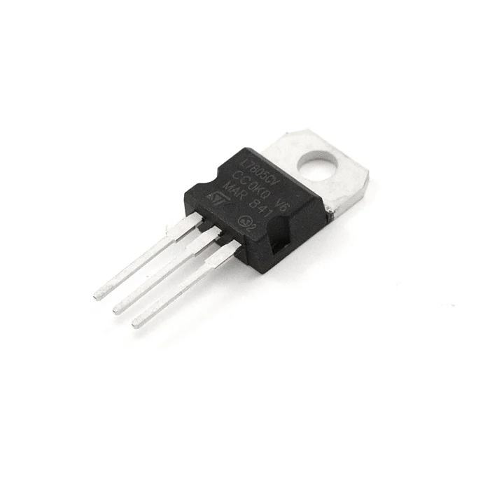

- # Alimentação Externa

Para garantir seu funcionamento adequado, é fundamental fornecer uma alimentação estável dentro da faixa de tensão permitida (1,8V a 5,5V / CC). Neste guia, exploraremos as diversas formas de alimentar a Raspberry Pi Pico e suas vantagens.
!!! warning
	As tensões operacionais seguras estão entre 1,8 V e 5,5 V.

# 1. Alimentação via conector µUSB (micro-USB)

A forma mais simples e comum de alimentar a Pico é através da porta µUSB. Ao conectar um cabo USB com um fonte de energia, a placa recebe uma tensão de 5V, essa tensão pode ser aferida no pino VBUS. Através de reguladores, essa tensão é reduzida para 3,3V que é efetivamente utilizada pela RP2040 e pode ser aferida no pino 36 - **3V3(OUT)**.

#### Vantagens:

- Fácil de usar e amplamente disponível.
- Ideal para desenvolvimento e testes.

#### Desvantagens:

- Dependência de uma fonte de alimentação externa com conexão µUSB.
- Ocupa a porta µUSB, limitando sua utilização para outros propósitos.

# 2. Alimentação via Pinos de Entrada (VSYS e VBUS)
A Pico permite a alimentação diretamente através dos pinos:

- VBUS (5V): Alimentação vinda da porta micro-USB.
- VSYS (1,8V a 5,5V): Entrada principal de alimentação.

!!! tip
	Se você estiver utilizando uma fonte de alimentação externa, o ideal é conectar ao VSYS para garantir a regulagem de tensão correta.

#### Vantagens:

- Flexibilidade para usar diferentes fontes de alimentação.
- Permite o uso de baterias ou fontes externas.

#### Desvantagens:

- Requer atenção à tensão fornecida para evitar danos.

# 3. Possibilidades de conexões

#### 3.1 Power Banks

#### 3.2 Baterias Li-Ion/Li-Po

#### 3.3 Pilhas AA/AAA ou Baterias Recarregáveis

#### 3.4 Fontes de Energia acima de 5V

Quando uma fonte de alimentação não fornece tensão na faixa permitida, como por exemplo, Baterias 9V ou Fonte 12V, é possível utilizar reguladores de tensão para ajustar a saída. Existem dois tipos principais:

AMS1117 (3.3V) → Converte tensões maiores em 3.3V.

{width=400}

7805 (5V) → Converte tensões maiores em 5V.

{width=400}

# 4. Referências

- [Powering your Pico](https://projects.raspberrypi.org/en/projects/introduction-to-the-pico/12)
- [Guide to powering the Raspberry Pi Pico](https://www.penguintutor.com/electronics/pico-power)
- [How to Power the Raspberry Pi Pico? 6 Different ways](https://randomnerdtutorials.com/power-raspberry-pi-pico-6-different-ways/)
- [How to power the Raspberry Pi Pico](https://lab.arts.ac.uk/books/raspberry-pi/page/how-to-power-the-raspberry-pi-pico)
- [How to Power Raspberry Pi Pico with Batteries: Li-ion, 9V, 12V, AA, AAA Examples](https://electrocredible.com/power-raspberry-pi-pico-with-batteries/)