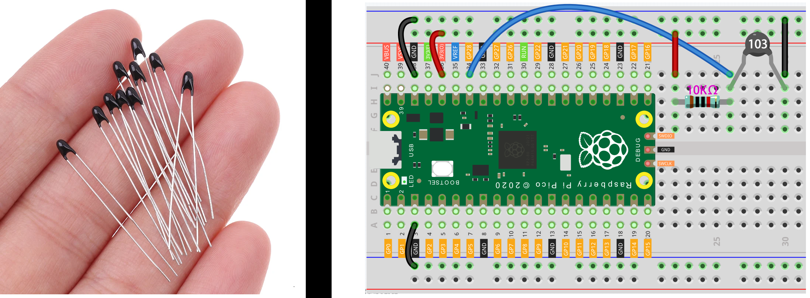

# Sensores analógicos

No laboratório temos uma série de sensores analógicos e que podem ser utilizados para mensurarem o mundo externo.

Estender material, falando de:

- Condicionamento de sinal
- Ponte de Wheatstone
- Problemas com sensores analógicos 
- Calibraćão

## LDR

O LDR (Light Dependent Resistor), também conhecido como fotorresistor, é um tipo de sensor passivo. Isso significa que ele não requer energia externa para funcionar e não produz energia própria. Em vez disso, sua resistência elétrica varia em resposta à intensidade da luz incidente. Para entender melhor, consulte:

- https://learn.sparkfun.com/tutorials/photocell-hookup-guide/photocell-overview

## Termistor NTC

Um termistor NTC é composto de um material semicondutor cuja resistência elétrica diminui quando a temperatura aumenta. Isso significa que ele possui um coeficiente de temperatura negativo, daí o nome "Negative Temperature Coefficient". Quando a temperatura aumenta, os elétrons do material semicondutor ganham energia térmica, o que aumenta sua mobilidade e reduz a resistência elétrica do termistor. Para entender melhor, consulte:

- https://www.circuitbasics.com/arduino-thermistor-temperature-sensor-tutorial/

## Strain gauge

É dispositivo cuja resistência elétrica que varia com a deformação, pode ser utilizado para medir uma série de coisas, desde o quanto uma rachadura em uma parede está aumentando, se um eixo está sofrendo deformação. Ele não desenvolvido para medir "peso",  mas podemos usar para ter uma noção de quanto de forca foi aplicado nele.

- https://en.wikipedia.org/wiki/Strain_gauge

## SHARP

Sendo o mais genérico dos apresentados, esse tipo sensor de ele possui diversas aplicações como: sensor de proximidade, sensor de distância e sensor de movimento. Esse tipo de sensor emite luz infravermelha em direção a um objeto e mede o tempo que leva para a luz refletida retornar ao sensor. Ele possui um circuito integrado que calcula essa distância até o objeto com base no ângulo de inclinação do feixe de luz refletido. Os sensores Sharp geralmente fornecem uma saída analógica que é proporcional à distância medida até o objeto. Essa saída analógica pode variar de acordo com o modelo específico do sensor, mas geralmente é uma tensão ou corrente que varia de acordo com a distância. Para entender melhor, consulte:

- https://www.makerguides.com/sharp-gp2y0a710k0f-ir-distance-sensor-arduino-tutorial/

