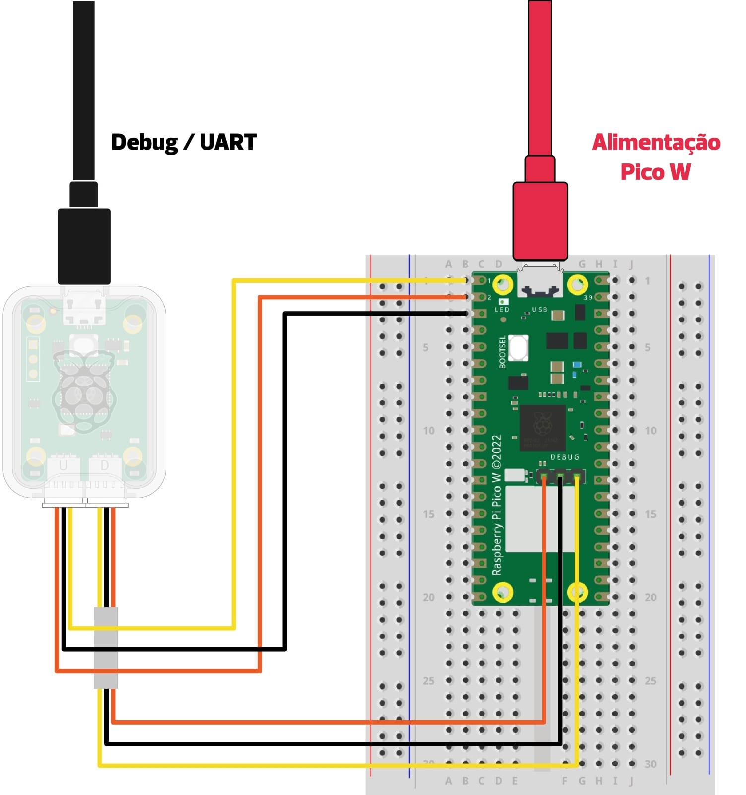
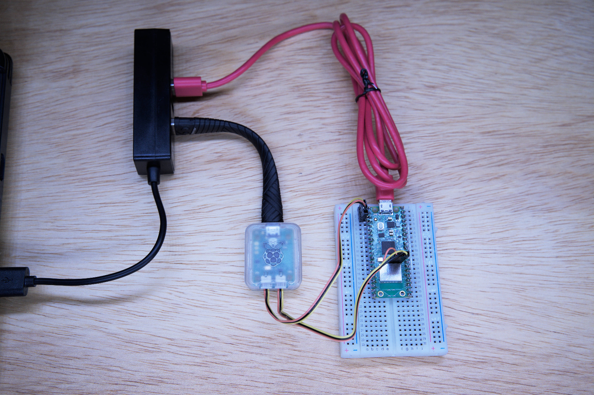
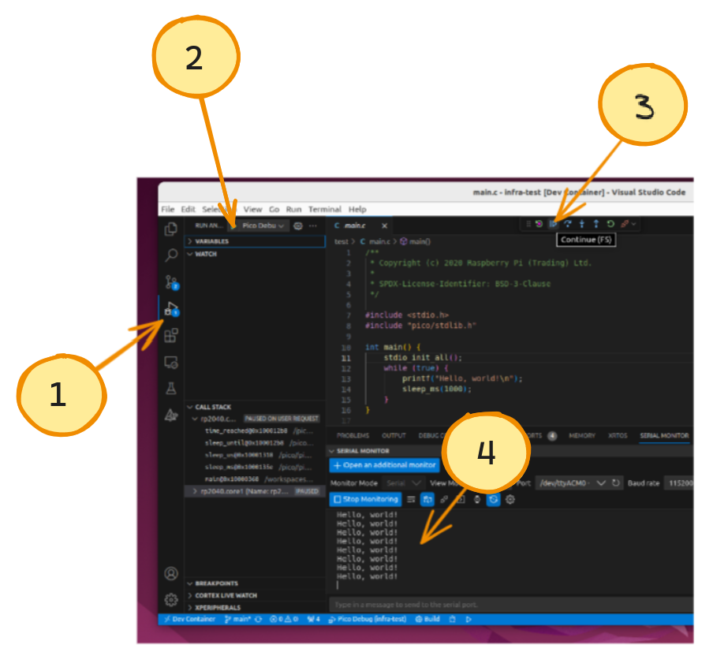
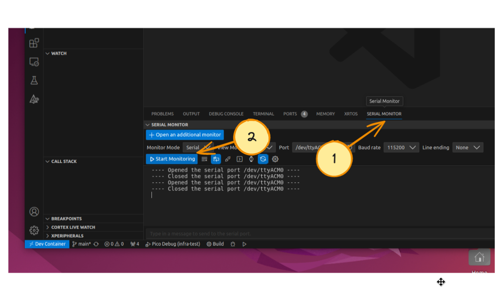

# Infra Linux Docker

=== "Windows? / MAC?"
    Indicamos o desenvolvimento usando uma vm Ubuntu.
    Para máquinas virtuais, é recomendado o uso do `Oracle VM Virtual Box`.

    Antes de iniciar a máquina virtual é necessário fazer a seguinte configuração para garantir que a Raspberry Pico seja indentificada dentro da VM:

    - Windows: [Virtual box](https://www.virtualbox.org/)
    - Mac: [Paralles](https://www.parallels.com/)  
    - MAC: Dica use o [UTM](https://mac.getutm.app/)

    Instale o Ubuntu 22.04 na VM!

=== "Linux"
    Ubuntu 22.04? Só seguir a instalação. 
    
    ==Algum outro Linux? Deve funcionar, só o passo de instalação do docker que deve ser diferente==.
    
## Ubuntu 22.04

> Tutorial para Ubuntu 22.04, da para facilmente adaptar para outro linux (por conta do aluno)

!!! exercise "docker"
    Executar no terminal (uma linha por vez!):
    
    ```bash
    sudo apt-get update
    sudo apt-get install ca-certificates curl
    sudo install -m 0755 -d /etc/apt/keyrings
    sudo curl -fsSL https://download.docker.com/linux/ubuntu/gpg -o /etc/apt/keyrings/docker.asc
    sudo chmod a+r /etc/apt/keyrings/docker.asc

    # Add the repository to Apt sources:
    echo \
    "deb [arch=$(dpkg --print-architecture) signed-by=/etc/apt/keyrings/docker.asc] https://download.docker.com/linux/ubuntu \
    $(. /etc/os-release && echo "$VERSION_CODENAME") stable" | \
    sudo tee /etc/apt/sources.list.d/docker.list > /dev/null
    sudo apt-get update
    ```
    
    Agora:
    
    ```bash
    sudo apt-get install docker-ce docker-ce-cli containerd.io docker-buildx-plugin docker-compose-plugin
    ```
    
    Teste com:
    
    ```bash
    sudo docker run hello-world
    ```
    
    Este comando baixa uma imagem de teste e a executa em um contêiner. Quando o contêiner é executado, ele imprime uma mensagem de confirmação e encerra.

    > ref: https://docs.docker.com/engine/install/ubuntu/#installation-methods

!!! exercise "Configurando permissão"
    Siga os passos no site a seguir, para podermos executar o docker sem permissão de super usuário:
    

    ```bash
    sudo groupadd docker
    sudo usermod -aG docker $USER
    newgrp docker
    ```

    Teste com:
    
    ```bash
    docker run hello-world
    ```
    
    - Se não funcionar, reinicie o computador e teste com o comando anterior.

    > ref: https://docs.docker.com/engine/install/linux-postinstall/
    
!!! exercise "vscode"
    Instale o vscode:
    
    - https://linuxhint.com/install-visual-studio-code-ubuntu22-04/
    
    Teste com:
    
    ``` bash
    $ code 
    ```
    
<!--
!!! exercise "Wokwi-cli"

    1. Instale o wokwi-cli (simulador de sistemas embarcados)

    ```bash
    sudo snap install curl
    curl -L https://wokwi.com/ci/install.sh | sh
    ```
    
    2. Crie uma conta no site:
    
    - https://wokwi.com/

    3. Entre em: CI Tokens: https://wokwi.com/dashboard/ci
    
    
    
    4. Gere um token e copie o código
    
    5. Cole na última linha do arquivo `.bashrc`
    
    ```bash
    gedit ~/.bashrc
    ```
 -->
 
!!! exercise
    Configurando permissão do USB:
    
    ```bash
    sudo usermod -a -G "$(stat -c "%G" /dev/ttyUSB0)" $USER
    sudo usermod -a -G "$(stat -c "%G" /dev/ttyACM0)" $USER
    sudo reboot
    ```
    

## Testando tudo - vscode

Agora que já temos toda a infra instalada, vamos testar!

!!! exercise
    Clone o repositório com códigos de teste

    ```bash
    git clone https://github.com/insper-embarcados/infra-test.git
    ```

!!! exercise
    Abra o respositório no vscode

    ```bash
    code infra-test/
    ```

    ==Instale todas as extensões sugeridas!==

!!! exercise
    Abrir no dev-container

    Após tudo instalado, vamos abrir a pasta no docker criado para a disciplina! 

    - **ctrl** + **shift**+ **p**
    - **Dev. Containers: Open Folder in Container..**

    >> isso deve demorar um pouco!

!!! exercise 
    Vamos compilar o projeto!

    Clique em build na barra inferior:

    

    Escolha o compilador `arm-none-eabi`

    

    Você deve obter:

    

### Programando e depurando
    
Agora vamos programar a placa!
    

!!! exercise
    Conecte o debug-probe e a rasp. Para isso você vai precisar de:
    
    - Dois cabos USB
    - Debug-Probe
    - Raspberry pi pico
    - Protoboard
    
    === "Diagrama"
        
    === "Real"
        
        
!!! warning "Executando na vm?"
    Se estiver usando uma VM, execute os passos adicionais:

    1.    Abra as Configurações -> USB
    2.    Verifique se o controlador USB está habilitado.
    3.    Clique no símbolo do "USB +" para adicionar a Raspberry Pi Pico.
    -

!!! exercise
    Selecione o programa que iremos depurar

    

!!! exercise
    Inicialize o software

    

    ==Você deve obter o Hello world== no serial

!!! exercise
    Abra o serial monitor (terminal)

    
