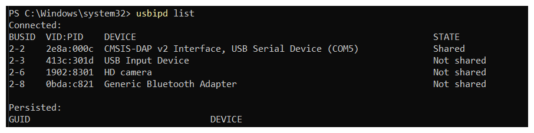

# Infra WSL Ubuntu

=== "Windows?"
    Indicamos o desenvolvimento usando o *WSL (Windows Subsystem for Linux) com Ubuntu 22.04*.


    
## WSL 

!!! exercise "Instalar o WSL"
    
    Verifique se o WSL está ativado no seu sistema operacional, para isso faça os seguintes passos:

    - Abra os *Recursos Opcionais* do Windows, conforme imagem abaixo:

    

    - Em seguida clique em *More Windows features* ou *Mais Recursos do Windows* (ptbr) conforme a última opção na imagem.

    - Agora procure o *Subsistema do Windows para Linux* (WSL) conforme na imagem, clique no Quadrado, verifique se ficou azul e de um *OK*.

    

    - O Windows começará a instalar o WSL, após o processo acabar a tela ficará parecida com a imagem a seguir, clique em *Reiniciar Agora*.

    

    - Após reiniciar abra o PowerShell no Windows como *Administrador* e digite os seguintes comandos:
    

    ``` bash
    dism.exe /online /enable-feature /featurename:Microsoft-Windows-Subsystem-Linux /all
    dism.exe /online /enable-feature /featurename:VirtualMachinePlatform /all
    ```
    *OBS:* Um comando por vez, esperando cada um ser executado devidamente, caso tenha problemas chame o técnico ou professor.

    
    - Após reiniciar abra o PowerShell novamente como *Administrador* e digite os seguintes comandos:

    *OBS:* Um comando por vez, esperando cada um ser executado devidamente, caso tenha problemas chame o técnico ou professor.

    ``` bash
    wsl --install
    wsl --update
    wsl --set-default-version 2
    ```

!!! exercise "Instalando Ubuntu 22 no WSL"

    A distribuição do Linux que utilizaremos no WSL será o Ubuntu 22, você deverá instalar a mesma versão.

    Para isto:

    - Abra a Microsoft Store no seu Windows.

    - Agora pesquise por Ubuntu 22.04 na *Microsoft Store* e Instale o seguinte:
    
    

    *OBS:* Se tiver algum problema, contate um técnico ou o professor da disciplina.
 
    

*Sempre que você quiser utilizar o WSL com Ubuntu 22 você pode pesquisar no Windows pelo software "Ubuntu 22.04.3 LTS" e abri-lo.*

Reinicie o computador e tente abrir o "Ubuntu 22.04.3 LTS", se tudo tiver dado certo você precisará definir um usuário e senha, e a tela a ser exibida será:


*Parabéns*, agora você tem um WSL Ubuntu instalado e prontinho para uso!!


Agora vamos instalar o *USBIPD*, responsável por fazer a interface de conexão entre o dispositivo USB no windows com o WSL/Ubuntu.


!!! exercise "Instalando USBIPD"
    
    1. Instalar usbipd-win_4.2.0.msi dos "Assets" disponibilizado no link https://github.com/dorssel/usbipd-win/releases/tag/v4.2.0.
    
    2. Após isto inicie o PowerShell com Administrador.

    3. Digite o comando usbipd list, aparecerá algo parecido com a imagem abaixo:

    
    
    Note que há informações sobre os periféricos conectados ao nosso computador.
    

!!! exercise "docker no wsl Ubuntu 22"
    Executar no terminal (uma linha por vez!):
    
    ```bash
    sudo apt-get update
    sudo apt-get install ca-certificates curl
    sudo install -m 0755 -d /etc/apt/keyrings
    sudo curl -fsSL https://download.docker.com/linux/ubuntu/gpg -o /etc/apt/keyrings/docker.asc
    sudo chmod a+r /etc/apt/keyrings/docker.asc

    # Add the repository to Apt sources:
    echo \
    "deb [arch=$(dpkg --print-architecture) signed-by=/etc/apt/keyrings/docker.asc] https://download.docker.com/linux/ubuntu \
    $(. /etc/os-release && echo "$VERSION_CODENAME") stable" | \
    sudo tee /etc/apt/sources.list.d/docker.list > /dev/null
    sudo apt-get update
    ```
    
    Agora:
    
    ```bash
    sudo apt-get install docker-ce docker-ce-cli containerd.io docker-buildx-plugin docker-compose-plugin
    ```
    
    Teste com:
    
    ```bash
    sudo docker run hello-world
    ```
    
    Este comando baixa uma imagem de teste e a executa em um contêiner. Quando o contêiner é executado, ele imprime uma mensagem de confirmação e encerra.

    > ref: https://docs.docker.com/engine/install/ubuntu/#installation-methods

!!! exercise "Configurando permissão"
    Siga os passos no site a seguir, para podermos executar o docker sem permissão de super usuário:
    

    ```bash
    sudo groupadd docker
    sudo usermod -aG docker $USER
    newgrp docker
    ```

    Teste com:
    
    ```bash
    docker run hello-world
    ```
    
    - Se não funcionar, reinicie o computador e teste com o comando anterior.

    > ref: https://docs.docker.com/engine/install/linux-postinstall/

!!! exercise "vscode"
    Instale o vscode no seu Windows caso não tenha:
    
    - https://code.visualstudio.com/download
    
    Teste no terminal do *Ubuntu 22.04.3 LTS* com:
    
    ``` bash
    $ mkdir workspace # criando o workspace
    $ cd workspace # entrando dentro do workspace
    $ mkdir embarcados #vamos criar um diretorio para nossos projetos de embarcados dentro de workspace
    
    $ # Verifique se está dentro do workspace/embarcados, caso sim, continue

    $ git clone https://github.com/insper-embarcados/infra-test
    $ code infra-test/ # vamos abrir a infra
    ```

    *OBS:* Execute um comando por vez!

    Se o seu VSCODE abrir, esta etapa estará validada, por enquanto feche o VSCODE e vamos para a próxima etapa.

    *OBS:* Instale todos os plugins que forem solicitados no VSCode
 
<!--
!!! exercise "Wokwi-cli"

    1. Instale o wokwi-cli (simulador de sistemas embarcados)

    ```bash
    sudo snap install curl
    curl -L https://wokwi.com/ci/install.sh | sh
    ```
    
    2. Crie uma conta no site:
    
    - https://wokwi.com/

    3. Entre em: CI Tokens: https://wokwi.com/dashboard/ci
    
    
    
    4. Gere um token e copie o código
    
    5. Cole na última linha do arquivo `.bashrc`
    
    ```bash
    gedit ~/.bashrc
    ```
 -->


!!! exercise "Conectando tudo"
    Conecte o debug-probe e a rasp. Para isso você vai precisar de:
    
    - Dois cabos USB
    - Debug-Probe
    - Raspberry pi pico
    - Protoboard
    
    === "Diagrama"
        
    === "Real"
        

!!! exercise "Roteie o USB via ip do Windows para o WSL"
    
    Com a Rasp Pico e o Debugger conectados no PC, faça:
    
    - Reiniciar PowerShell com administrador.

    - Digite o comando *usbipd list*

    

    Procure pelo DEVICE de nome CMSIS-DAP e identifique seu *VID:PID, no meu caso por exemplo é o 2e8a:000c*.

    - usbipd bind -i "VID:PID" # sem as aspas

    Substitua o VID:PID pelo correspondente da Raspberry Pico Probe (CMSIS-DAP), quando você der *usbipd list* de novo aparece que o *DEVICE está com STATE = Shared*, como na imagem abaixo:

    

    - usbipd attach --wsl -i "VID:PID" 

    Nesta parte substitua o VID:PID pelo correspondente, no meu caso o 2e8a:000c, mas no seu será um diferente.

    Exemplo:
    ```bash
    $ usbipd attach --wsl -i 2e8a:000c
    ```
    
    Aqui o dispositivo (CMSIS DAP / Rasp Pico Debugger) já é acessível no WSL.

    Para verificar, entre no *Ubuntu 22.04.3 LTS*, copie e cole:

    ```bash
    $ if [ -e /dev/ttyACM0 ]; then echo "Parabéns, a Rasp tá funcionando no wsl "; else echo "Tem alguma coisa errada"; fi
    ```

    Basicamente checamos se existe o device *ttyACM0*, se sim, retornamos um mensagem de "Parabéns", se não, "tem alguma coisa errada".

    *Se aparecer "Parabéns..." é porque tudo até aqui deu certo :)*

!!! exercise "Permissões USB no wsl"
    Configurando permissão do USB:
    
    ```bash
    sudo usermod -a -G "$(stat -c "%G" /dev/ttyUSB0)" $USER
    sudo usermod -a -G "$(stat -c "%G" /dev/ttyACM0)" $USER
    sudo reboot
    ```


## Testando tudo - vscode

Agora que já temos toda a infra instalada, vamos testar!


!!! exercise
    Abra o respositório no vscode

    ```bash
    code infra-test/
    ```

    ==Instale todas as extensões sugeridas!==

!!! exercise
    Abrir no dev-container

    Após tudo instalado, vamos abrir a pasta no docker criado para a disciplina! 

    - **ctrl** + **shift**+ **p**
    - **Dev. Containers: Open Folder in Container..**

    >> isso deve demorar um pouco!

!!! exercise 
    Vamos compilar o projeto!

    Clique em build na barra inferior:

    

    Escolha o compilador `arm-none-eabi`

    

    Você deve obter:

    

### Programando e depurando
    
Agora vamos programar a placa!
    
!!! exercise
    Selecione o programa que iremos depurar

    

!!! exercise
    Inicialize o software

    

    ==Você deve obter o Hello world== no serial

!!! exercise
    Abra o serial monitor (terminal)

    
