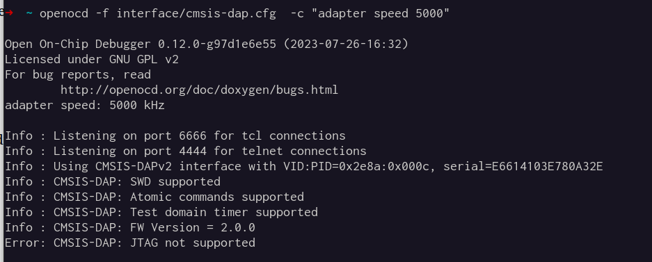
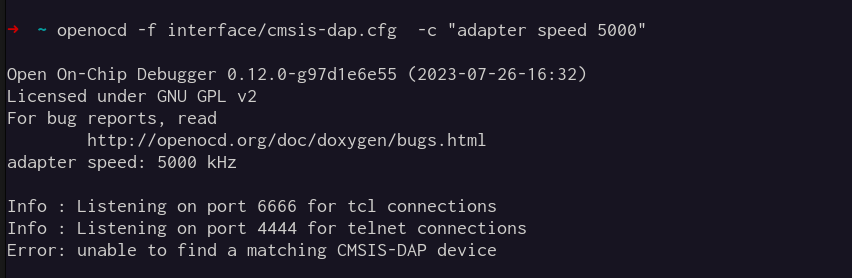

# Infra

A disciplina vai ser executada em Linux, preferência para Ubuntu 22.04, o mesmo que será usado na disciplina de sistemas hardware software, mas os softwares que iremos usar são diferentes!

## Pré-configuração para VM

Para máquinas virtuais, é recomendado o uso do `Oracle VM Virtual Box`.

Antes de iniciar a máquina virtual é necessário fazer a seguinte configuração para garantir que a Raspberry Pico seja indentificada dentro da VM:


1.    Abra as Configurações -> USB
2.    Verifique se o controlador USB está habilitado.
3.    Clique no símbolo do "USB +" para adicionar a Raspberry Pi Pico.


## Parte 1 - gcc, sdk and examples 

Crie uma pasta chamada `pico` na raiz do seu usuário, vamos instalar todos os softwares nesse local!

```bash
$ mkdir pico
$ cd pico
```

1. Toolchain

``` bash
$ sudo apt install cmake gcc-arm-none-eabi libnewlib-arm-none-eabi libstdc++-arm-none-eabi-newlib
```

2. SDK

```bash
$ git clone https://github.com/raspberrypi/pico-sdk.git
$ git -C pico-sdk submodule update --init
```

Adicione o caminho recém clonado ao `.bashrc`

```bash
$ echo export PICO_SDK_PATH=$HOME/pico/pico-sdk > ~/.bashrc
$ source ~/.bashrc
```

3. Clone o pico examples

```bash
$ git clone https://github.com/raspberrypi/pico-examples
```

### Testando

Agora devemos ser capazes de compilar o repositório de exemplos:

```bash
$ cd pico-examples
$ mkdir build
$ cd build
$ cmake ..
$ make blink
```

Você deve obter algo como:

<script async id="asciicast-5PjMJmsDpfMx1oFwKsppp7w8F" src="https://asciinema.org/a/5PjMJmsDpfMx1oFwKsppp7w8F.js"></script>

!!! warning
    Não seguir se não funcionar!
    
## Parte 2 - debug-probe

Vamos instalar o OpenOCD necessário para usarmos o `pico-probe`.

1. Volte para a pasta das ferramentas:

```bash
cd ~/pico
```

1. Instale as dependências: 

```bash
$ sudo apt install automake autoconf build-essential texinfo libtool libftdi-dev libusb-1.0-0-dev pkg-config
```

2. Compilnando e instalando o PicoProbe

```bash
$ git clone https://github.com/raspberrypi/openocd.git --branch rp2040-v0.12.0 --depth=1 --no-single-branch
$ cd openocd
$ ./bootstrap
$ ./configure
$ make -j4
$ sudo make install
```

4. Configure a permissão do usb:

```bash
$ sudo echo ATTRS{product}=="*CMSIS-DAP*", MODE="664", GROUP="users" > /etc/udev/rules.d/99-debug-probe.rules
```

```bash
sudo udevadm control --reload-rules && sudo udevadm trigger
```

3. Instale o `gdb` crosscompile:

```
$ sudo apt install gdb-multiarch
```

### Testando

!!! TODO
    Inserir imagem debug-probe
    
Plugue o debug-probe no computador e execute:
 
```bash
openocd -f interface/cmsis-dap.cfg -f target/rp2040.cfg -c "adapter speed 5000"
```

=== "Correto"
    
=== "Fail"
    

## Parte 3 - Wokwi-cli

Wokwi é um simulador de microcontroladores, iremos usar em algumas atividades de laboratório.

1. Instale o software:

```bash
curl -L https://wokwi.com/ci/install.sh | sh
```

### Testando

Execute no terminal `wokwi-cli --help`:

```bash
$wokwi-cli --help
Wokwi CLI v0.9.0 (abc2bb2a3530)

  USAGE

      $ wokwi-cli [options] [path/to/project]

  OPTIONS
  
  ....
```

## Parte 4 - vscode

Instale o vscode no Linux:

```bash
sudo snap install --classic code 
```

### Testando

Abra o vscode! 

```bash
code .
```

## Parte 5 - Configurando vscode e testando

Volte para a pasta base:

```bash
$ cd ~/pico
```

Clone o repositório de teste e abra no vscode:

```bash
$ git clone git@github.com:insper-embarcados/infra-test.git
$ cd infra-test
$ code .
```

Agora vamos carregar as extensões necessárias. No vscode execute:

1. `file` -> `Preferences` -> `Profiles` -> `Import Profile ...`
2. `Select File`
3. `pico.code-profile`
4. Crie um novo profile chamado `pico`
5. Aguarde as extensões serem instaladas
   - Quando pedir pelo compilador escolha qualquer versão do `arm-none-eabi`. 
6. Agora compile o projeto clicando no botão `Build` (barra inferior), você deve obter o seguinte resultado:

    - no terminal `[build] Build finished with exit code 0`
    - pasta built criada no diretório com o arquivo `test/main.uf2`
   
<iframe width="700" height="415" src="https://www.youtube.com/embed/aouIrh3FCn4?si=pbTZrMpU57Gs2F7Q" title="YouTube video player" frameborder="0" allow="accelerometer; autoplay; clipboard-write; encrypted-media; gyroscope; picture-in-picture; web-share" allowfullscreen></iframe>


