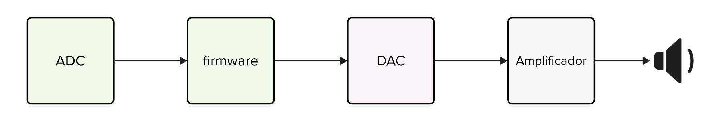
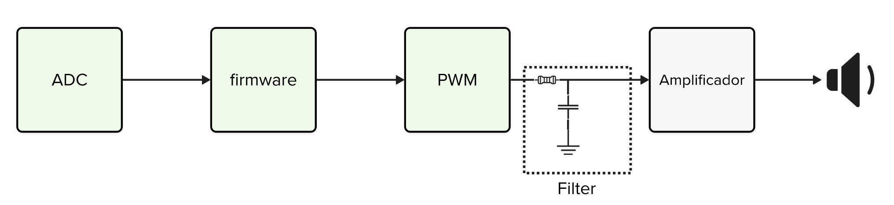

# Expert - DSP - Áudio

| Lab Expert - DSP - Áudio Preparatório                          |
|----------------------------------------------------------------|
| **Deadline**: {{lab_expert_dsp_audio_deadline}}                |
| [Repositório no classroom]({{lab_expert_dsp_audio_classroom}}) |
| 💰 100% nota de lab                                            |

Neste laboratório iremos criar um sistema capaz de ler um microfone e produzir o sinal lido em um speaker! 

## Lab

Fazer a leitura de um microfone é fácil, basta configurar o ADC e ler o valor que o microfone gera, criar uma base de tempo, e fazer a convecão periódicamente. Para saber como usar um microfone na pico, consulte:

- [pico-examples/adc/microphone_adc]( https://github.com/raspberrypi/pico-examples/tree/master/adc/microphone_adc)

{width=400}

Agora o desafio é como fazemos para gerar o áudio, a maioria dos microcontroladores possui o conversor analógico para digital, mas poucos possuem um digital para analógico (DAC), que iria facilitar em muito a nossa vida, já que poderíamos simplesmente copiar o valor do ADC para DAC e bum, teríamos um som sendo gerado no pino, ai bastaria amplificar o sinal e pronto, teríamos um áudio sendo reproduzido!

Como não temos o DAC, poderíamos pensar em algumas alternativas:

- Usar um codec de áudio externo para fazer a conversão
- Conectar um conversor digital to analog (DAC) 

Mas existe uma alternativa mais fácil e que não demanda o uso de um novo dispositivo, a alternativa envolve criarmos um DAC a partir de um PWM e um filtro passivo composto de um resistor e capacitor:

O repositório a seguir possui uma bom exemplo e demonstraćão de como gerar um áudio usando essa técnica na nossa pico! Inclusive com exemplo de como reproduzir uma música!

- https://github.com/rgrosset/pico-pwm-audio/tree/main

!!! tip
    Outras referencias: 
    
    - http://antirez.com/news/143
    - http://www.openmusiclabs.com/learning/digital/pwm-dac.1.html

## Entrega

Você deve entregar um sistema que é capaz de enquanto um botão estiver pressionado, ler um áudio via ADC e reproduzir o áudio via um PWM. 

Você vai precisar juntar esses dois exemplos:

- [pico-examples/adc/microphone_adc]( https://github.com/raspberrypi/pico-examples/tree/master/adc/microphone_adc)
- [pico pwm audio](https://github.com/rgrosset/pico-pwm-audio/)

Dicas:

- Primeiro rode o exemplo da PICO de microfone
- Execute o exemplo de áudio PWM
    - Lembre de montar o filtro com os resistores e capacitores
- Junte os dois para fazer um sistema que reproduz um áudio.
