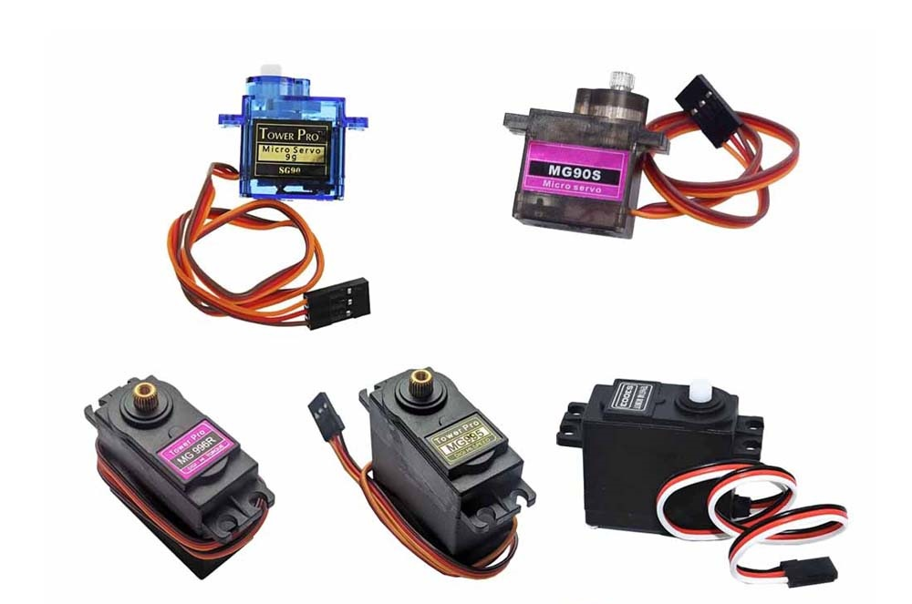
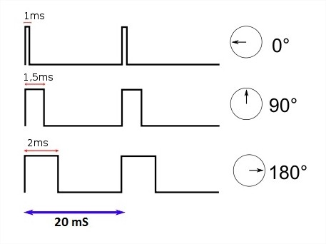
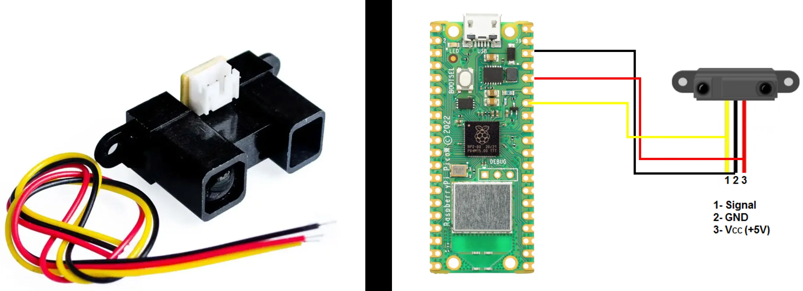

# Expert - PPM - Servomotor

| Lab Expert - PPM - Servomotor                                |
| ------------------------------------------------------------ |
| **Deadline**: {{lab_expert_pwm_servomotor_deadline}}         |
| [Repositório no Classroom]({{lab_expert_dsp_audio_classroom}}) |
| 💰 100% nota de laboratório                                   |

Neste laboratório, iremos criar um sistema capaz de ajustar a posição de um servomotor através da seleção de diferentes sensores!

### PWM

Como foi estudado no LAB 5, podemos controlar o brilho de um LED através de uma técnica chamada de PWM (Pulse Width Modulation). Essa técnica permite que um sinal digital seja modulado em largura de pulso, variando a razão entre o tempo em que o sinal está em nível alto (1) e o tempo em que está em nível baixo (0). Isso resulta em um sinal com uma largura de pulso variável, o que permite controlar a média de potência entregue ao dispositivo. Para revisar:

[Insper Embarcados - PWM](https://insper-embarcados.github.io/site/rp2040/rp2040-pwm/)

### PPM

PPM (Pulse Position Modulation) é uma técnica onde a informação é codificada na posição do pulso em relação a um intervalo de tempo fixo. Em um sinal PPM, um pulso é enviado em momentos específicos durante um período fixo, e a posição desses pulsos em relação ao início do período é usada para representar dados.

### Servomotor

Um servomotor é um dispositivo que pode girar um determinado ângulo de acordo com o sinal que recebe. Ele possui três fios: um para fornecer energia (VCC), um para aterramento (GND) e um para o sinal de controle.

A maioria dos servomotores utiliza o PPM. Normalmente, aplicam essa técnica através de pulsos PWM com uma frequência de cerca de 50 Hz (ou um período de 20 ms), e a largura do pulso determina a posição desejada do servomotor. Um pulso de 1 ms geralmente representa a posição mínima, um pulso de 1,5 ms representa a posição central e um pulso de 2 ms representa a posição máxima, embora esses valores possam variar dependendo do fabricante e do modelo específico do servomotor.

Para entender melhor, acesse:

[Blog Wokwi - Servo Motor](https://blog.wokwi.com/learn-servo-motor-using-wokwi-logic-analyzer/)

## Lab

Para controlar o servomotor, não é complicado. Basta ajustar um [exemplo de PWM](https://github.com/raspberrypi/pico-examples/tree/master/pwm/hello_pwm), ajustando o ciclo de trabalho (duty cycle) com um período de 20 ms (50 Hz), e o servo responderá ao comprimento do pulso dentro desse período. Para entender como aplicar, consulte:

[Repositório Pico Servo](https://github.com/irishpatrick/pico-servo/tree/main)

!!! warning "Desafio 1"

Agora que já sabemos como ajustar a posição do servo, o desafio é adaptar o exemplo baremetal acima para trabalhar utilizando RTOS.

!!! warning "Desafio 2"

Implementar uma leitura ADC para que o servo seja controlado pela posição de um potenciômetro.

Após os desafios, você poderá controlar a posição do servomotor através da posição do potenciômetro, certo? Podemos entender então que o potenciômetro está trabalhando como um sensor de posição, onde o seu comportamento é o de variar a resistência dependendo da sua posição.

Existem diversos componentes que também variam sua resistência ou possuem uma resposta sinal analógico, através de estímulos do meio ambiente, e esses tipos de componentes podem ser utilizados como sensores em diversas aplicações:

#### 1 - LDR

O LDR (Light Dependent Resistor), também conhecido como fotorresistor, é um tipo de sensor passivo. Isso significa que ele não requer energia externa para funcionar e não produz energia própria. Em vez disso, sua resistência elétrica varia em resposta à intensidade da luz incidente. Para entender melhor, consulte:

[SparkFun - Photocell Overview](https://learn.sparkfun.com/tutorials/photocell-hookup-guide/photocell-overview)

#### 2 - Termistor NTC

Um termistor NTC é composto de um material semicondutor cuja resistência elétrica diminui quando a temperatura aumenta. Isso significa que ele possui um coeficiente de temperatura negativo, daí o nome "Negative Temperature Coefficient". Quando a temperatura aumenta, os elétrons do material semicondutor ganham energia térmica, o que aumenta sua mobilidade e reduz a resistência elétrica do termistor. Para entender melhor, consulte:

[Circuit Basics - Thermistor Tutorial](https://www.circuitbasics.com/arduino-thermistor-temperature-sensor-tutorial/)

#### 3 - SHARP

Sendo o mais genérico dos apresentados, esse tipo sensor de ele possui diversas aplicações como: sensor de proximidade, sensor de distância e sensor de movimento. Esse tipo de sensor emite luz infravermelha em direção a um objeto e mede o tempo que leva para a luz refletida retornar ao sensor. Ele possui um circuito integrado que calcula essa distância até o objeto com base no ângulo de inclinação do feixe de luz refletido. Os sensores Sharp geralmente fornecem uma saída analógica que é proporcional à distância medida até o objeto. Essa saída analógica pode variar de acordo com o modelo específico do sensor, mas geralmente é uma tensão ou corrente que varia de acordo com a distância. Para entender melhor, consulte:

[Maker Guides - Sharp GP2Y0A710K0F IR Distance Sensor Arduino Tutorial](https://www.makerguides.com/sharp-gp2y0a710k0f-ir-distance-sensor-arduino-tutorial/)

!!! warning "Desafio 3"

Implementar a leitura de cada um desses sensores na Pico W, imprimindo seu valor já convertido para sua grandeza física.

## Entrega

Você deve entregar um sistema que seja possível selecionar entre 2 dos sensores, onde cada um irá ajustar a posição de um servomotor diferente. Por sua vez, o movimento do motor terá que influenciar mecanicamente em algum objeto, como alguns exemplos abaixo:

1. [Tutorial - Robô de Papel](https://labdegaragem.com/profiles/blogs/tutorial-robo-de-papel-faca-o-seu-garabot-controlado-por-ir)
2. [Robotic Eyebrows](http://www.pyroelectro.com/tutorials/robotic_eyebrows/)
3. [Arduino-Controlled Robotic Hand](https://www.youtube.com/watch?v=QH8MPCCrpbg)

**Requisitos:**

1. Implementar o sistema com RTOS.
2. Cada um dos sensores deverá estar ligado a um pino ADC diferente.
3. Controlar mecanicamente algum objeto, com um objetivo.