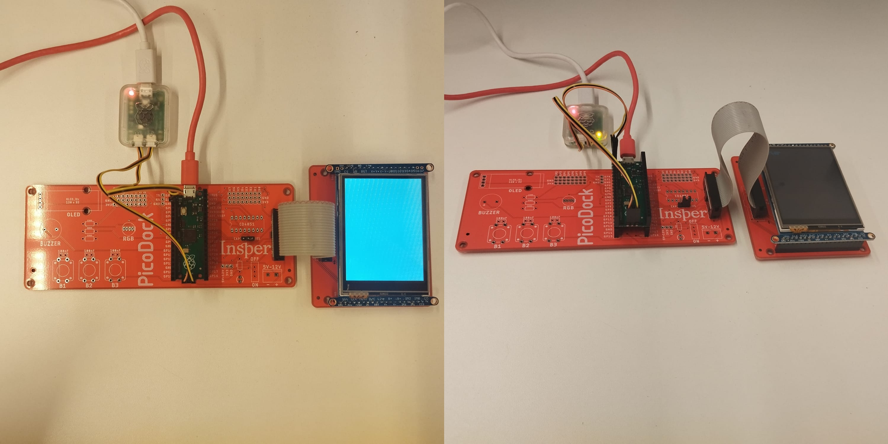

# Expert - ili9341 c/ Touch Resistivo

| Lab Expert - ili9341 c/ Touch Resistivo                |
| ------------------------------------------------------ |
| **Deadline**: {{lab_expert_2_deadline}}                |
| [Repositório no Classroom]({{lab_expert_2_classroom}}) |
| 💰 100% nota de laboratório                             |

Neste laboratório, iremos utilizar o display LCD com driver ili9341 para mostrar informações de sensores. 

!!! warning "Placa Adaptadora para o LCD"
    Desenvolvemos duas placas (PicoDock / TFT LCD - Dock) que facilita as conexões da PICO com o LCD (ili9341):
	

	{width=800px}
	
	- PicoDock

## Definições

Durante o curso realizamos várias aplicações com procolo UART, principalmente para enviar dados da Pico W para o PC e vice-versa, contudo para comunicações com outros dispositivos como sensores por exemplos a velocidade e integridade dos dados se torna mais necessário, para isso, foram criados outros tipos de protocolo, e um deles é o SPI.

### SPI

O protocolo SPI (Serial Peripheral Interface) é realmente muito útil em comunicações entre microcontroladores e dispositivos periféricos, como sensores. Ele oferece uma comunicação serial síncrona de alta velocidade e é adequado para transferências de dados rápidas e confiáveis em curta distância, você pode encontrar mais detalhes sobre o protocolo no seguinte link:

https://learn.sparkfun.com/tutorials/serial-peripheral-interface-spi/all

### LCD TFT ili9341

{width=400px}

A principal característica do TFT LCD ili9341 é sua alta resolução e capacidade de exibir cores vivas. Ele geralmente possui uma resolução de 320x240 pixels e é capaz de exibir milhares de cores, o que o torna ideal para aplicações gráficas. Outra vantagem desse display é a sua capacidade de ser controlado por interfaces comuns, como SPI (Serial Peripheral Interface), o que simplifica ainda mais o processo de comunicação com dispositivos externos.

## LAB

Neste lab, vamos utilizar o exemplo disponível e adaptá-lo para nossa aplicação específica:

https://github.com/insper-embarcados/pico-dock_examples/tree/main/PicoDock_TFT_Resistive_Example

### LCD TFT ili9341 com Adafruit GFX Library

A Adafruit criou uma [biblioteca](https://learn.adafruit.com/adafruit-gfx-graphics-library/overview) muito interessante, ela fornece uma sintaxe comum e um conjunto de funções gráficas para todos os nossos displays LCD e OLED, bem como matrizes de LEDs.

No repositório que foi fornecido acima você irá encontrar uma aplicação utilizando a Pico para se comunicar com o driver **ili9341** (e também outros drivers) já com a biblioteca Adafruit GFX integrada, rode o exemplo e faça testes com o mesmo.

## Entrega

Utilizando RTOS, você deverá  fazer a leitura de algum sensor e mostrar seu respectivo dado no LCD TFT ili9341.

### Dicas:

1. Integrar o exemplo do display com FreeRTOS;
2. Escolher um sensor para que os valores sejam exibidos
3. Fazer a leitura do sensor e mostra no display LCD utilizando a biblioteca Adafruti GFX Library
