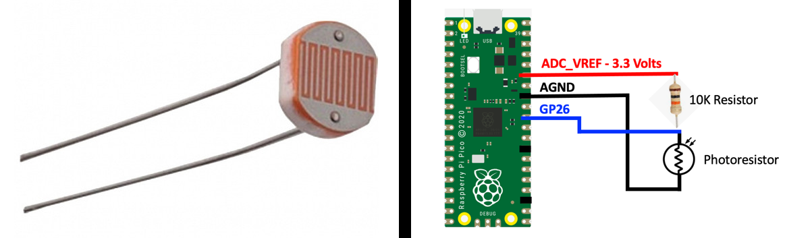

# Expert - PPM - Servomotor

| Lab Expert - PPM - Servomotor                                |
| ------------------------------------------------------------ |
| **Deadline**: {{lab_expert_pwm_servomotor_deadline}}         |
| [Repositório no Classroom]({{lab_expert_dsp_audio_classroom}}) |
| 💰 100% nota de laboratório                                   |

Neste laboratório, iremos criar um sistema capaz de ajustar a posição de um servomotor através da seleção de diferentes sensores!

## Lab

Sistema embarcados são responsáveis por ler e controlar o mundo externo e fazer isso é muitas vezes desafiador pois precisamos usar sensores e atuadores externos, esses dispositivos possuem diferentes interfaces e características distintas. Nessa série de laboratórios da especialidade de sensores e atuadores iremos explorar um pouco esse vasto mundo e fornecer ferramentas a vocês para facilitar esse processo.  

### Servomotor

Uma de controlarmos posição de um objeto é utilizando um motor chamado de `servomotor`, ele diferente do motor de passo, recebe como entrada a posição e automaticamente (ele possui uma malha fechada interna), faz com que o rotor vá direto para a posição definida. Servo motores são muitos utilizados, podemos listar alguns exemplos:

- Controle da direção de um carrinho de controle remoto
- Posicionadores robóticos
- Posicionamento de câmeras
- Fechaduras automáticas

Nesse laboratório vocês irão criar um sistema (DIVERTIDO) usando dois servomotores e dois sensores analógicos. 

{width=400px}

Para entender como o servo motor funciona, consulte o material no site da disiplina:

- [Dispositivos/Servomotor](/site/dispositivos/servo)

### Sensores e sensores e mais sensores

Você deve escolher dois sensores do listados a seguir, todos irão gerar uma variação da tensão dado uma grandeza externa.

#### 1 - LDR

O LDR (Light Dependent Resistor), também conhecido como fotorresistor, é um tipo de sensor passivo. Isso significa que ele não requer energia externa para funcionar e não produz energia própria. Em vez disso, sua resistência elétrica varia em resposta à intensidade da luz incidente. Para entender melhor, consulte:

- https://learn.sparkfun.com/tutorials/photocell-hookup-guide/photocell-overview

#### 2 - Termistor NTC

Um termistor NTC é composto de um material semicondutor cuja resistência elétrica diminui quando a temperatura aumenta. Isso significa que ele possui um coeficiente de temperatura negativo, daí o nome "Negative Temperature Coefficient". Quando a temperatura aumenta, os elétrons do material semicondutor ganham energia térmica, o que aumenta sua mobilidade e reduz a resistência elétrica do termistor. Para entender melhor, consulte:

- https://www.circuitbasics.com/arduino-thermistor-temperature-sensor-tutorial/

#### 3 - SHARP

Sendo o mais genérico dos apresentados, esse tipo sensor de ele possui diversas aplicações como: sensor de proximidade, sensor de distância e sensor de movimento. Esse tipo de sensor emite luz infravermelha em direção a um objeto e mede o tempo que leva para a luz refletida retornar ao sensor. Ele possui um circuito integrado que calcula essa distância até o objeto com base no ângulo de inclinação do feixe de luz refletido. Os sensores Sharp geralmente fornecem uma saída analógica que é proporcional à distância medida até o objeto. Essa saída analógica pode variar de acordo com o modelo específico do sensor, mas geralmente é uma tensão ou corrente que varia de acordo com a distância. Para entender melhor, consulte:

- https://www.makerguides.com/sharp-gp2y0a710k0f-ir-distance-sensor-arduino-tutorial/

## Entrega

Você deve entregar um sistema que possui dois servos motores e dois sensores analógicos (listados a seguir), onde cada um irá ajustar a posição de um servomotor diferente. Por sua vez, o movimento do motor terá que influenciar mecanicamente um objeto, como alguns exemplos abaixo:

1. [Tutorial - Robô de Papel](https://labdegaragem.com/profiles/blogs/tutorial-robo-de-papel-faca-o-seu-garabot-controlado-por-ir)
2. [Robotic Eyebrows](http://www.pyroelectro.com/tutorials/robotic_eyebrows/)
3. [Arduino-Controlled Robotic Hand](https://www.youtube.com/watch?v=QH8MPCCrpbg)

**Requisitos:**

1. Possuir no mínimo dois servos
1. Implementar o sistema com RTOS.
2. Cada um dos sensores deverá estar ligado a um pino ADC diferente.
3. Controlar mecanicamente algum objeto, com um objetivo.

Dicas:

1. Primeiro faća o servomotor funcionar, utilize dois potenciometros como controle da posição
1. Substitua os potenciometros pelos sensores listados a seguir
1. Monte a parte mecânica.
