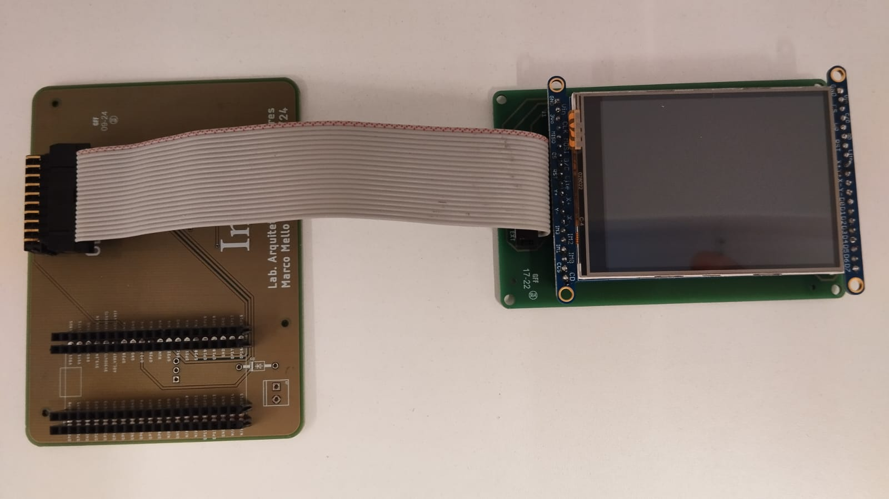
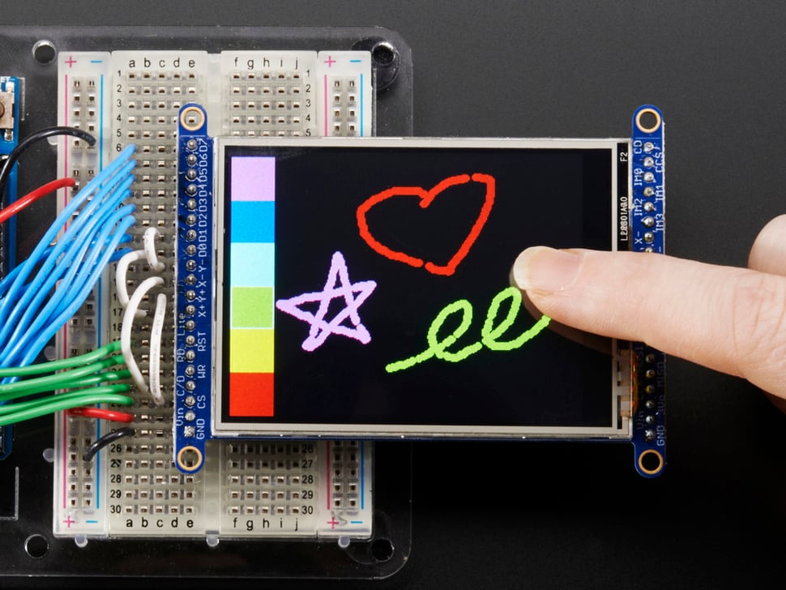
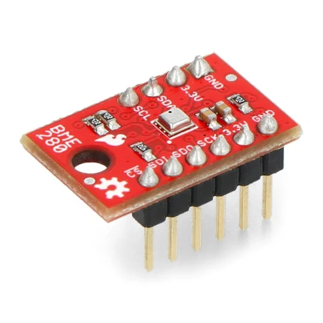

# Expert - ili9341 c/ Touch Resistivo

| Lab Expert - ili9341 c/ Touch Resistivo                |
| ------------------------------------------------------ |
| **Deadline**: {{lab_expert_2_deadline}}                |
| [Repositório no Classroom]({{lab_expert_2_classroom}}) |
| 💰 100% nota de laboratório                             |

Neste laboratório, iremos utilizar o display LCD com driver ili9341 para mostrar informações de sensores. 

!!! warning "Placa Adaptadora para o LCD"
    Desenvolvemos duas placas (PicoDock / TFT LCD - Dock) que facilita as conexões da PICO com o LCD (ili9341):
	

	{width=400px}
	
	- https://insper-embarcados.github.io/site/dispositivos/oled1/#placa-adaptadora

## Definições

Durante o curso realizamos várias aplicações com procolo UART, principalmente para enviar dados da Pico W para o PC e vice-versa, contudo para comunicações com outros dispositivos como sensores por exemplos a velocidade e integridade dos dados se torna mais necessário, para isso, foram criados outros tipos de protocolo, e um deles é o SPI.

### SPI

O protocolo SPI (Serial Peripheral Interface) é realmente muito útil em comunicações entre microcontroladores e dispositivos periféricos, como sensores. Ele oferece uma comunicação serial síncrona de alta velocidade e é adequado para transferências de dados rápidas e confiáveis em curta distância, você pode encontrar mais detalhes sobre o protocolo no seguinte link:

https://learn.sparkfun.com/tutorials/serial-peripheral-interface-spi/all

### LCD TFT ili9341

{width=400px}

A principal característica do TFT LCD ili9341 é sua alta resolução e capacidade de exibir cores vivas. Ele geralmente possui uma resolução de 320x240 pixels e é capaz de exibir milhares de cores, o que o torna ideal para aplicações gráficas. Outra vantagem desse display é a sua capacidade de ser controlado por interfaces comuns, como SPI (Serial Peripheral Interface), o que simplifica ainda mais o processo de comunicação com dispositivos externos.

### BME280

{width=400px}

O BME280 pode ser usado para fazer leituras de pressão, umidade e temperatura. 

Intervalos:

- Temp: -40ºC a 85ºC
- Umidade: 0 - 100% UR, =-3% de 20-80%
- Pressão: 30.000Pa a 110.000Pa, precisão relativa de 12Pa, precisão absoluta de 100Pa
- Altitude: 0 a 30.000 pés (9,2 km), precisão relativa de 3,3 pés (1 m) ao nível do mar, 6,6 (2 m) a 30.000 pés.

## LAB

Com os componentes previamente definidos, vamos agora integrá-los a nossa Pico. Neste lab, vamos utilizar os exemplos fornecidos a seguir e adaptá-los para nossa aplicação específica, portando os mesmo para nossa infra.

### LCD TFT ili9341 com Adafruit GFX Library

A Adafruit criou uma [biblioteca](https://learn.adafruit.com/adafruit-gfx-graphics-library/overview) muito interessante, ela fornece uma sintaxe comum e um conjunto de funções gráficas para todos os nossos displays LCD e OLED, bem como matrizes de LEDs.

Essa biblioteca é muito utilizada com plataforma Arduino, mas nada que impeça de que seja possível portar a mesma para a Pico por exemplo, e foi isso que o usuário [tvlad1234](https://github.com/tvlad1234) fez:

https://github.com/tvlad1234/pico-displayExamples

No repositório acima você irá encontrar uma aplicação utilizando a Pico para se comunicar com o driver **ili9341** (e também outros drivers) já com a biblioteca Adafruit GFX integrada, rode o exemplo e faça testes com o mesmo.

!!! tip Placa Adaptadora

    É possível utilizar a [placa adaptadora](https://insper-embarcados.github.io/site/dispositivos/oled1/) que utilizamos com a placa OLED1, contudo, os pinos do EXT estão mapeadores de tal maneira que utilizam pinos compatíveis com SPI1, o exemplo do LCD acima utiliza SPI0, ou seja, para utilizar a placa adaptadora com o diplay LCD ili9341, você deverá alterar o exemplo fornecido e mapear os pinos da biblioteca [ili9341](https://github.com/tvlad1234/pico-displayDrivs/blob/5b5b52dc8ff59c58db32c9c3cc63c75239cef35b/ili9341/ili9341.c) para o SPI1.

### BME 280

Assim como no lab onde utilizamos a IMU, precisaríamos acessar o [datasheet](https://cdn.sparkfun.com/assets/learn_tutorials/4/1/9/BST-BME280_DS001-10.pdf) do sensor para saber como acessar os dados que desejamos, contudo, no próprio repositório da pico-examples está disponível um código exemplo que utiliza esse sensor:

https://github.com/raspberrypi/pico-examples

Encontre o exemplo para ler esse valor utilizando protocolo **SPI** e execue-o.

## Entrega

Utilizando RTOS, você deverá integrar ambos os dispositivos, tanto o LCD TFT ili9341, quanto o sensor BME280 e mostrando os valores das grandezas lidas e no display LCD.

### Dicas:

1. Criar exemplos separados com RTOS para cada um dos dispositivos;
2. Os dois exemplos utilizam o mesmo periférico SPI (SPI0), você deve modificar um dos exemplos para utiliza o outro periférico SPI disponível (SPI1)
3. Para portar um exemplo externo, seguir as intruções que disponibilizamos no site: https://insper-embarcados.github.io/site/pico/pico-examples/.
