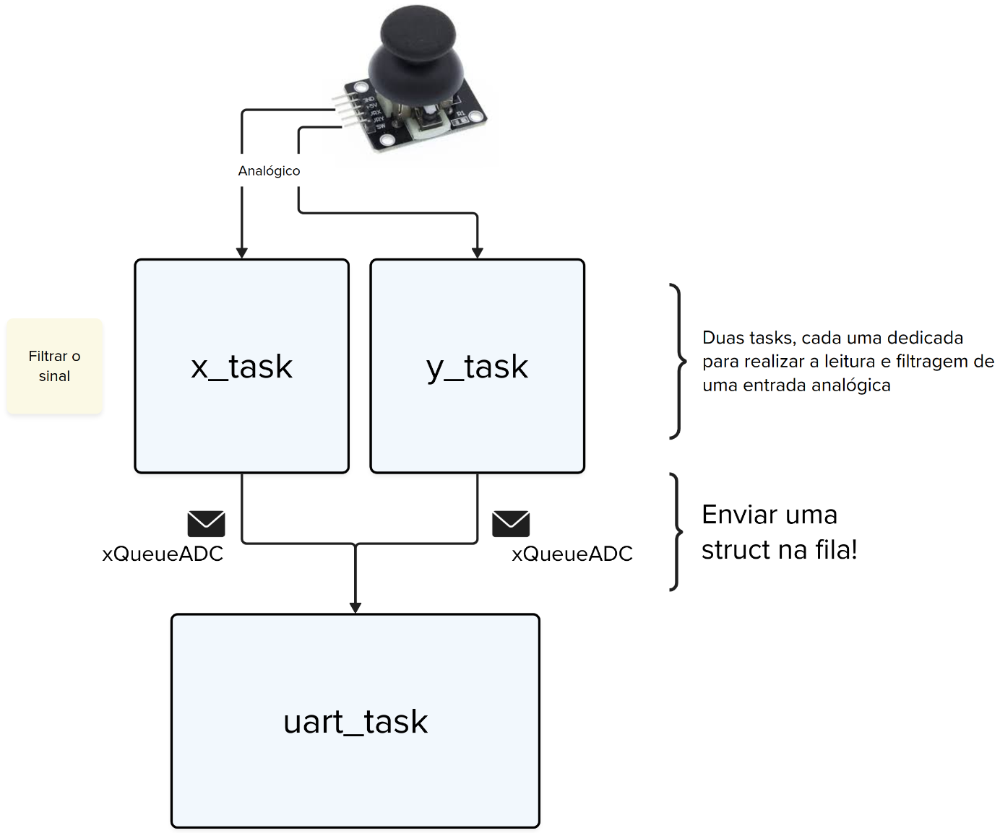
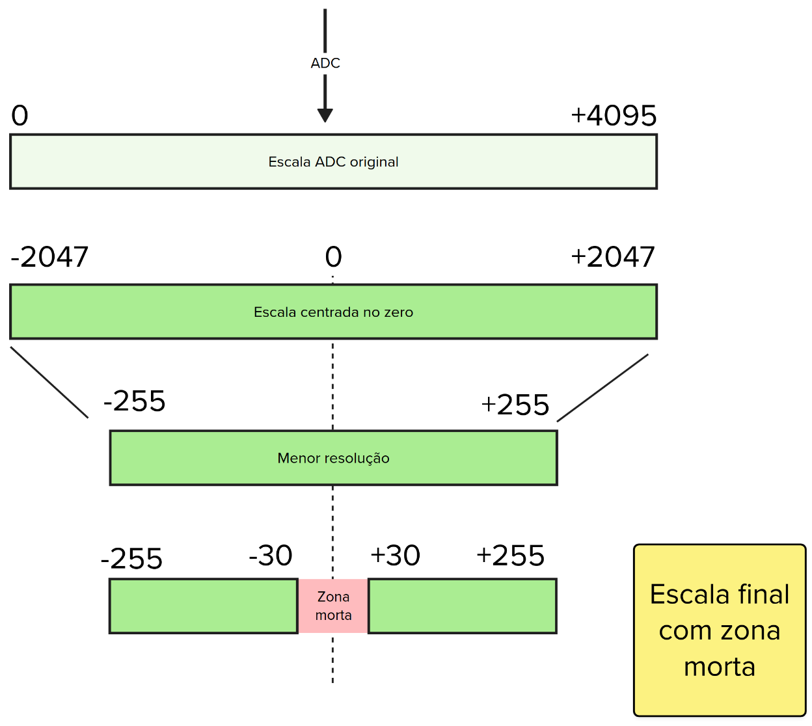

# Timer - Prática

| Lab 3 - Timer - Prática                                   |
|-----------------------------------------------------------|
| **Prazo**: =={{lab_adc_pwm_pra_deadline}}==               |
| [Repositório no classroom]({{lab_adc_pwm_pra_classroom}}) |
| 💰 70% nota de lab                                        |

Neste laboratório iremos usar um joystick analógico para implementarmos um "mouse".

Para isso, vocês precisarão de:

| Lista de Materiais   | Valor    |
|----------------------|----------|
| 1x JY-023 (joystick) | R$ 8,00 |

## Requisitos

Fazer a leitura de um joystick, formatar os dados corretamente e enviar via serial para a leitura do programa python.


### Python

No repositório estou fornecendo um programa python (`python/main.py`) que faz a leitura da porta UART e processa o dado para movimentar o mouse, para que isso funcione corretamente será necessário enviar os dados no seguinte formato:

```
AXIS VAL_1 VAL_0 EOP
```

Onde cada um dos termos do datagrama é um composto por 8 bits que indica:

- `AXIS`: 0 ou 1 para indicar eixo `X` ou eixo `Y`.
- `VAL_1`: Byte ==mais significativo== (MSB)do valor do movimento do eixo
- `VAL_0`: Byte ==menos significativo== (LSB) do valor do movimento do 
- `EOP`: -1 indica fim de pacote

Exemplo:

- Movimentar o mouse no eixo X para a posição 845 (direita)

`00000000 00000011 01001101 11111111`

> Notem que o valor de 845 em binário é: `00000011 01001101`!

- Movimentar o mouse no eixo Y para a posição -55 (baixo)

`00000001 11111111 11001001 11111111`

> Notem que o valor de -55 em binário é: `11111111 11001001`!

#### Executando o programa

Primeiro devemos configurar qual porta o programa irá usar, você deve colocar a mesma que usa no monitor serial!

```
ser = serial.Serial('/dev/ttyACM0', 115200)
```

Depois devemos instalar as dependências: `pip3 install -r requirements.txt`, aconselhamos fazer isso em um ambiente virtual. 

Agora é só executar o programa que ficará esperando por dados na serial no formato indicado anteriormente e irá mexer o mouse.

```bash
python main.py
```

### firmware

Para garantirmos a integridade do sinal analógico, vocês devem aplicar uma média móvel antes de fazer o envio do dado para a fila, mais com o intuito de trabalhar RTOS do que ser realmente necessário, iremos estruturar o firmware da seguinte maneira:

{width=800}

Onde:

- `x_task` e `y_task`: Fazem a leitura e filtragem do valor analógico
- `xQueueADC`: ID (`1` / `0`) e dado filtrado para ser transmitido
- `uart_task`: Faz o envio do dado pela UART

## Dicas


A seguir dicas sobre como executarem o lab:

###  JY-023 (joystick)

Esse joystick é composto por 2 potênciometros e um  push button encapsulados em no mesmo componente. Os potenciômetros possuemuma curva anti logarítmica, ou seja, o centro do mesmo não representa 50% do valor da resistência, como representado no gráfico abaixo:


No gráfico da linear, linha roxa, metade do giro corresponde a metade da resistência. Já no da anti logarítmica, vermelha, repare como no começo do giro a progressão da resistência é rapida e brusca, e no final ela se torna bem lenta.


!!! danger "Log para Linear"
    Crie uma função que convertar o valor lido (curva logarítimica) em um valor linear, ou seja, quando o joystick estiver em respouso (ambos os eixos centralizados), o valor lido pelo ADC deverá ser 50% da escala de 0 a 4095, ou seja, aproximadamente 2047.


- Alimentar o módulo com `ADC_VREF` da PICO pode diminuir significativamente o ruído no mesmo.

### Dados

Para o mouse funcionar correto devemos obter um valor `0` quando o mesmo não está parado e um valor positivo para mover por exemplo para direita (se for o eixo `x`) e um valor negativo para mover para esquerda. Ou seja, vamos ter que mudar a escala da leitura analógico de `0 ... 4095` para `-255 ... +255` e com uma zona morta, como indicado a seguir:



!!! danger "Zona morta"
    A zona morta define um valor que não deve ser realizado o envio para o python, ou se enviado o valor deve ser sempre 0. Isso é necessário por variações mecânicas que o potenciômetro possui, que quando solto o seu valor não é necessariamente 2095.

### `xQueueADC` 

A fila `xQueueADC` deverá ser uma fila de `structs` para podermos separar se o dado pertence ao eixo `x` ou `y`, para isso sugerimos criar a seguinte `struct`:

```c
typedef struct adc {
    int axis;
    int val;
} adc_t;
```

!!! info
    Não sabe enviar uma struct para a fila, consulte a página da disciplina:
    
    - [Freertos/Queue Struct](/site/freertos/freertos-queue-advanced)
