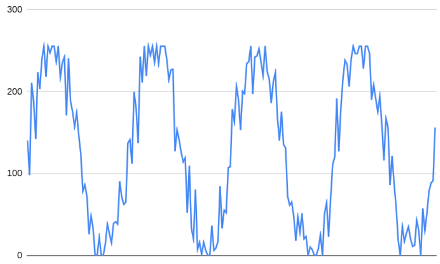
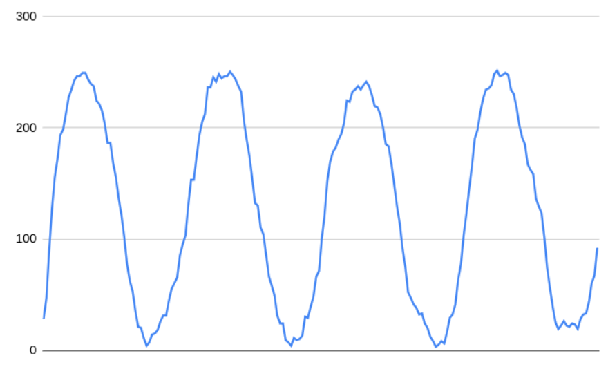

# ADC - PWM - Preparatório

| Lab 5 - ADC / PWM - Preparatório                          |
|-----------------------------------------------------------|
| **Deadline**: {{lab_adc_pwm_pre_deadline}}                |
| **Atividade:** [classroom]({{lab_adc_pwm_pre_classroom}}) |
| 💰 30% nota de lab                                        |


!!! exercise "Leitura prévia"

    Para realizar este laboratório você deve estudar antes:
   
    - ADC: [📕 ==RP2040/ADC==](/site/rp2040/rp2040-adc)
    - PWM: [📘 ==RP2040/PWM==](/site/rp2040/rp2040-pwm)

## Atividade

Lembre-se de sempre executar no Linux e dentro do dev. container! Valide enviando o código para o GitHub! A qualidade de código está ativada, então se o seu código falhar, verifique em qual etapa foi, pode ser por conta de qualidade de código!

!!! exercise "exe 1"
    - Arquivo: `exe1/main.c`
    - Teste: Verifica printf

    > Objetivo: Configurar mais um ADC
    
    O código fornecido configura o ADC 1 (`GP27`) para fazer a leitura do valor do potenciometro conectado nele. Configure o pino ADC 0 (`GP26`) para fazer a leitura do outro potenciometro. 
    
    Valor esperado na serial:
    
    ```
    voltage 1: 1.650806 V
    voltage 2: 2.650806 V
    voltage 1: 1.520806 V
    voltage 2: 2.120806 V
    ```
    
    > Dicas:
    
    Você vai precisar consultar o diagrama com o [MUX do ADC](/site/rp2040/imgs/adc.png) para saber o ID que deve usar
    
!!! exercise "exe 2"
    - Arquivo: `exe2/main.c`
    - Teste: Verifica pinos dos leds
    
    O exemplo fornecido configura o PWM no pino do LED R para operar em 80% de duty cycle, configure o pino do LED G para operar com 20% de Duty Cycle.
    
    ==A diferença na intensidade do LED não é vísivel no wokwi, mas vai ser no mundo real!==
    
!!! exercise "exe 3"
    - Arquivo: `exe2/main.c`
    - Teste: O valor que sai no terminal.
    
    O mundo analógico não é de brincadeira, um valor pode ter muito ruído devido a diversos fatores. Uma forma fácil de filtrar um ruído que possui uma frequência maior que a do sinal é via um filtro passa baixas (lembram de camada?).
    
    A média móvel é um filtro passa baixa simples de implementar, a ideia é que fazemos uma média do sinal que está entrando a fim de minimizarmos informaćoes de alta frequência que podem ser ruído. A média móvel é definida pelo tamanho da janela que iremos aplicar o filtro, ou seja uma média móvel de janela 5 funciona da seguinte maneira: Considere A como o valor de entrada e gera uma saída y:
    
    - `A[5]`: Indica a quinta amostra, `A[4]` a quarta amostra...
    
    $y = \frac{A_{5} + A_{4} + A_{3} + A_{2} + A_{1}}{5}$
    
    Agora considere a próxima amostra: `A[6]` a nova saída é o vetor rotacioado (descartasse a amostra mais antiga) e o novo valor adicionado no vetor: 
    
    $y = \frac{\boldsymbol{A_{6}} + A_{5} + A_{4} + A_{3} + A_{2}}{5}$
    
    > Da para implementar a média móvel de duas maneiras: com um vetor ou de forma recursiva. 
    
    - Livro com ótima explicaćão: [The Scientist and Engineer's Guide to Digital Signal Processing](https://www.analog.com/media/en/technical-documentation/dsp-book/dsp_book_ch15.pdf)
    
    ## Tarefa
    
    Para todos os dados que chegam na fila `xQueueData`, aplicar uma média móvel de tamanho 5 e imprimir o dado filtrado na UART. 
    
    O dado que chega na fila é um inteiro que possui uma senoide com um ruído:
    
    
    
    E vocês aplicando a média móvel devem obter algo assim:
    
    
    
    ## Esperado na UART
    
    ```
    28 
    47 
    89 
    127 
    155 
    172 
    193  
    ```
    
    !!! tip ""
        Você pode pegar esses dados e plotar no google sheets para ver se o resultado é o esperado.
