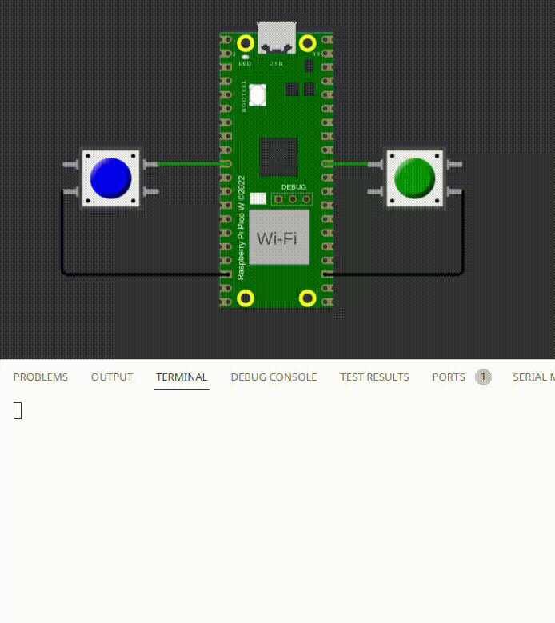

# GPIO - Preparatório

| Lab 1 - GPIO - Preparatório                            |
|--------------------------------------------------------|
| **Deadline**: {{lab_gpio_pre_deadline}}                |
| **Atividade:** [classroom]({{lab_gpio_pre_classroom}}) |

!!! exercise "Leitura delay"

    Para realizar este laboratório você deve estudar antes.
   
    - O que é delay e como ele funciona: [📕 ==RP2040/Delay==](/site/rp2040/rp2040-delay)
    - O que é o periférico GPIO: [📘 ==RP2040/GPIO==](/site/rp2040/rp2040-gpio)
    
## Labs preparatórios

!!! info
    {width=100px, align=left}
    
    Realizar dentro do Linux com o seu ambiente já pre configurado. 
    
    - Se você ainda não configurou, siga os passos em [Útil/infra](/site/infra-linux-docker)

    Acesse a atividade pelo link do classroom no topo da página.


A disciplina utilizará atividades preparatórias que ajudarão vocês no desenvolvimento dos laboratórios. Essas atividades devem ser realizadas no VSCode e, geralmente, ==não necessitam do uso da placa de desenvolvimento==. O objetivo é desacoplar um pouco os elementos; com o simulador, é possível praticar apenas o código e alguns aspectos da conexão de hardware, sem a complexidade de montar os componentes eletrônicos.

Esta entrega possui verificação automática. Para validar a entrega, envie o código para o seu repositório no GitHub e verifique o resultado do Actions. O sistema verifica:

- Se o código compila.
- Teste de unidade em cada código *(se ele funciona como deveria funcionar)*.
- Análise da qualidade de código:
    - cppcheck *(erros básicos de linguagem C)*
    - embedded-check *(erros conceituais de sistemas embarcados)*

Agora vamos começar. Sugerimos que realizem um exercício por vez e, após concluído, enviem para o GitHub para verificação.

!!! video
    

## Atividades

Agora execute os exercícios, lembre que você pode consultar os snippets de código dentro de [RP2040/GPIO/snippets](/site/rp2040/rp2040-gpio/#snippets)

!!! exercise "exe1"
    - Arquivo: `exe1/main.c`
    - Teste: Verifica se os dois LEDs mudam de estado.
    
    #### Código
    
    Faça os dois LEDs do `exe1` piscarem ao mesmo tempo! O código fornecido já funciona com o LED vermelho, agora você deve fazer o mesmo com o amarelo. ==Lembre de manter o vermelho piscando junto!==
    
    #### Funcionalidade esperada
    
    
    
!!! exercise "exe2"
    - Arquivo: `exe2/main.c`
    - Teste: Aperta um dos botões e verifica a mensagem no terminal.
    
    #### Código
    
    1. botão 1 for apertado imprima na tela: `Botao 1`
    1. botão 2 for apertado imprima na tela: `Botao 2`
    
    Lembre de configurar o botão 2 como entrada!
    
    ```c 
    // Usar o printf a seguir:
    printf("Botao 1\n");
    printf("Botao 2\n");
    ```
 
    #### Funcionalidade esperada
    
    
    
!!! exercise "exe3"
    - Arquivo: `exe3/main.c`
    - Teste: Aperta um dos botões e verifica se o LED correspondente muda de valor.
    
    #### Código

    Toda vez que o botão for apertado inverta o estado do LED de cor relativa.
    
    Exemplo: Ambos os leds estão apagados, quando o botão vermelho for apertado, acenda o LED Vermelho. Se o Botão for apertado e solto novamente, apague o LED Vermelho. Faça o mesmo para o Verde!. 

    Lembre de configurar todos os pinos como Entrada ou Saída.

    #### Funcionalidade esperada
    
    
    
!!! exercise "exe4"
    - Arquivo: `exe4/main.c`
    - Teste: Verifica se os LEDs acendem na ordem certa.
    
    #### Código

    Toda vez que o Btn Vermelho for apertado, faca os LEDs acenderem na ordem: Vermelho, Roxo, Azul e Verde. ==Só acenda um LED por vez!==.
    
    Utilize um delay de `300ms` entre os estados.

    #### Funcionalidade esperada
    
    
