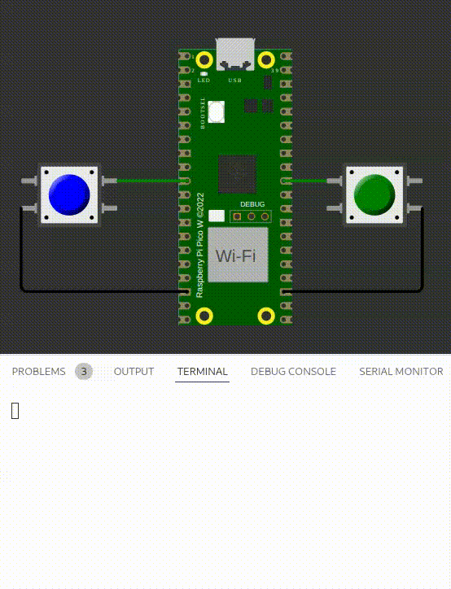

# GPIO - Preparatório

| Lab 1 - GPIO - Preparatório                        |
|----------------------------------------------------|
| **Deadline**: {{lab_gpio_pre_deadline}}            |
| 💰 30% nota de lab (junto com qualidade de código) |


Os laboratórios de embarcados são compostos de duas partes: uma chamada pré-lab, onde praticamos um pouco em um ambiente simulado, e outra chamada prática, onde realmente usamos o microcontrolador e controlamos algo real.

Aqui, iremos aprender sobre os conceitos básicos do microcontrolador.

!!! exercise "Leitura prévia"

    Para realizar este laboratório você deve estudar antes.
   
    - O que é delay e como ele funciona: [📕 ==RP2040/Delay==](/site/rp2040/rp2040-delay)
    - O que é o periférico GPIO: [📘 ==RP2040/GPIO==](/site/rp2040/rp2040-gpio)

### Praticando

!!! exercise
    Leia sobre os laboratórios preparatórios:
    
    - [labs/preparatórios](/site/labs/pre-lab)

!!! exercise "Entrega 3: Firmware"
    
    Acesse o repositório via o link a seguir, clone para a sua máquina e trabalhe nele usando o wokiwi:
    
    - [classroom firmware 1 (original)]({{lab_gpio_pre_classroom}}) 

Agora execute os exercícios, lembre que você pode consultar os snippets de código dentro de [RP2040/GPIO/snippets](/site/rp2040/rp2040-gpio/#snippets) e enviar o código para o github para validação.

!!! exercise "exe1"
    - Arquivo: `exe1/main.c`
    - Teste: Verifica se os dois LEDs mudam de estado.
    
    #### Código
    
    Faça os dois LEDs do `exe1` piscarem ao mesmo tempo! O código fornecido já funciona com o LED vermelho, agora você deve fazer o mesmo com o amarelo. ==Lembre de manter o vermelho piscando junto!==
    
    #### Funcionalidade esperada
    
    
    
!!! exercise "exe2"
    - Arquivo: `exe2/main.c`
    - Teste: Aperta um dos botões e verifica a mensagem no terminal.
    
    #### Código
    
    1. botão 1 for apertado imprima na tela: `Botao 1`
    1. botão 2 for apertado imprima na tela: `Botao 2`
    
    Lembre de configurar o botão 2 como entrada!
    
    ```c 
    // Usar o printf a seguir:
    printf("Botao 1\n");
    printf("Botao 2\n");
    ```
 
    #### Funcionalidade esperada
    
    
    
!!! exercise "exe3"
    - Arquivo: `exe3/main.c`
    - Teste: Aperta um dos botões e verifica se o LED correspondente muda de valor.
    
    #### Código

    Toda vez que o botão for apertado inverta o estado do LED de cor relativa.
    
    Exemplo: Ambos os leds estão apagados, quando o botão vermelho for apertado, acenda o LED Vermelho. Se o Botão for apertado e solto novamente, apague o LED Vermelho. Faça o mesmo para o Verde!. 

    Lembre de configurar todos os pinos como Entrada ou Saída.

    #### Funcionalidade esperada
    
    
   
!!! exercise "exe4"
    - Arquivo: `exe4/main.c`
    - Teste: Verifica se os LEDs acendem na ordem certa.
    
    #### Código

    Toda vez que o Btn Vermelho for apertado, faca os LEDs acenderem na ordem: Vermelho, Roxo, Azul e Verde. ==Só acenda um LED por vez!==.
    
    Utilize um delay de `300ms` entre os estados.

    #### Funcionalidade esperada
    
    
    
    
 !!! exercise "exe5"
    - Arquivo: `exe5/main.c`
    - Teste: Aperta um dos botões e contar apenas uma vez!
    
    Bouncing é um problema encontarado em botões mecânicos, um botão pode ser entendido como um sistema massa mola, que quando apertado
    vibra e pelo microcontrolador ser muito rápido, ele interpreta isso como várias apertadas.
    
    #### Código

    Imprima via printf quantas vezes o botão foi apertado, implemente um código de **debouncing** que filtra a vibracão do botão.
    
    
    
    #### Funcionalidade esperada
    
    
