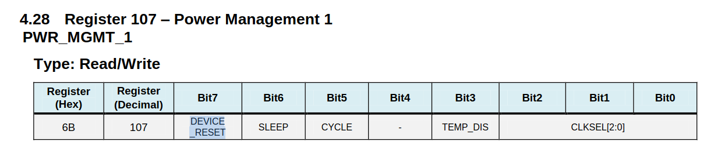
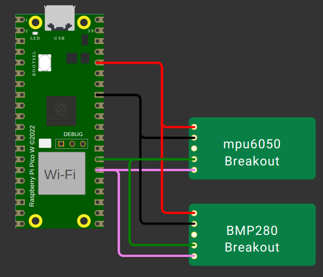

# I2C - Preparatório

| Lab 6 - Preparatório                               |
|----------------------------------------------------|
| **Prazo**: {{lab_i2c_pre_deadline}}                |
| **Atividade:** [classroom]({{lab_i2c_pre_classroom}}) |
| 💰 30% da nota de lab                              |

!!! exercise "Leitura prévia"

    Para realizar este laboratório, você deve estudar antes:
   
    - i2c: [📕 **RP2040/i2c**](/site/rp2040/rp2040-i2c)

## Atividade

Neste pré-lab, exploraremos um pouco a comunicação i2c usando como base o sensor MPU6050, que é uma unidade inercial que possui internamente um acelerômetro e um giroscópio. Para isso, você terá que consultar o manual de registradores desse sensor:

- [Mapa de registradores do MPU6050](https://invensense.tdk.com/wp-content/uploads/2015/02/MPU-6000-Register-Map1.pdf)

!!! exercise "exe 1"
    - Arquivo: `exe1/main.c`

    O código fornecido configura o registrador `0x6B`:`PWR_MGMT_1` colocando o valor `1` no bit `7:DEVICE_RESET`, fazendo com que o dispositivo reinicie e opere com os valores de fábrica.
    
    
    
    Agora, consultando o [manual](https://invensense.tdk.com/wp-content/uploads/2015/02/MPU-6000-Register-Map1.pdf), acesse o `ACCEL_CONFIG` e configure o acelerômetro para operar no range de 4G.

!!! exercise "exe 2"
    - Arquivo: `exe2/main.c`

    O código fornecido faz a leitura do registrador `0x75`:`WHOAMI`, que é um registrador contendo uma informação que confirma o ID do chip. Você deve ler o valor do `INT_ENABLE` e imprimir na serial usando o seguinte printf:
    
    ```c
    printf("INT_ENABLE: 0x%X \n", buffer[0]);
    ```

!!! exercise "exe 3"
    - Arquivo: `exe2/main.c`
    
    O I2C permite conectar dois periféricos no mesmo barramento. No exemplo, conectamos o `BMP280`, um sensor de temperatura e pressão da Bosch. Você deve acessar o registrador ID e imprimir o valor lido na serial:
    
    ```
    printf("BMP280 ID: 0x%X \n", buffer[0]);
    ```

    Consulte o [manual do BMP280](https://cdn-shop.adafruit.com/datasheets/BST-BMP280-DS001-11.pdf) e extraia a informação do endereço padrão desse sensor e do endereço do registrador que possui o ID.

    
