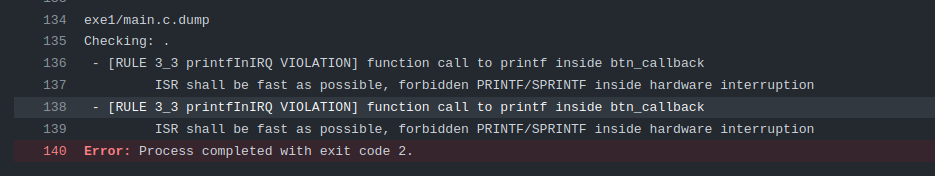

# IRQ - Preparatório

| Lab 2 - IRQ - Preparatório                          |
|-----------------------------------------------------|
| **Prazo**: =={{lab_irq_pre_deadline}}==             |
| **Entrega:** [classroom]({{lab_irq_pre_classroom}}) |
| 💰 30% nota de lab                                  |

!!! exercise "Leitura prévia"

    Para realizar este laboratório você deve estudar antes.
   
    - O que é uma IRQ de GPIO: [📘 ==RP2040/GPIO IRQ==](/site/rp2040/rp2040-gpio-irq)

## Qualidade de código

Antes de seguir para a atividade com GPIO, relizar os exercícios de qualidade de código.

!!! exercise "Qualidade de código"
    Realizar os dois exercícios:
    
    - [Code Quality / Head File](site/CodeQuality/isr-variables/)
    - [Code Quality / ISR variáveis](site/CodeQuality/isr-handler/)

## Atividade

Lembrem de sempre executar no Linux e dentro do dev. container! Validar enviando o código para o github! A qualidade de código está ativada, então se seu código falhar, verique em qual etapa foi, pode ser por conta de qualidade de código!

!!! exercise "exe1"
    - Arquivo: `exe1/main.c`
    - Teste: Verifica se o `printf` é executado na função principal.
    
    #### Código
    
    O código fornecido configura a interrupção no pino do botão e, toda vez que ele for pressionado, imprime `fall` no terminal; e quando ele é solto, imprime `rise`. O código funciona, mas possui ==um erro de qualidade de código!== Não devemos usar `printf` dentro de interrupções!
    
    
    
    Modifique o código adicionando uma flag e realize o `printf` na função `main`. O comportamento deve ser o mesmo, mas a forma como lidaremos com o evento é diferente!
    
    #### Funcionalidade esperada
    
    

!!! exercise "exe2"
    - Arquivo: `exe2/main.c`
    - Teste: Verifica se o LED muda de valor sempre que o botão é pressionado.
    
    #### Código
    
    Utilizando interrupção no pino do botão, faça com que o LED mude de valor sempre que o botão for pressionado (não fazer nada quando for solto)! Lembre-se de utilizar uma `flag` e sempre fazer o processamento na `main`!  
    
    #### Funcionalidade esperada

    

!!! exercise "exe3"
    - Arquivo: `exe3/main.c`
    - Teste: Verifica se o `printf` é executado corretamente.
    
    #### Código
    
    O código fornecido configura a interrupção no pino de dois botões e, toda vez que um deles for pressionado, imprime `fall red` ou `fall green` no terminal. O código funciona, mas possui ==um erro de qualidade de código!== Não devemos usar `printf` dentro de interrupções!

    Modifique o código adicionando agora duas flags e realize o `printf` na função `main`. O comportamento deve ser o mesmo, mas a forma como lidaremos com o evento é diferente!

    #### Funcionalidade esperada

    

!!! exercise "exe4"
    - Arquivo: `exe4/main.c`
    - Teste: Verifica se os LEDs se comportam corretamente
    
    #### Código
 
    Configure os botões com IRQs:
    
    - Botão vermelho: Borda de descida (quando for pressionado)
    - Botão verde: Borda de subida (quando for solto)

    Toda vez que o botão vermelho for pressionado, inverta o estado do LED vermelho e toda vez que o botão verde for solto, inverta o estado do LED verde.

    #### Funcionalidade esperada
  
    ==Note a diferença entre as boardas de subida e descida de cada botão.==

    
