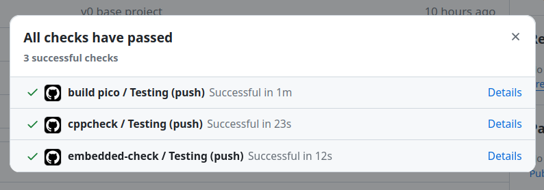

# Lab prática
<!--intro-start-->

As atividades de laboratório demandam que vocês utilizem a placa física, e a entrega é composta de duas frentes:

- Mostrar o projeto funcionando.
- Código sem qualidade de código.

Para conseguir executar o código na placa, será necessário seguir os passos descritos em [Pico W/Programando](/site/pico/pico-debugging).

## Desenvolvendo

Para desenvolver as atividades práticas será necessário utilizar a placa de desenvolvimento. E para isso ter o `depbug-probe` instalado e o kit junto:

{width=400}

## Validando prática

Vocês possuem uma semana para terminarem o lab e apresentar o projeto montado e funcionando para alguém da equipe. Consultar **horários disponíveis** para apresentar o laboratório.

| Horário         | Segunda-feira           | Terça-feira         | Quarta-feira        | Quinta-feira            | Sexta-feira                 |
|-----------------|-------------------------|---------------------|---------------------|-------------------------|-----------------------------|
| **09:45-12:00** | Marco ==(Arquitetura)== |                     |                     | Corsi ==(Arquitetura)== | Corsi ==(PD1 6andar TI23)== |
| **18:00-19:00** |                         | Daniel ==(Ágil 2)== | Daniel ==(Ágil 2)== | Daniel ==(Ágil 2)==     |                             |

Lembrando que:

- Os laboratórios possuem nota binária: PASS/ FAIL
- Para validar a entrega vocês devem:
    - Entregar código no github (sem falhas de qualidade de código)
    - Apresentar protótipo funcionando até data limite

## Validando qualidade de código

Você deve obter algo como:

