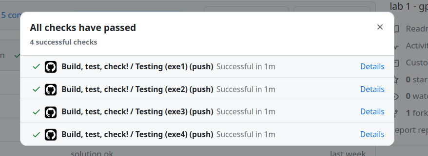

# Sobre preparatório
<!--intro-start-->

!!! info
    {width=100px, align=left}
    
    Realizar dentro do Linux com o seu ambiente já pre configurado. 
    
    - Se você ainda não configurou, siga os passos em [Útil/infra](/site/infra-linux-docker)

    Acesse a atividade pelo link do classroom no topo da página.

## Desenvolvendo os exercícios

A disciplina utilizará atividades preparatórias que ajudarão vocês no desenvolvimento dos laboratórios. Essas atividades devem ser realizadas no VSCode e, geralmente, ==não necessitam do uso da placa de desenvolvimento==. O objetivo é desacoplar um pouco os elementos; com o simulador, é possível praticar apenas o código e alguns aspectos da conexão de hardware, sem a complexidade de montar os componentes eletrônicos.

!!! video
    

## Testando exercícios

Esta entrega possui verificação automática. Para validar a entrega, envie o código para o seu repositório no GitHub e verifique o resultado do Actions. O sistema verifica:

- Se o código compila.
- [Teste de unidade]()[^1] em cada código.
- Análise da qualidade de código:
    - cppcheck *(erros básicos de linguagem C)*
    - embedded-check *(erros conceituais de sistemas embarcados)*

[^1]: Utilizamos o `wokiwi-ci` para verificar se o seu código faz o que deveria fazer.

Vocês devem obter o seguinte resultado no actions:

