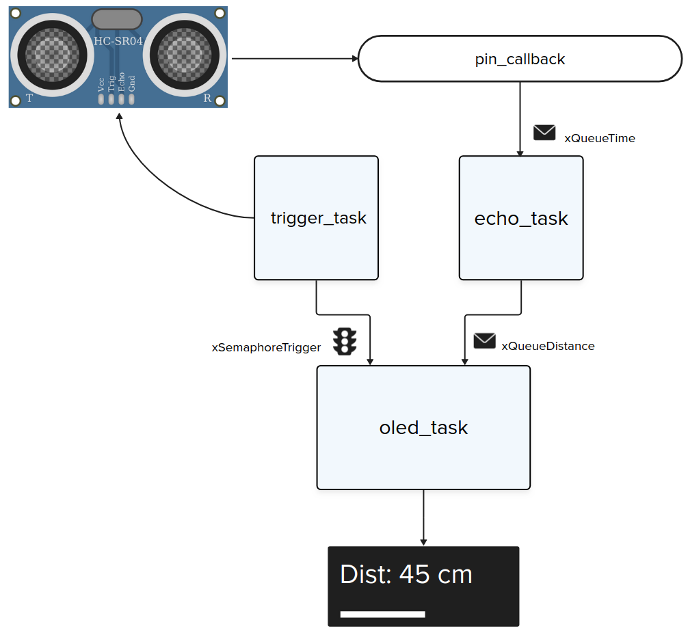

# RTOS - Prática

| Lab 4 - GPIO - Prática                                 |
|--------------------------------------------------------|
| **Deadline**: =={{lab_rtos_pra_deadline}}==            |
| [Repositório no classroom]({{lab_rtos_pra_classroom}}) |
| 💰 70% nota de lab                                     |

## Sobre os laboratórios prática

!!! exercise
    - Ler sobre o [Dispositivos/OLED1](/site/dispositivos/oled1) antes de seguir.
    
!!! warning
    Agora surgem novas regras, consulte a página: [CodeQuality/RTOS](site/CodeQuality/rtos) para saber as regras que serão aplicadas.
    
O projeto exemplo fornecido possui um RTOS e duas `tasks`, sendo que só uma está ativada. O código exemplo fornece uma demo de como utilizar a placa OLED1 e as bibliotécas gráficas.

Para comecar de uma olhada no código fornecido e o execute na placa. Depois de executar a primeira versão, mude a task criada para executar um outro demo que modifica o tamanho das fontes:

```c
int main() {
    stdio_init_all();

    xTaskCreate(oled1_demo_1, "Demo 1", 4095, NULL, 1, NULL);
    //xTaskCreate(oled1_demo_2, "Demo 2", 4095, NULL, 1, NULL);

    vTaskStartScheduler();

    while (true)
        ;
}
```

## Praticando

Vamos mexer novamente com o sensor de `ultrassom`, só que agora iremos estruturar o código para operar com `rtos` e exibir o resultado no OLED. 

!!! info
    Você deve seguir necessáriamente a estrutura proposta a seguir

A estrutura do código que deve ser entrega, deve seguir o diagrama a seguir, onde:

- `pin_callback`: Função callback do pino do echo.
- `trigger_task`: Task responsável por gerar o trigger.
- `echo_task`: Task que faz a leitura do tempo que o pino `echo` ficou levantado.
- `oled_task`: Task que exibe a informação da distancia no display.
    - Faz uso de dois recursos, `xSemaphoreTrigger` e `xQueueDistance`

Recursos:
    
- `xQueueTime`: Fila com informação do tempo `to_us_since_boot`
- `xSemaphoreTrigger`: Avisa o OLED que uma leitura foi disparada
- `xQueueDistance`: Valor da distância em cm lido pela `task_echo`



### Display

Você deve exibir no display:

- Se o sensor falhou
- O valor da distância, quando executada
- Uma barra que representa a distância

