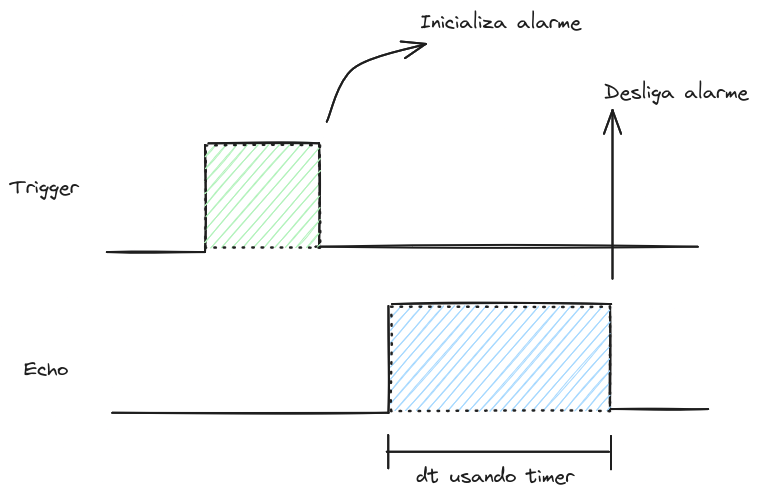
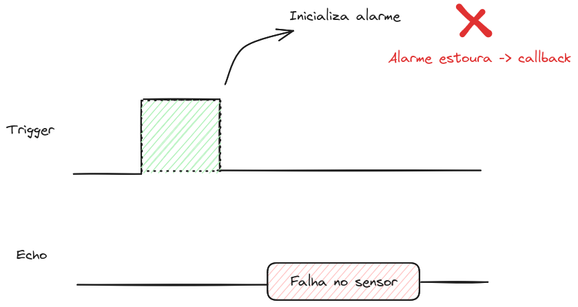

# Timer - Prática

| Lab 3 - Timer - Prática                               |
|-------------------------------------------------------|
| **Prazo**: =={{lab_timer_pra_deadline}}==               |
| [Repositório no classroom]({{lab_timer_pra_classroom}}) |
| 💰 70% nota de lab                                    |

Neste laboratório, aplicaremos os conceitos de timer para realizarmos a leitura de um sensor de distância e criarmos um dataloger.

!!! info "HC-SR04"
    !!! video
        

Para isso, vocês precisarão de:

| Lista de Materiais | Valor   |
|--------------------|---------|
| 1x HC-SR04         | R$ 14,00 |

## Requisitos

O sistema deve fazer a interface com o módulo de ultrasom, fazer a leitura de forma periódica e enviar os valores pela UART. Além disso, o sistema deve poder ser configurado via um terminal.

### Leitura

Vocês devem utilizar o periférico de timer para fazer a leitura do tempo que o `Echo` fica em alto. Além disso, devem usar um alarme para detectar se por algum motivo o sensor não retornou um sinal.

=== "Leitura correta"
    A imagem a seguir ilustra uma leitura normal do sensor:

    
=== "Leitura com erro"
    E a imagem a seguir ilustra uma falha no sensor, nesse caso o alarme estoura e o sistema fornece uma mensagem de erro.

    

### Terminal

O usuário deve ser capaz de controlar algumas opções do sistema pelo terminal:

- `Start`: Inicializa a leitura
- `Stop`: Para a leitura

Em modo start o sistema deve produzir um log no terminal com a hora, minuto e segundo que a leitura foi realizada e o valor da distância:

```
22:10:01 - 100 cm
22:10:02 -  89 cm
22:10:03 -  70 cm
22:10:04 -  50 cm
....
23:03:01 - Falha
```

Resultado esperado:


### Dicas

A seguir algumas dicas de como fazer, você pode ou não seguir:

1. Comece pela leitura do sensor (imprima o resultado na serial).
1. Implemente a detecção de falha.
    - Para testar basta desconectar qualquer fio do sensor!
1. Adicione o RTC (atualize o print).
1. Implemente a parte de leitura da serial.

- Para ler dado da serial/terminal sem que o programa fique travado para sempre esperando um dado.

```c
// Return a character from stdin if
// there is one available within a timeout. 
int getchar_timeout_us (uint32_t timeout_us)
```

- [Documentaćão - API ](https://www.raspberrypi.com/documentation/pico-sdk/runtime.html#ga9b10b3bc1a4750fcb0e691566bc868e8)

!!! info
    Não esqueçam de verificar o code quality! Agora ele vai começar a apitar na cabeça de vocês!

## Desafios extras

Gostou e quer fazer mais? Que tal:

- Pense em uma forma de calibrar o sensor.
- Tente ler dois sensores ao mesmo tempo.
- Modo alerta, se a distância chegar a um limite gere um som de alarme!
- Crie um código em python para exibir o valor.
