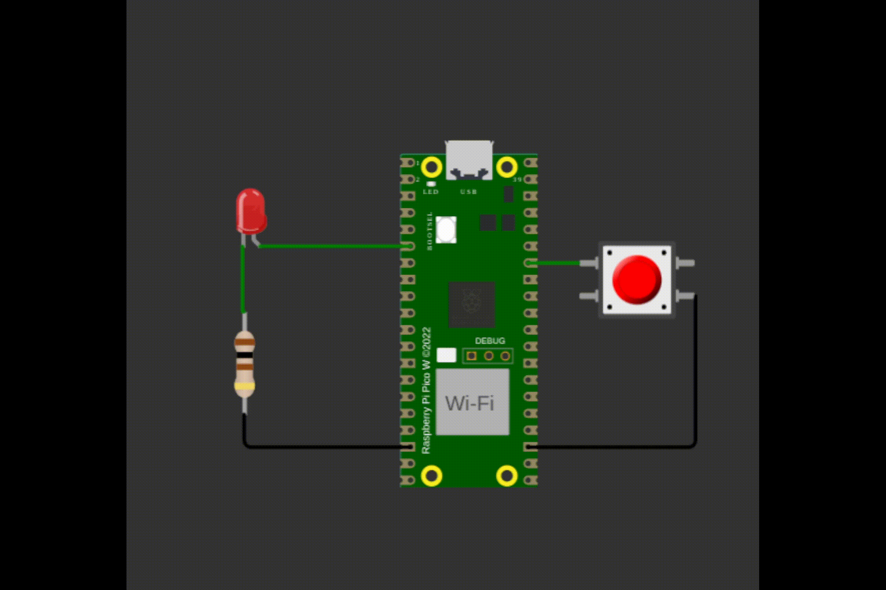
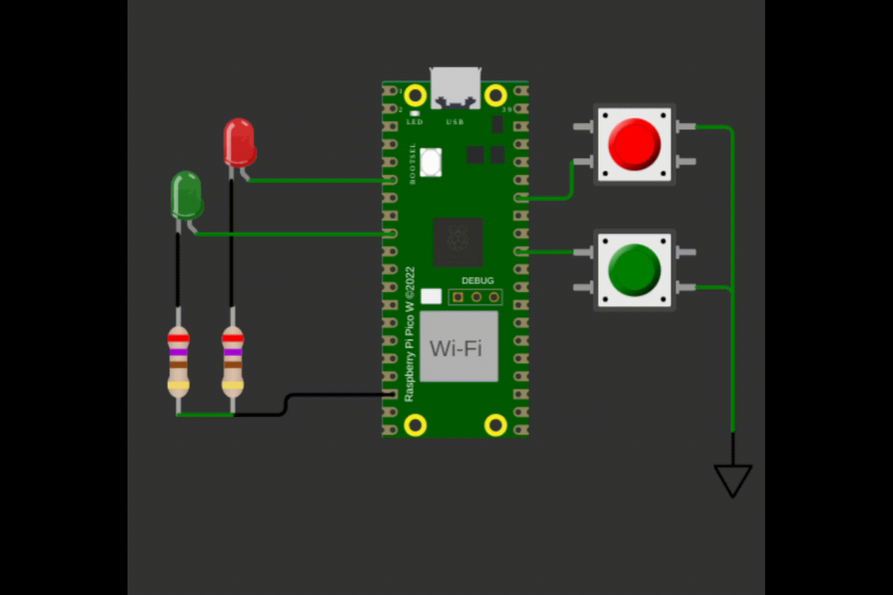
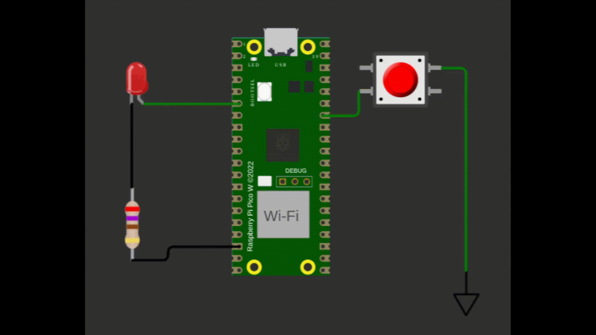

# Timer - Preparatório

| Lab 3 - Timer - Preparatório                            |
|---------------------------------------------------------|
| **Deadline**: {{lab_timer_pre_deadline}}                |
| **Atividade:** [classroom]({{lab_timer_pre_classroom}}) |
| 💰 30% nota de lab                                      |

!!! exercise "Leitura prévia"

    Para realizar este laboratório você deve estudar antes.
   
    - Sobre o periférico timer: [📕 ==RP2040/Timer==](/site/rp2040/rp2040-timer)
    - Sobre o periférico RTC: [📘 ==RP2040/RTC==](/site/rp2040/rp2040-rtc)

## Atividade

Lembrem de sempre executar no Linux e dentro do dev. container! Validar enviando o código para o github! A qualidade de código está ativada, então se seu código falhar, verique em qual etapa foi, pode ser por conta de qualidade de código!

!!! warning
    Não vamos ter pré lab de RTC pq não conseguimos simular no wokwi!

!!! exercise "exe1"
    - Arquivo: `exe1/main.c`
    - Teste: Verifica o pino do LED

    Pisca LED chique!
    
    Quando o botão pressionado inicialize um timer repetitivo que opere a `500 ms`, sempre que o timer estourar, você deve mudar o valor do LED. Quando o botão for pressionado novamente, pare a execução do timer (`cancel_repeating_timer`).
    
    Tanto o botão quanto o LED devem operar com interrupção, lembrem de realizarem as operacoes na função main e não nos callbacks. 
    
    -  O LED deve sempre começar e terminar no estado apagado!

    

!!! exercise "exe2"
    - Arquivo: `exe2/main.c`
    - Teste: Verifica os pinos dos LEDs

    Árvore de natal.
    
    O mesmo comportamento do anterior, só que agora com vezes dois (deve utilizar dois timers). Para o LED vermelho usar `500 ms` e para o LED Verde usar `250 ms`. 
    
    -  Os LED devem sempre começar e terminar no estado apagado!

    

!!! exercise "exe3"
    - Arquivo: `exe3/main.c`
    - Teste: Verifica os pinos dos LEDs

    Aperto longo.
    
    Só considerar o botão como ativado quando ele for solto após ter sido mantido por um tempo longo pressionado (mais que 500 ms), isso deve ligar e desligar o LED. 
    
    -  Os LED devem sempre começar e terminar no estado apagado!

    Dica: 
    
    Da para fazer usando o tempo absoluto ou usando o alarme!
    
    

!!! exe4
    - Arquivo: `exe4/main.c`
    - Teste: Não tem
    
    Utilizando o RTC faca um LED físico piscar a cada 5 segundos.
 
    ==Precisa testar na placa real, wokwi não tem o RTC implementado.!==

    
