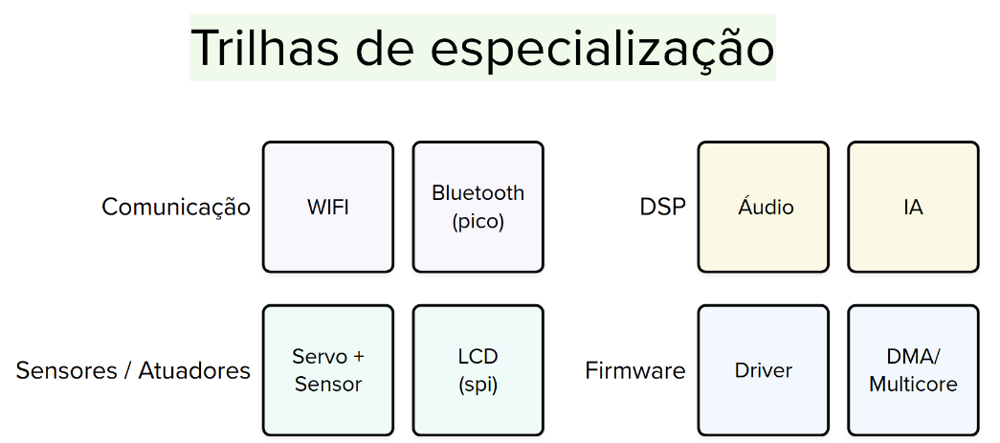
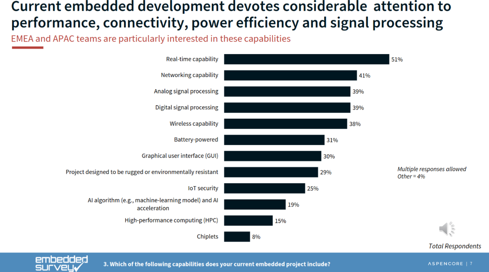

# Projeto aberto!

!!! info
    Preencha com a descricão do seu projeto:
    
    https://docs.google.com/forms/d/e/1FAIpQLSfwpA0wiwgLs_AHL28IuCGt1i-4y0dBHbSeeFcmRSKYT25qjA/viewform?usp=dialog

Agora é com vocês, já passaram por dois projetos e entenderam de que são capazes de fazerme coisas muito legais e complexas. Ter ideia não é fácil, então nós fizemos uma curadoria de algumas ideias, que vocês podem escolher fazer, ou usar para ter novas ideias:

- [Ideias](https://docs.google.com/spreadsheets/d/1G-PC3vaRSkxljorcNbnRracTNgGwdA5xolt-NPy4ndI/edit?gid=0#gid=0)

Outra coisa que ajuda ter ideias é saber o que vocês vão poder aprender na trilha de especializacão, a seguir temos um resumo:

A seguir um breve resumo:

- **Comunicação**: Aprender a utilizar outras formas de comunicação entre o uC e outro dispositivo.
    - WIFI: Como usar o wifi da nossa placa, enviar e receber dados de um servidor.
    - Blutooth: Nossa placa possuiu um blutooth muito melhor do que o HC-06, conseguimos fazer coisas como criar uma caixinha de som!
- **Processamento Digital de Sinais (DSP)**: Focada em como adquirir, tratar e processar sinais em sistemas embarcados, essa trilha avança até a aplicação de Inteligência Artificial.
    - Áudio: Aprender como coletar áudio e reproduzir o som em um falante.
    - IA: Aprender a treinar uma rede neural e executar ela na plaquinha, vamos usar a nossa IMU como entrada da rede.
- **Sensores e Atuadores**: Esta trilha aprofunda a compreensão sobre como podemos detectar e controlar o mundo físico usando módulos. Frequentemente, esses módulos requerem o uso de protocolos machine-to-machine (M2M), como I2C, SPI, entre outros.
    - Servo: Aprender a criar um 
- **Firmware**: Uma das principais preocupações em sistemas embarcados são os requisitos energéticos, segurança e confiabilidade. Esta trilha se dedica a aprofundar o entendimento sobre como desenvolver códigos eficientes.

As trilhas foram criadas com base na experiência da equipe e também utilizando como referência informações disponíveis sobre o desenvolvimento de produtos com sistemas embarcados, uma das referências utilizadas é um survey da `embedded.com`:

{width=400}

## Projeto

O projeto precisa:

- Ser em grupos de três! 
- Ter coisas das três trilhas.

Nota final:

- Vamos ter uma rubrica por especialidade.
- A nota final vai ser individual onde a trilha na qual você faz parte conta mais para a sua nota:
    - 2/4 sua especialidade, 1/4 outras especialidades.
    
## Outras fontes

Existem outras boas fontes de ideias:

- [hackaday](https://hackaday.io/discover)
- [tindie](https://www.tindie.com/)
- [adafruit](https://blog.adafruit.com/page/2/)
