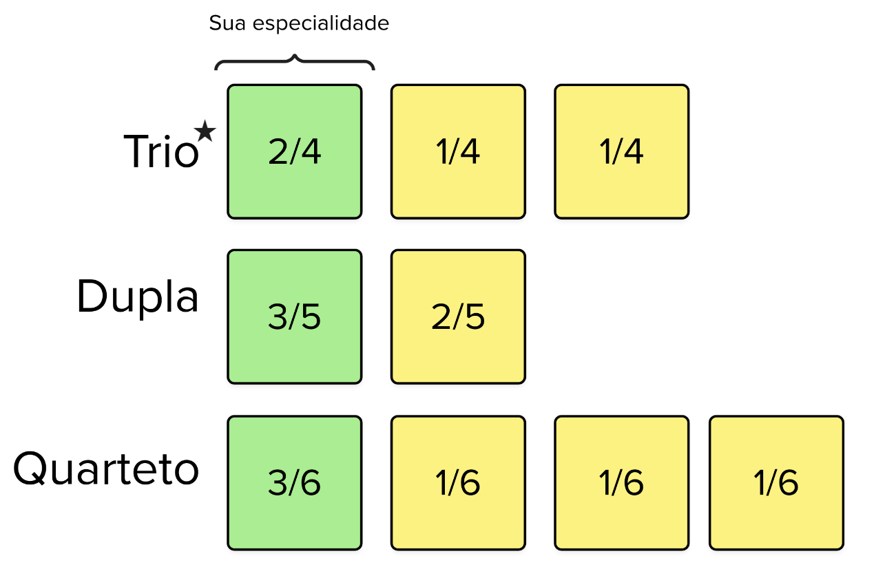

# Rubrica do Projeto

A nota final será composta pela avaliação do grupo nas especialidades que o projeto explora. A especialidade escolhida individualmente terá o maior peso na nota final (cada aluno terá uma nota diferente dos demais). As rubricas são dependentes apenas da especialidade escolhida, não do projeto em si.

Idealmente, vocês desenvolverão o projeto em trios. Nesse caso, a nota final será composta pela média entre a nota da sua especialidade e a média das outras especialidades do grupo. Para outros casos, consulte o esquema a seguir:

## Comunicação

O objetivo é que você seja capaz de estabelecer uma comunicação ponto a ponto com outro dispositivo (como um PC, servidor ou outra placa), enviando ou recebendo informações por essa rede.

### C (Mínimo)

- Envia **OU** recebe dados.
- Utiliza WiFi, Bluetooth ou USB nativos da placa Pico W.
- Documenta o protocolo de comunicação utilizado.

### Ganhando Pontos

Cada item a seguir adiciona meio ponto:

- Envia **E** recebe dados pela rede.
- Gerencia a conexão de forma eficiente (reconexão automática, tratamento de erros).
- Implementa mecanismos de otimização de dados (ex.: compressão de dados).
- Estabelece comunicação segura com criptografia.
- Implementa otimizações de energia.

## Firmware

A expectativa é que você estruture o firmware seguindo boas práticas, promovendo a redução de erros, a eficiência (em processamento e energia) e facilitando futuras alterações.

### C (Mínimo)

- Utiliza multi-core com RTOS.
- Organiza o código em bibliotecas.
- Documenta o firmware com diagramas de blocos (RTOS).

### Ganhando Pontos

- Compatível com o padrão MISRA-C.
- Isola outras especializações (ex.: comunicação, sensores) em diferentes tarefas.
- Adota e documenta um padrão de estilo seguido em todo o código.
- Utiliza DMA.
- Implementa estratégias de economia de energia.

## DSP

Na especialidade de DSP, espera-se que você seja capaz de amostrar sinais analógicos do mundo real, processá-los e extrair informações. Você pode utilizar técnicas modernas de processamento de sinais, como IA, ou métodos clássicos, como filtros e FFT.

### C (Mínimo)

- Aquisição e extração de informações de um sinal por meio de IA ou teoria clássica.
- Documenta o processo de tratamento do sinal, com explicações dos algoritmos usados.
- A documentação deve incluir diagramas de fluxo e limitações dos algoritmos utilizados.

### Ganhando Pontos

- Geração de um sinal.
- Processamento em tempo real de sinais.
- Uso de FFT (Transformada Rápida de Fourier) para análise de frequências.

## Sensores e Atuadores

Nesta especialidade, você deve ser capaz de usar novos dispositivos e criar soluções mais integradas entre hardware e usuário, dominando o uso de sensores e atuadores.

### C (Mínimo)

- Exibe informações via display e usa sensor não abordado nos labs.
- Sistema integrado em um protótipo (case).
- Documenta o funcionamento dos módulos e as bibliotecas usadas para cada sensor e atuador.

### Ganhando Pontos

- Implementa calibração de sensores e detecção de falhas.
- Implementa filtros básicos para leituras de sensores (ex.: filtro de média móvel).
- Otimiza o consumo de energia em sensores e atuadores, reduzindo leituras em modo de baixa energia.
- Realiza fusão de dados de múltiplos sensores.
- Desenvolvimento de algoritmos de controle (ex.: PID) para controle de atuadores.
