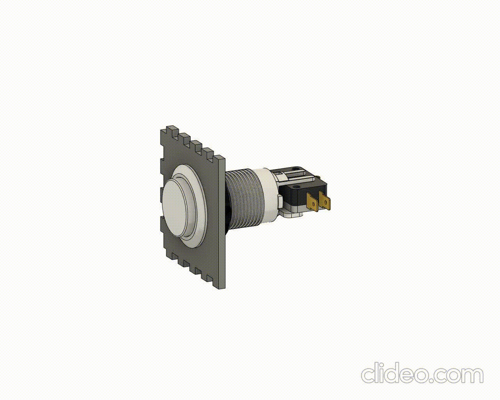

# Botão de Arcade

O botão de arcade necessita somente de um **furo de 28mm** para que consiga passe livre e seja rosqueado por dentro.

> ## **_ARQUIVOS_**
>
>[DXF](./files/corteBotaoArcade.dxf)
>
>[SVG](./files/corteBotaoArcade.svg)
>
>[f3d](./files/botaoArcade.f3z)

