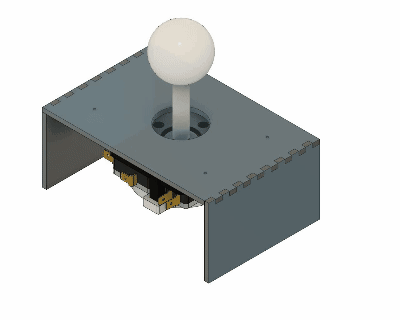

# Joystick

> ## **_ARQUIVOS_**
>
>[DXF Topo](./files/Top.dxf)
>[DXF Espaçador](./files/Espacador.dxf)
>
>[SVG Topo](./files/Top.svg)
>[SVG Espaçador](./files/Espacador.svg)
>
>[f3d](./files/botaoArcade.f3z)

