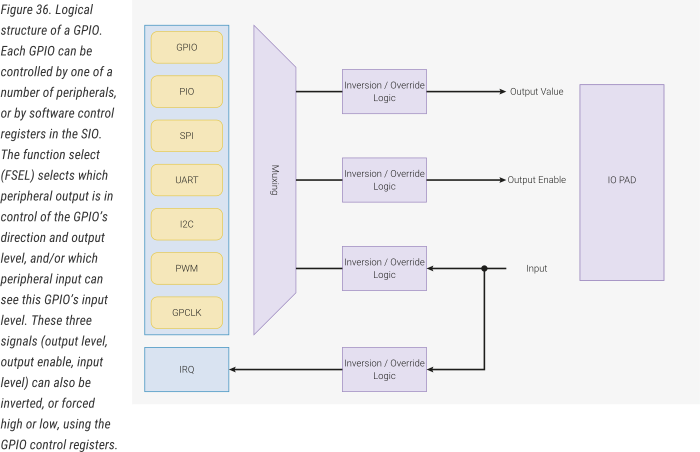
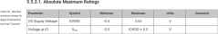
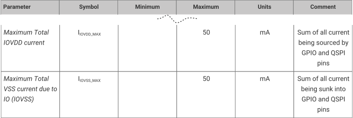

#  GPIO - General Purpose Input / Output

| Links |
|-------|
| [datasheet]      |
| [sdk] |
| [examples] |

[sdk]:  https://www.raspberrypi.com/documentation/pico-sdk/hardware.html#hardware_gpio

[datasheet]: https://datasheets.raspberrypi.com/rp2040/rp2040-datasheet.pdf#section_gpio

[examples]: https://github.com/raspberrypi/pico-examples/tree/master/gpio

Periférico responsável por controlar digitalmente um pino da rp2040 e interligar os pinos aos periféricos internos do microcontrolador. Os pinos da rp2040 são divididos em dois bancos, porem um dos bancos é dedicado a leitura do programa de uma memória FLASH (`QSPI` bank), sobrando apenas o banco `GPI0` para o desenvolvedor. Este banco possui 30 pinos (`GPIO0` .. `GPIO29`) que podem ser usados tanto como entrada quanto como saída.

O GPIO opera como um mux, permitindo que outros periféricos internos do microcontrolador também acessem os pinos, como ilustrado na figura abaixo extraído do manual:

### Importante

Conforme manual respeite a tensão máxima de `3.3V` no pino da rp2040:

E a corrente máxima nos pinos (entrada ou saída) em `50mA`:

