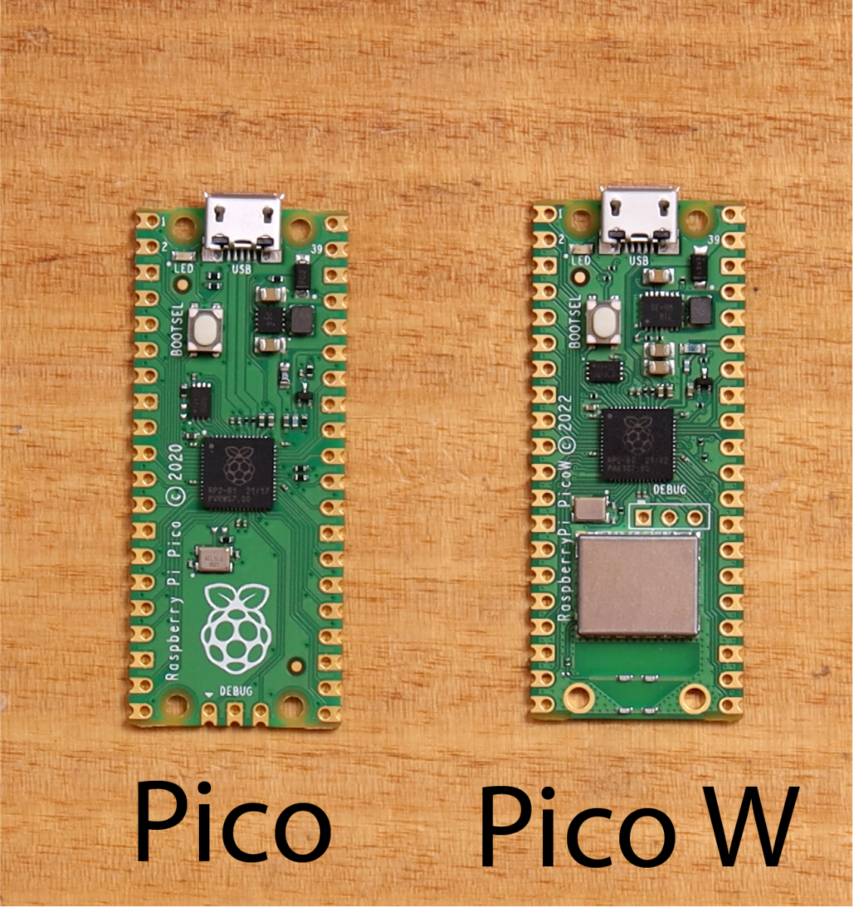

# Pico - W 

O `Raspberry Pi Pico` e o `Pico W` são bem semelhantes. Para a grande maioria dos projetos não haverá diferença, tanto que até o momento não haviamos falado da existencia dessa versão Pico W. O `Raspberry Pi Pico W` é uma versão do Pico que inclui conectividade wireless de 2.4GHz, isso abre oportunidades para uma variedade maior de aplicações.



!!! tip
    Datasheet Pico W: [https://datasheets.raspberrypi.com/picow/pico-w-datasheet.pdf](https://datasheets.raspberrypi.com/picow/pico-w-datasheet.pdf)


## Chip CYW43439

Ambas as versões, Pico e Pico W, utilizam o mesmo microcontrolador RP2040. A principal diferença está na inclusão do chip CYW43439 da Infineon no Pico W, que adiciona as seguintes funcionalidades wireless:


- WiFi 4 (802.11n), Single-band (2.4 GHz)
- WPA3
- SoftAP (Até 4 clientes)
- Bluetooth 5.2
    - Suporte para Bluetooth LE Central and Peripheral roles
    - Suporte para Bluetooth Classic


Na Pico W, alguns pinos internos (usuário não tem acesso) são direcionados para comunicação com o CYW43439 e foram substituídos pelo GPIO presente no CY43439. Esses podem ser controládos pelo usuário, são eles:

- WL_GPIO2 – (Entrada) Sentido VBUS. ALTO quando VBUS está presente (Veja o datasheet)
- WL_GPIO1 – (Saída) Controla o pino SMPS Power Save integrado (Veja o datasheet)
- WL_GPIO0 – (Saída) Controla o LED On-board

!!! warning
    O led on-board é controlado pelo GPIO25 no Pico padrão. No Pico W, este GPIO é usado para comunicação com o módulo wireless, mas o controle do LED pode ser feito pelo pino `WL_GPIO0` do módulo wireless.


## RP2040 / PICO W

Vamos utilizar a interface do CYW43439 para fazer um pisca led. O intuito é entender as configurações básicas para desenvolvemento de aplicações utlizando a versão Pico W.  


### SDK

Para desenvolver aplicações utilizando o Pico W, você pode basear-se em qualquer projeto desenvolvido para o Pico e fazer algumas modificações: 

-  O arquivo `CMakeLists.txt` que está na raiz do projeto (onde fica a pasta build). Defina `PICO_BOARD` como `pico_w`:

```diff

set(PICO_BOARD pico_w)

```

- Já no arquivo `CMakeLists.txt` dentro da pasta do projeto (onde está o arquivo `main.c`) e adicione `pico_cyw43_arch_none` no `target_link_libraries`:

```diff

target_link_libraries(
                      ....
                      .....
+                     pico_cyw43_arch_none)
```

No arquivo 'main.c' adicione no headfile:

```c
#include "pico/cyw43_arch.h"
```

### Hello World

Um exemplo completo de um blink led:

[pico-examples/blob/master/pico_w/wifi/blink/picow_blink.c](https://github.com/raspberrypi/pico-examples/blob/master/pico_w/wifi/blink/picow_blink.c){.ah-button}

```c
#include <stdio.h>
#include "pico/cyw43_arch.h" // específica do Pico W, interface wireless

int main() {
    stdio_init_all();

    //inicializa o módulo wireless CYW43439. 
    //Se a inicialização falhar, a função retorna um valor não zero, e o programa imprime uma mensagem de erro e termina.
    if (cyw43_arch_init()) {
        printf("Wi-Fi init failed");
        return -1;
    }
    while (true) {
        cyw43_arch_gpio_put(CYW43_WL_GPIO_LED_PIN, 1);
        sleep_ms(250);
        cyw43_arch_gpio_put(CYW43_WL_GPIO_LED_PIN, 0);
        sleep_ms(250);
    }
}
```


- A função cyw43_arch_gpio_put()` é chamada para definir o estado do LED (ligado ou desligado). - É definido neste arquivo: [https://github.com/raspberrypi/pico-sdk/blob/master/src/rp2_common/pico_cyw43_arch/cyw43_arch.c](https://github.com/raspberrypi/pico-sdk/blob/master/src/rp2_common/pico_cyw43_arch/cyw43_arch.c)
- o LED é controlado diretamente através do pino `CYW43_WL_GPIO_LED_PIN`. É definido neste arquivo: [https://github.com/raspberrypi/pico-sdk/blob/master/src/boards/include/boards/pico_w.h](https://github.com/raspberrypi/pico-sdk/blob/master/src/boards/include/boards/pico_w.h)

!!! tip
    acesse a documentação SDK Oficial para ter mais detalhes: 

    [https://lorenz-ruprecht.at/docu/pico-sdk/1.4.0/html/index.html](https://lorenz-ruprecht.at/docu/pico-sdk/1.4.0/html/group__pico__cyw43__arch.html#ga7a05bd21f02a0effadbba1e8266b8771)

    


### Wifi e Bluetooth

- Para exemplos de utilização do WiFi e Bluetooth, recomenda-se consultar documentações específicas e tutoriais que exploram essas funcionalidades em projetos práticos.

[pico-examples/blob/master/pico_w/](https://github.com/raspberrypi/pico-examples/blob/master/pico_w/)