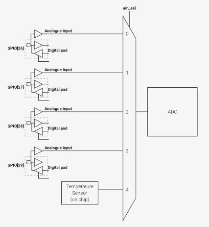
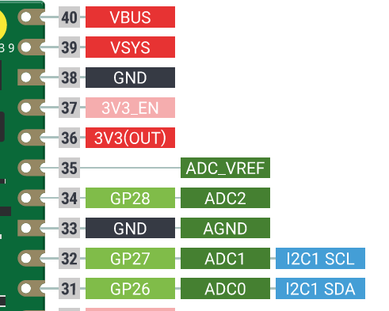

# ADC

- https://resources.pcb.cadence.com/blog/2023-adc-sampling-rate

Conversor Analógico-Digital (ADC) é um hardware capaz de converter um valor analógico em um valor digital. Os ADCs possuem várias características, sendo as mais importantes:

- Resolução: Qual o tamanho da palavra em bits que o módulo faz a conversão.
- Effective Number of Bits (ENOB): Quantos bits da conversão não possuem ruído.
- Taxa de amostragem máxima: O quão rápido o módulo é capaz de realizar uma conversão.

::: info
Os valores usados no texto são referentes ao ADC do nosso RP2040, mas podem variar se forem usar outro uC.
::: 

A resolução do sinal vai implicar na quantização do sinal, quantização é o processo de convertermos um valor que é constante em amplitude em um valor que é discreto em amplitude. Por exemplo, se o nosso ADC foi configurado para ler um valor entre [0, 3.3]V e ele possui, por exemplo, 12 bits de resolução, isso vai implicar que cada bit equivale a:

$bit = \frac{3.3 \, V}{2^{12}} = 0.8 \, mV$  

O gráfico a seguir detalha o processo de quantização:


>   Ref: [Understanding Analog-to-Digital Converters: Deciphering Resolution and Sampling Rate](https://www.allaboutcircuits.com/technical-articles/understanding-analog-to-digital-converters-deciphering-resolution-and-sampl/)

Mas as coisas não são tão simples assim, a quantização está sujeita a ruído, que aparece na forma do **ENOB**, no caso de um ENOB de por exemplo `8.7` bits, isso significa que apenas os 8 bits mais significativos possuem um valor "limpo", isso limita a nossa resolução de `0.8mV` para:

$$bit = \frac{3.3 \, V}{2^{8}} = 12 \, mV$$

Ou seja, a resolução efetiva da conversão é de `12mV`, perdemos quase 30% de resolução nisso.

::: tip
Nem tudo está perdido, se aplicarmos um filtro no sinal podemos remover o ruído e obter uma resolução mais próxima à original.
:::

Ao realizarmos uma amostragem de um sinal analógico devemos nos preocupar em realizar uma amostragem periódica no tempo (a matemática fica mais fácil com isso), isso significa que o tempo entre uma amostragem e outra deve ser constante. Além disso, temos que lembrar do teorema de Nyquist, que diz que um sinal analógico deve ser amostrado pelo menos no dobro da frequência máxima (lembra do Fourier?) de um sinal; na prática, esse valor deve ser muito maior que o dobro da frequência máxima.

## RP2350

O nosso microcontrolador possui um ADC com as seguintes características: 

- 500ksps (using an independent 48MHz clock) (kilo samples per second)
- 12-bit with 8.7 ENOB (see Section 4.9.3)
- Five input mux

Notem que o ADC possui 5 entradas, mas só podemos realizar a conversão de apenas uma por vez! Ou seja, a taxa máxima de `500 ksps` cai para `100 ksps` se usarmos as quatro portas. Outro detalhe é que a entrada `4` do mux não está conectada a um pino, mas sim a um sensor de temperatura interno do uC.



Na Pico, os pinos do ADC são: `GP28`, `GP27` e `GP26`. Notem que a entrada `3` do mux do ADC não está disponível na PICO, seria o pino (`GP29`) da RP2040.



## SDK

Para usar o PWM você deve modificar o `CMakeLists.txt` adicionando `hardware_adc` no `target_link_libraries`:

```diff
target_link_libraries(
                      ....
                      .....
+                     hardware_adc)
```

E adicionar no headfile:

```c
#include "hardware/adc.h"
```

## Snippets

Códigos exemplo para o ADC.

### Hello ADC

[Simulação no wokwi](https://wokwi.com/projects/392250190334148609){.ah-button}
/
[pico-examples/adc/hello_adc/hello_adc.c](https://github.com/raspberrypi/pico-examples/blob/master/adc/hello_adc/hello_adc.c){.ah-button}

```c
#include <stdio.h>
#include "pico/stdlib.h"
#include "hardware/gpio.h"
#include "hardware/adc.h"

int main() {
    stdio_init_all();
    printf("ADC Example, measuring GPIO27\n");

    adc_init();

    // Make sure GPIO is high-impedance, no pullups etc
    adc_gpio_init(27);
    // Select ADC input 1 (GPIO27)
    adc_select_input(1);

    while (1) {
        // 12-bit conversion, assume max value == ADC_VREF == 3.3 V
        const float conversion_factor = 3.3f / (1 << 12);
        uint16_t result = adc_read();
        printf("Raw value: 0x%03x, voltage: %f V\n", result, result * conversion_factor);
        sleep_ms(500);
    }
}
```
