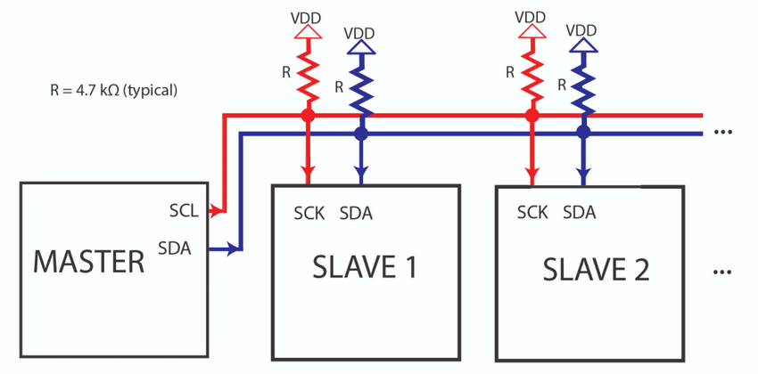
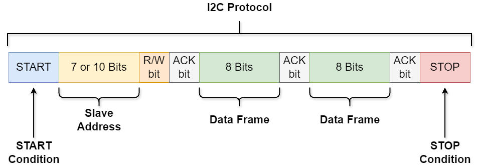
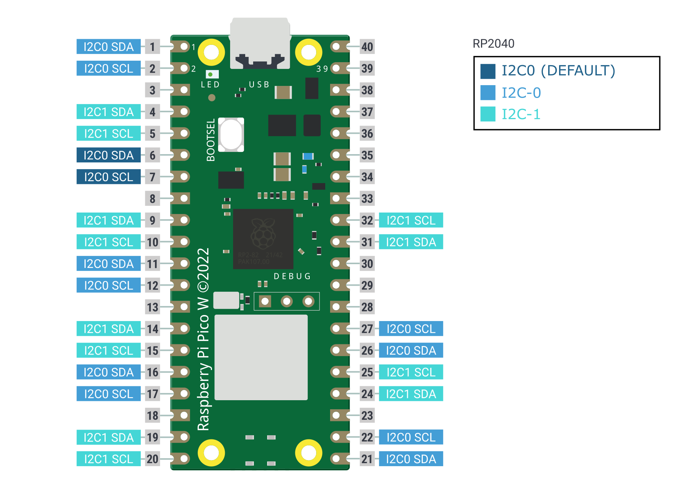

## Introdução ao I2C
O I2C (Inter-Integrated Circuit) é um protocolo de comunicação serial síncrona que permite a comunicação entre microcontroladores e dispositivos periféricos utilizando apenas dois pinos: um chamado de **SDA** (Serial Data Line) e uma linha de clock **SCL** (Serial Clock Line). Ele foi desenvolvido pela Philips Semiconductor (atualmente NXP Semiconductors) nos anos 80.

Breve lista de alguns sensores que possuem comunicação I2C:

- [BMP280](https://www.adafruit.com/product/2651): Sensor de pressão barométrica que pode ser usado para medir temperatura e pressão atmosférica com alta precisão.
- [HTU21D-F](https://www.adafruit.com/product/1899): Sensor de temperatura e umidade que oferece medições de alta precisão em um pequeno pacote, ideal para aplicações meteorológicas.
- [MCP9808](https://www.adafruit.com/product/1782): Sensor de temperatura de alta precisão que pode ser utilizado em ambientes controlados e monitoramento de sistemas.
- [LIS3DH](https://www.adafruit.com/product/2809): Acelerômetro de baixo consumo de energia e alta precisão, capaz de detectar movimento e orientação.
- [TSL2591](https://www.adafruit.com/product/1980): Sensor de luz digital de alta sensibilidade que pode medir luminosidade em uma ampla gama de condições de iluminação.
- [VL53L0X](https://www.adafruit.com/product/3317): Sensor de distância por tempo de voo (Time-of-Flight, ToF) que oferece medições de distância precisas e rápidas em curtas distâncias.

## Topologia

Para usar o I2C, é necessário conectar os dispositivos em uma infraestrutura de barramento, geralmente utilizando resistores de pull-up na linha de dados (SDA) e na linha de clock (SCL). O sinal de clock (SCL) é sempre gerado pelo dispositivo controlador, que é o dispositivo que inicia e controla as comunicações. O sinal de dados (SDA) pode ser manipulado tanto pelo dispositivo controlador quanto pelo dispositivo com o qual ele está se comunicando.



É possível conectar um único dispositivo controlador a vários dispositivos em paralelo, formando uma topologia conhecida como "varal". Para possibilitar essa conexão, cada dispositivo é identificado por um endereço de 7 bits único.

::: warning
Notem que o protocolo I2C exige que a linha tenha um `pull-up`
:::

## Protocolo

A comunicação no protocolo I2C é baseada em transações de controlador e dispositivo. O dispositivo controlador inicia e controla as comunicações, enquanto os dispositivos respondem às solicitações do controlador.



<!--
Abaixo disponibilizo uma visão geral do protocolo

1. **Start Condition**: A comunicação no barramento I2C é iniciada por uma condição de início (start condition), na qual o controlador coloca o sinal SDA de nível alto para baixo enquanto o sinal SCL permanece em alto.

2. **Endereçamento**: O controlador transmite o endereço do dispositivo com o qual deseja se comunicar. Cada dispositivo no barramento possui um endereço único de 7 ou 10 bits. O bit seguinte indica se o controlador está escrevendo (0) ou lendo (1) dados do dispositivo.

3. **Acknowledge (ACK)**: Após o recebimento do endereço, o dispositivo correspondente responde com um sinal de ACK para confirmar que foi endereçado corretamente.

4. **Transferência de Dados**: Após o endereçamento, o controlador pode enviar ou receber dados do dispositivo. Durante a transmissão de dados, o controlador envia bytes de dados para o dispositivo, que responde com sinais ACK após a recepção de cada byte.

5. **Stop Condition**: Após concluir a comunicação, o controlador emite uma condição de parada (stop condition), na qual o sinal SDA é colocado de nível lógico baixo para alto enquanto o sinal SCL permanece em alto.

 -->

O controlador é responsável por gerar o clock e controlar a transferência de dados. O dispositivo é responsável por transmitir ou receber dados do controlador. O reconhecimento dos dados é enviado pelo dispositivo que está recebendo os dados, podendo ser tanto um controlador quanto um dispositivo. O protocolo I2C também permite que vários controladores residam no barramento I2C.

Cada dispositivo possui um endereço único que é determinado pela estrutura do sistema ou pelo dispositivo na linha. Quando um controlador deseja se comunicar com um dispositivo, o controlador transmite uma condição de START, seguida pelo endereço do dispositivo e um bit de controle (R/W) para determinar se o controlador deseja transmitir dados ou receber dados do dispositivo. O dispositivo então envia um pulso de reconhecimento (ACK) após o endereço.

Se o controlador (controlador-transmissor) estiver escrevendo para o dispositivo (dispositivo-receptor), o receptor recebe um byte de dados. Essa transação continua até que o controlador termine a transmissão com uma condição de STOP. Se o controlador estiver lendo de um dispositivo (controlador-receptor), o dispositivo transmite (dispositivo-transmissor) um byte de dados para o controlador, e o controlador então reconhece a transação com o pulso ACK. Essa transação continua até que o controlador termine a transmissão, e então o controlador emite uma condição de STOP.


## RP2040

O RP2040 possui duas interfaces I2C idênticas (I2C0 e I2C1). Ambas são capazes de gerar sinais de clock, iniciar e encerrar comunicações (no modo mestre), apresentam filas de até dezesseis posições para entrada e saída, e suportam o uso de DMA. No modo dispositivo ("slave"), as interfaces podem verificar os endereços e disparar uma interrupção quando uma comunicação do mestre é recebida.

Os pinos do RP2040 utilizados para comunicação I2C são configuráveis. A imagem abaixo apresenta as opções disponíveis:



## SDK

Para usar o I2C você deve modificar o `CMakeLists.txt` adicionando `hardware_i2c` no `target_link_libraries`:

```diff
target_link_libraries(
                      ....
                      .....
+                     hardware_i2c)
```

E adicionar no headfile:

```c
#include "hardware/i2c.h"
```

## Snippets

WIP

## Referências:

- "Usando I2C na Raspberry Pi Pico com MicroPython e C" Maker Hero. Disponível em: https://www.makerhero.com/blog/usando-i2c-na-raspberry-pi-pico/
- "Raspberry Pi Pico (RP2040) I2C Example with MicroPython and C/C++" DigiKey. Disponível em: https://www.digikey.com/en/maker/projects/raspberry-pi-pico-rp2040-i2c-example-with-micropython-and-cc/47d0c922b79342779cdbd4b37b7eb7e2
- "Raspberry Pi Pico (RP2040) I2C Example with MicroPython and C/C++" DigiKey. Disponível em: https://www.digikey.com/en/maker/projects/raspberry-pi-pico-rp2040-i2c-example-with-micropython-and-cc/47d0c922b79342779cdbd4b37b7eb7e2
