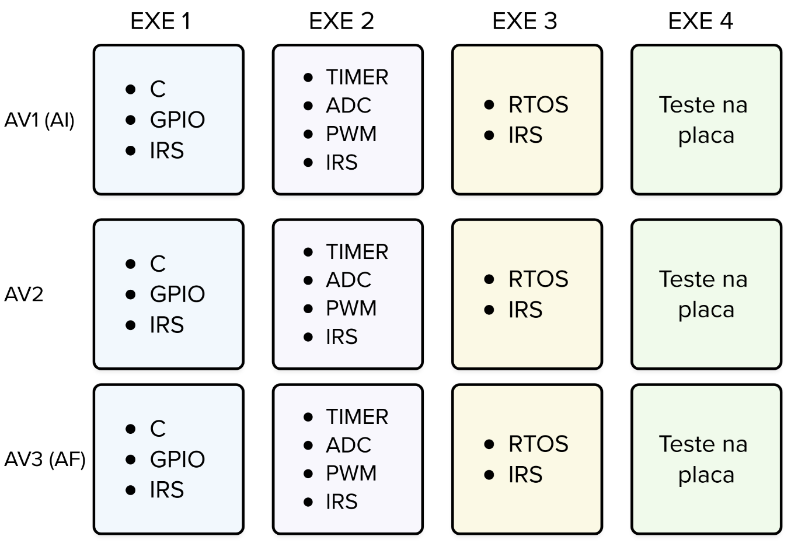

# Avaliação Individual

::::: center
:::: third 
::: box-blue 1. Simulado
[:memo: 25a-av2](https://classroom.github.com/a/eM1P5hlr)
:::
::::
:::: third
::: box-yellow 2. Entrega final
 :alarm_clock:2h de duracao
:::
::::
:::: third
::: box Nota
 :sparkles: Não pode usar LLM 
:::
::::
:::: third
::::
:::::

A avaliação de Sistemas Embarcados é baseada em **objetivos**. A ideia é garantir que cada aluno, de forma individual, atinja as competências básicas do curso, que são:

- escrever código em C
- trabalhar com GPIO
- lidar com interrupções
- utilizar timers
- usar ADC
- desenvolver códigos com RTOS
- testar programas diretamente na placa

::: warning Critério de barreira
Para que a nota das entregas (labs core, labs de especialização, APSs e projeto) seja considerada, é **obrigatório** atingir todos os objetivos acima. 
:::

Cada objetivo será avaliado em exercícios práticos, por exemplo:   
- exercício 1: avalia escrita de código em C, GPIO e interrupções 
- exercício 2: avalia uso de timer e ADC 
- exercício 3: foca em RTOS 
- exercício 4: verifica se o aluno sabe lidar com o hardware real 

## Passando nos objetivos

Vocês terão **3 chances** para cumprir todos os objetivos. 
Na prática, isso significa **3 sessões de 2h**, cada uma com 4 exercícios. 

Se, por exemplo, você já for aprovado no **exercício 1** na primeira prova, esse critério será marcado como concluído e você não precisará refazê-lo nas próximas.

## FAQ

- **Se eu passar em todos os objetivos na primeira prova, preciso fazer as outras?** 
  - Não! Mas lembre-se: isso não significa que já passou na disciplina. Ainda é necessário cumprir os labs core, labs de especialização, APSs e projeto.

- **Existe prova substitutiva (sub)?** 
  - Sim. Você pode faltar em uma das três provas e terá direito à substitutiva. 
  - Se faltar em mais de uma, terá direito apenas a uma prova substitutiva.

- **Pode consultar?** 
  - Sim, mas não é permitido consultar outras pessoas ou usar IA.

- **Terá testes?** 
  - Sim, os exercícios funcionam como um pré-lab.
