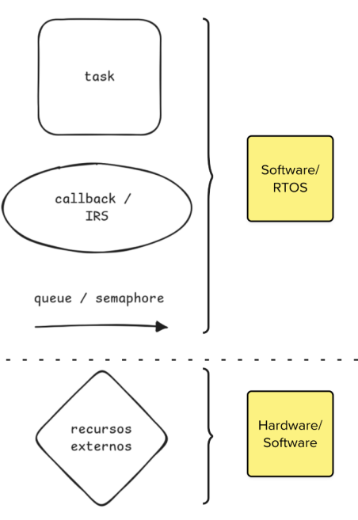
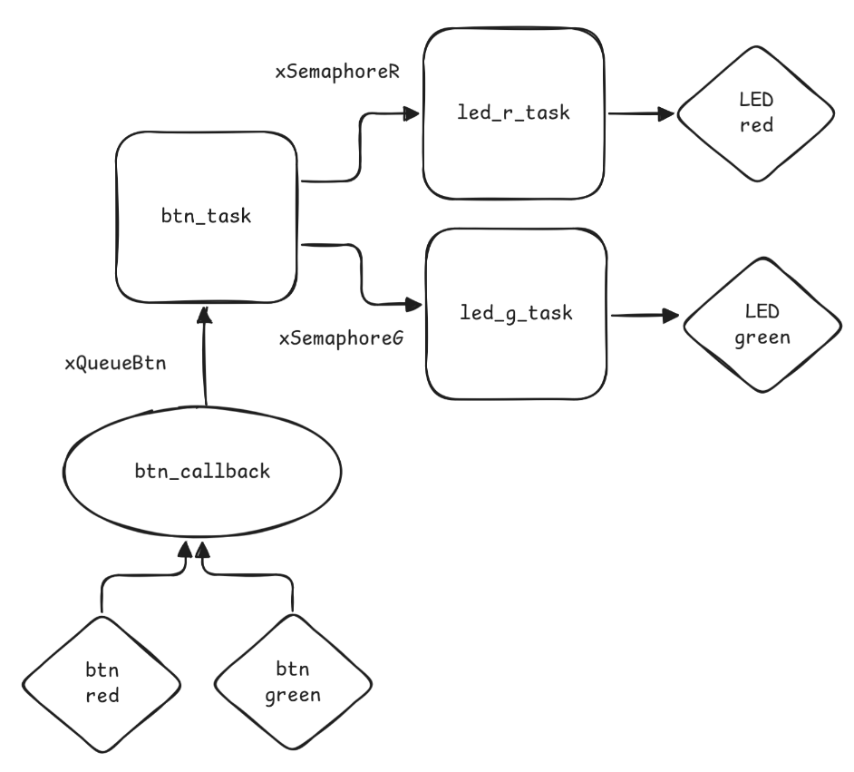

# Diagramas

Diagramas são ferramentas muito utilizadas por desenvolvedoras e desenvolvedores de software, pois facilitam a **modelagem e o entendimento de um sistema**. Eles podem aparecer em todas as etapas do desenvolvimento: **design, modelagem e implementação** de uma solução.

::: info Diagramas
Existem diversos tipos de diagramas para representar sistemas:

- Diagrama de blocos
- UML
- Máquina de estados
- [Tempo](http://groups.di.unipi.it/~augusto/seminars/PAM2002/s06.html)
- [Redes de petri](https://en.wikipedia.org/wiki/Petri_net))
- ...

Neste curso, vamos trabalhar com diagramas de forma mais **informal e prática**, mas ainda assim bastante útil.
:::

Engenheiras e engenheiros precisam ser capazes de:

- **Modelar** uma solução usando diagramas
- **Interpretar** diagramas já existentes (entender o que significam)
- **Elaborar** diagramas para depois transformá-los em software
- **Traduzir** um código para a representação em diagrama

No oferecimento desta disciplina (2025-2), teremos uma introdução estruturada para que vocês possam aprender a trabalhar com essa notação.

## Diagrama de blocos

O **diagrama de blocos** é formado por elementos visuais simples que oferecem uma visão geral do sistema, suas **dependências** e sua **estrutura**.

Durante as atividades com **RTOS**, vocês irão se deparar com diversos diagramas que mostram como o software foi organizado.

Um exemplo bastante comum é o uso de diagramas para descrever soluções em nuvem, como no caso a seguir:

Da mesma forma, existem diagramas específicos para **sistemas embarcados**. No nosso caso, com **RTOS**, conseguimos estruturar o projeto em *tarefas*. Veja o exemplo extraído do livro *Kinetis ARM Cortex-M4 MCU (ISBN 978-0-9823375-2-3)*:

Nesse diagrama, é possível identificar:

- **Tasks** (círculos)
- **Interrupções** (terminam em `_ISR`)
- **Filas e semáforos** (recursos de sincronização)

Embora o exemplo seja um pouco mais complexo, com a prática vocês ganharão familiaridade.

::: info Exemplo
Outro exemplo pode ser visto no livro *Making Embedded Systems*, de Elecia White (temos uma cópia no laboratório):

Aqui, a autora representa a solução de software para uma aplicação embarcada com display LCD. **No caso específico ela não utiliza RTOS, mas da pra ter uma ideia de outros usos em sistemas embarcados.**
:::

### No curso

Para simplificar, adotaremos uma **notação básica** para representar sistemas:

- **Quadrados** → *Tasks*
- **Círculos** → *Interrupções (ISR)*
- **Setas** → *Filas e semáforos* (mecanismos de sincronismo entre *tasks* e *ISRs*)

Notação:

::: tip
A escolha por elementos simples facilita o desenho, sem necessidade de ferramentas sofisticadas. Além disso, essa prática é útil para a carreira: em entrevistas técnicas, é comum pedirem que você desenhe uma solução na lousa para resolver um problema.
:::

Quer que eu prepare também uma **versão resumida** (tipo guia rápido) para que os alunos tenham em mãos como referência durante os exercícios?

### Exemplos

A seguir, um exemplo do uso do diagrama para representar a modelagem de um sistema:

::: warning
O diagrama não fornece todas as informações necessárias para entendermos exatamente o funcionamento do sistema, mas já dá para ter uma boa ideia!
:::

A partir do diagrama, somos capazes de identificar:

- Que existem 3 *tasks*:
    - `btn_task`
    - `led_r_task`
    - `led_g_task`
- Um callback (ISR):
    - `btn_callback`
- Quatro recursos de hardware:
    - Dois botões (`btn red` e `btn green`)
    - Dois LEDs (`led red` e `led green`)
- Que existe uma fila:
    - `xQueueBtn`
- E dois semáforos:
    - `xSemaphoreR` e `xSemaphoreG`

