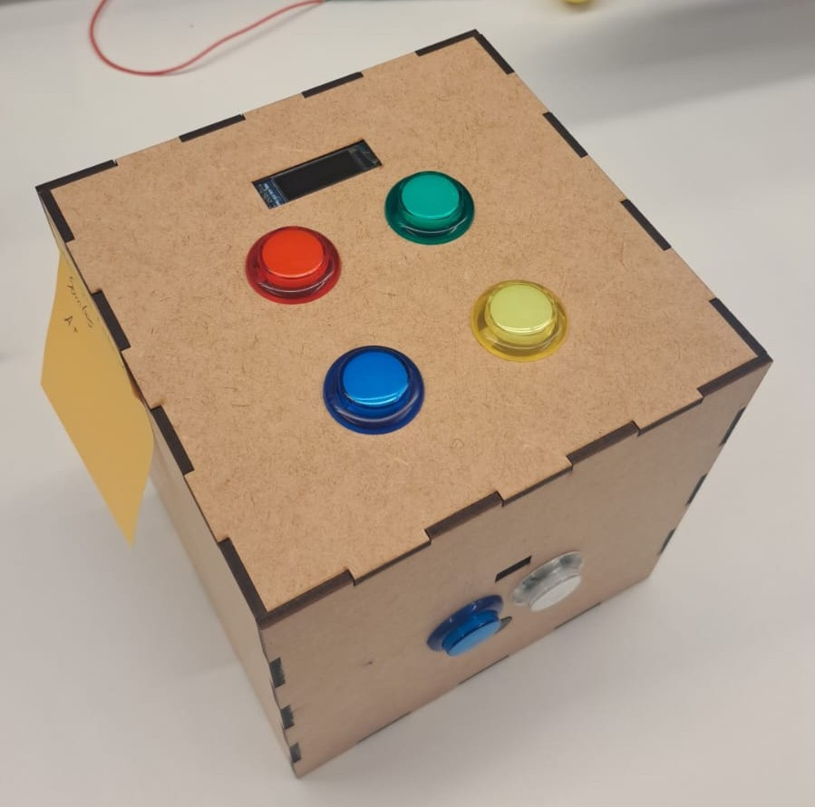
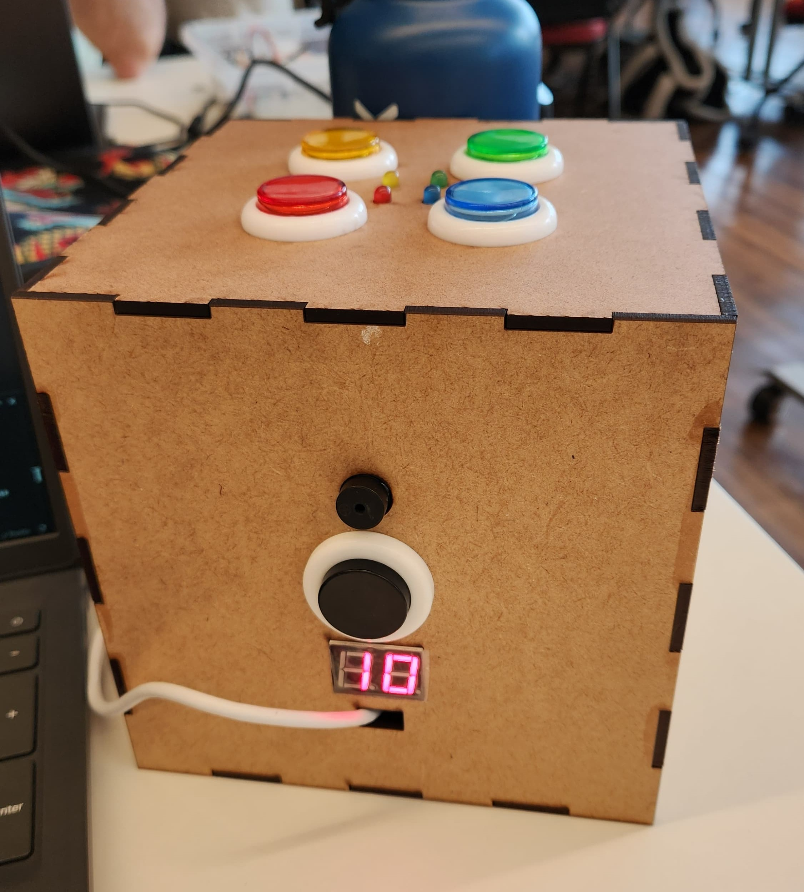
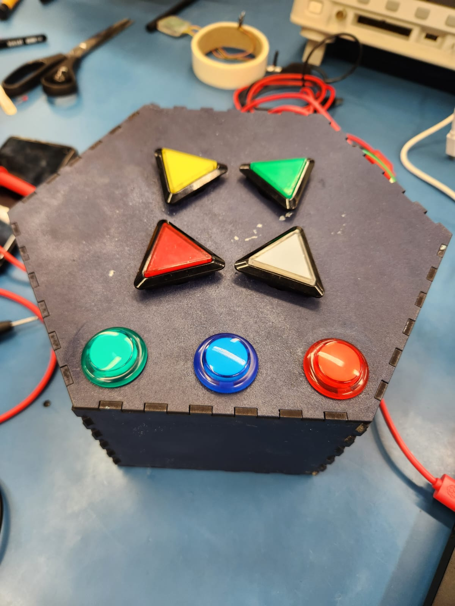
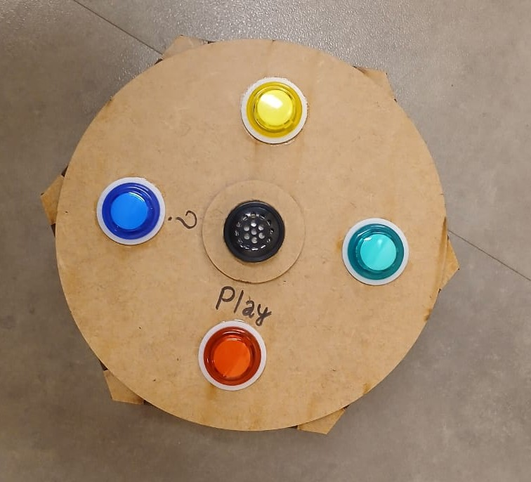

# APS - 1 - Genius

::: info
A APS pode ser feita individual ou em dupla
:::

<YouTube id="KfF-AZhUkdM"/>

O desafio é desenvolver o protótipo do jogo da memória "Genius", com as seguintes características:

- 4 (ou mais) LEDs de cores diferentes.
- 4 (ou mais) Botões (cada botão corresponde a um LED).
- 1 Buzzer (para reproduzir um som)

## Rubrica

O requisito mínimo do projeto para o conceito C é dele ter funcionamento similar ao do jogo, isso é: 

- Para cada botão, um LED e um som diferentes.
- O jogo deve progressivamente ir aumentando a dificuldade.
- Uma resposta visual e sonora para quando acertar ou errar.
- Gera aleatoriamente a sequência cada vez que o sistema é ligado ou o começa um novo jogo.
    - Usar a seed no `srand()`
- **Sistema integrado em protótipo físico, consultar página no site sobre prototipação!**

::: tip Qualidade de Código
O código não deve possuir erros de detectados pelas ferramentas de qualidade de código: `cppcheck` e `embedded-check`.
:::

Exemplo de entregas de design aceitável:

|  |  |  
|----------------------------|----------------------------|
|   |   |   
|  |                            |   

### Ganhando nota

::: info
Conceitos acumulativos, pode fazer qual quiser para ir acumulando pontos. Se deseja incluir algum que não está aqui, mandar mensagem ao professor.
:::

<Badge type="tip" text="meio conceito:" />

-  Organizar o código em arquivos `.c` e `.h` criando funções para organizar o código.
-  Sistema que exibe pontuação final.
-  Armazena pontuação mesmo quando perder a bateria.
    - <Badge type="info" text="meio conceito" /> Dado uma certa dificuldade, jogo acende duas luz ou mais luzes por vez! E espera que o usuário pressione mais de um botão por vez.
-  Diferentes modos de jogo: (Solo, Dupla, ... )
-  Implementar o código em formato de máquina de estados
-  Usar alarme de timer para se usuário não apertar o botão em x segundos, perde.
-  Para quem reproduz uma música (tipo mário). 
-  [Manual On and Automatic Off](https://www.youtube.com/watch?v=jSZM9Js_zk8) 

<!--
 - <Badge type="info" text="meio conceito" /> Se fizer um sistema que desliga a energia sozinho e liga quando apertar um botão
--> 

