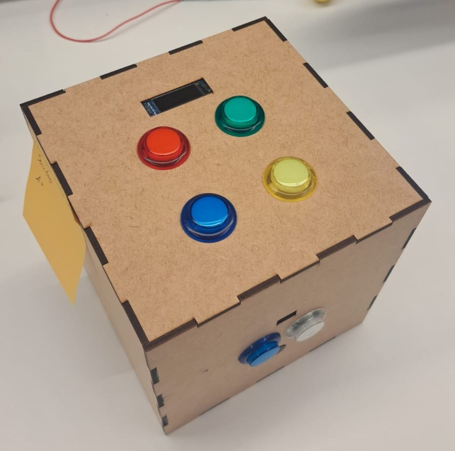
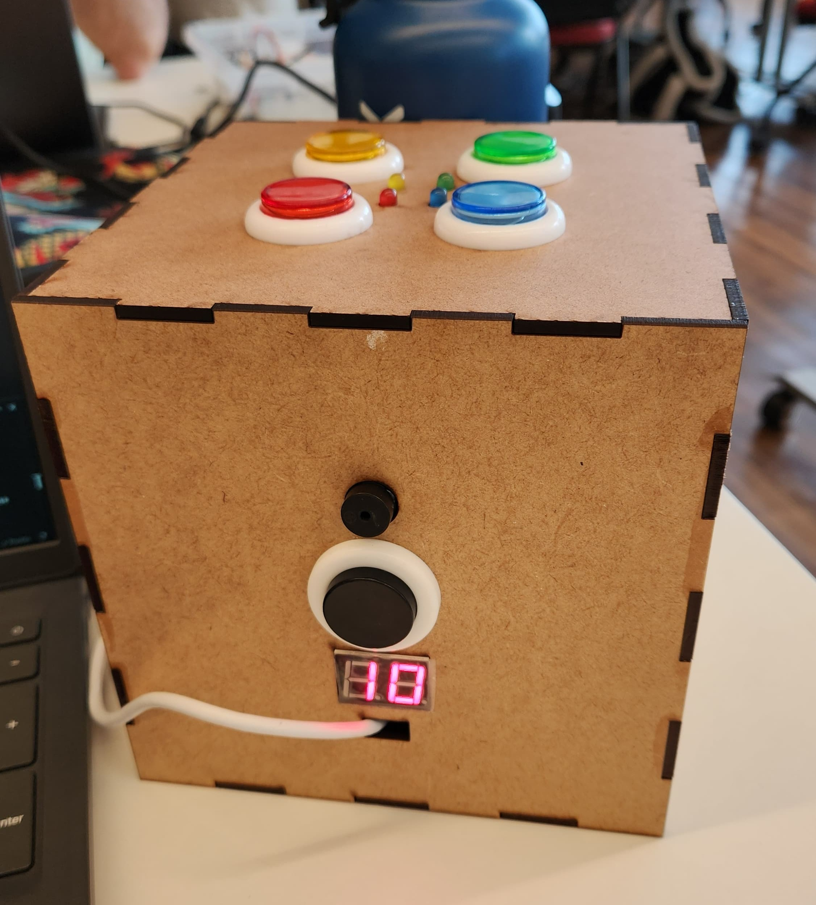
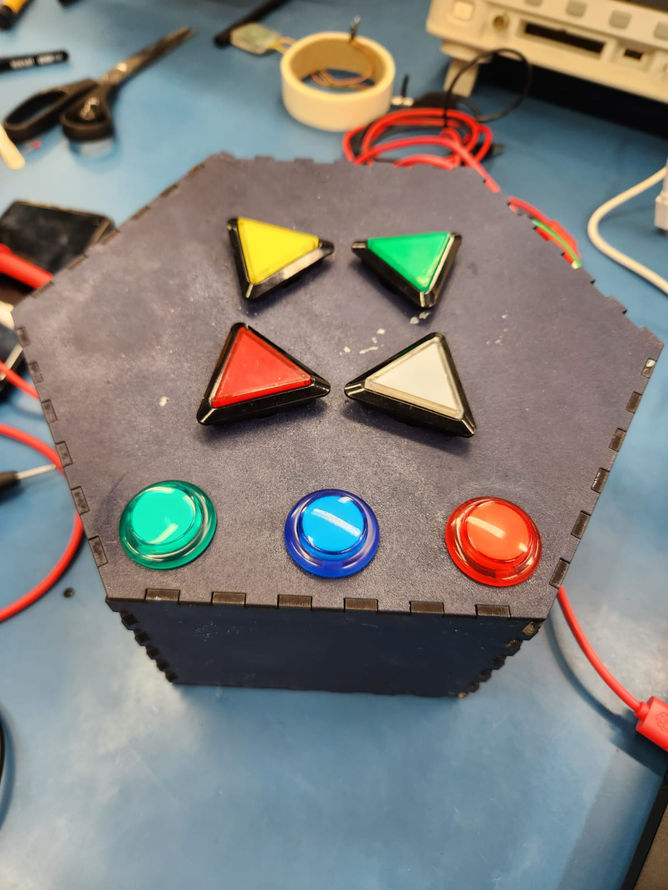
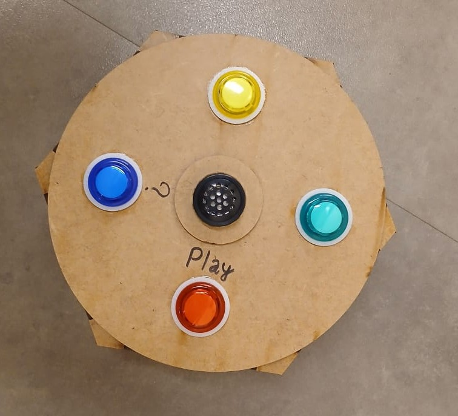

# APS - 1 - Genius

::::: center
:::: third 
::: box-blue 1. Classroom
[:memo: Link](https://classroom.github.com/a/ieZM3TBy)
:::
::::
:::: third
::: box-yellow 2. Entrega final
[Enviar no PrairieLearn](https://us.prairielearn.com/pl/course_instance/)
:::
::::
:::: third
::: box Nota
Realizar em dupla!
:::
::::
:::: third
::::
:::::

<YouTube id="KfF-AZhUkdM"/>

O desafio consiste em desenvolver um protótipo funcional do jogo da memória **“Genius”**, contemplando os seguintes requisitos de hardware:

- **4 (ou mais) LEDs** de cores distintas  
- **4 (ou mais) botões**, sendo cada botão associado a um LED  
- **1 buzzer**, responsável pela reprodução dos sons  

## Rubrica

Para atingir o conceito **C**, o projeto deve apresentar funcionamento equivalente ao jogo original, atendendo aos seguintes critérios mínimos:

- Cada botão deve estar associado a **um LED específico e a um som distinto**.
- O sistema deve fornecer **feedback visual e sonoro** tanto para acertos quanto para erros.
- A sequência deve ser **gerada aleatoriamente** sempre que:
  - o sistema for energizado; ou  
  - um novo jogo for iniciado.  
- A geração pseudoaleatória deve utilizar corretamente uma *seed* na função `srand()`.

- O sistema deve estar **integrado em protótipo físico funcional**.  
  Consulte a página oficial sobre prototipação para orientações.

::: tip Qualidade de Código
O código não deve apresentar erros apontados pelas ferramentas de análise estática **`cppcheck`** e **`embedded-check`**.
:::

## Expert

A dupla deverá obrigatoriamente integrar **dois** dos laboratórios classificados como *expert*. As combinações possíveis são:

- LCD + Multi Core  
- LCD + Áudio  
- Multi Core + Áudio  

A utilização dos recursos escolhidos deve **impactar diretamente a versão final do projeto**.  
Durante a apresentação, a equipe deverá justificar tecnicamente as decisões de projeto e demonstrar de forma clara como os recursos selecionados foram incorporados ao sistema.

### Design

Exemplo de entregas de design aceitável:

|  |  |
|----------------------------|----------------------------|
|   |   |
|  |                            |

### Ganhando nota

::: info
Conceitos acumulativos, pode fazer qual quiser para ir acumulando pontos. Se deseja incluir algum que não está aqui falar com o professor.
:::

<Badge type="tip" text="meio conceito:" />

-  Organizar o código em arquivos `.c` e `.h` criando funções para organizar o código.
-  Sistema que exibe pontuação final.
-  Armazena pontuação mesmo quando perder a bateria.
-  Dado uma certa dificuldade, jogo acende duas luz ou mais luzes por vez! E espera que o usuário pressione mais de um botão por vez.
-  Diferentes modos de jogo: (Solo, Dupla, ... ).
-  Implementar o código em formato de máquina de estados.
-  Usar alarme de timer para se usuário não apertar o botão em x segundos, perde.
-  Para quem reproduz uma música (tipo mário). 
-  Implementar o hardware em uma [placa universal](https://www.youtube.com/watch?v=AQKF6w1v5c0) ou em uma PCB.
<!--
-  [Manual On and Automatic Off](https://www.youtube.com/watch?v=jSZM9Js_zk8) 
 - <Badge type="info" text="meio conceito" /> Se fizer um sistema que desliga a energia sozinho e liga quando apertar um botão
--> 

