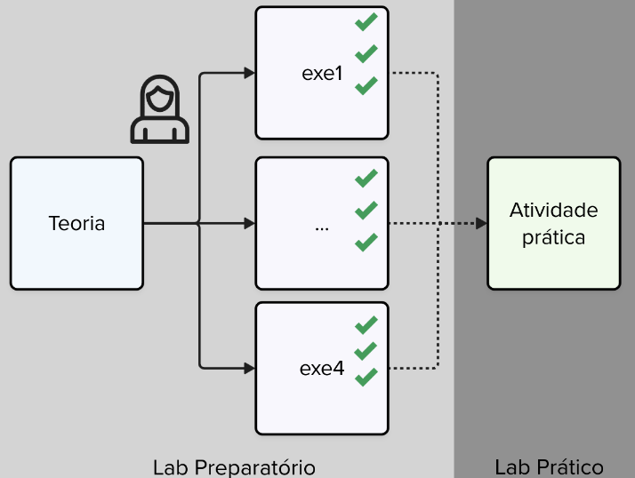
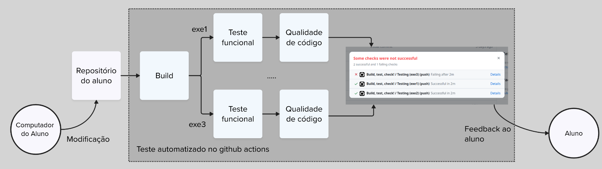

# Sobre

## Infra

O curso pode ser realizado em qualquer sistema operacional e em x86 ou ARM. Você deve ter o vscode instalado e deve instalar as seguintes extensões:

- [Raspberry Pi Pico](https://marketplace.visualstudio.com/items?itemName=raspberry-pi.raspberry-pi-pico)
- [Wokwi Simulator](https://marketplace.visualstudio.com/items?itemName=Wokwi.wokwi-vscode)

Para podermos utilizar o wokwi, cada aluno precisa registrar criar uma conta gratuíta na plataforma https://wokwi.com/ .

## Entregas

No curso temos 3 categorias de entregas:

- Labs Preparatório (individual)
- Labs Prática (individual)
- APS (dupla)

::: box-red
As entregas possuem datas fixas. A entrega em atraso implica penalização automática de 60% por até uma semana; após esse prazo, a atividade deixa de ter valor para nota.

Os prazos estão fixados no PrairieLearn.
:::

### Labs Preparatório

A disciplina utilizará atividades preparatórias que ajudarão vocês no desenvolvimento dos laboratórios. Essas atividades devem ser realizadas no VSCode e não necessitam do uso da placa de desenvolvimento. O objetivo é desacoplar um pouco os elementos: com o simulador, é possível praticar apenas o código e alguns aspectos da conexão de hardware, sem a complexidade de montar os componentes eletrônicos.

{width=400}

### Labs Prática

Já as atividades de laboratório prático demandam que vocês utilizem a placa física e apliquem o que aprenderam no ambiente virtual em uma aplicação real.

### APS

Ao todo, são duas APS. Elas se diferenciam dos laboratórios por serem mais complexas, realizadas em duplas e por envolverem design e criação de protótipos. São elas:

1. Jogo Genius
2. Desenvolvimento de um controle Bluetooth para um jogo

## Sistema de Verificação Automática

A disciplina faz uso de um sistema de verificação automática integrado ao GitHub, que envolve diferentes frentes:

1. Verificação se o projeto compila
2. Teste de funcionalidade do código (apenas para os pré-labs e prova)
3. Verificação de qualidade de código, com dois verificadores:
   - **cppcheck**: qualidade de código na linguagem C
   - **embedded-check**: qualidade de código para sistemas embarcados

O sistema está totalmente integrado ao GitHub e utiliza o Github Actions para realizar os testes. 
