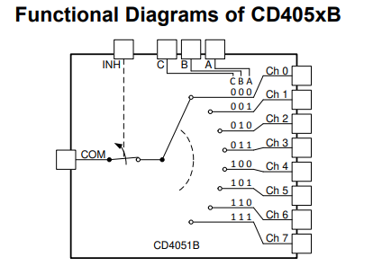
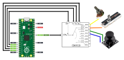

# CD4051

O [CD4051](chrome-extension://efaidnbmnnnibpcajpcglclefindmkaj/https://www.ti.com/lit/ds/symlink/cd4051b.pdf) é um multiplexador analógico 8:1, ou seja, ele permite selecionar um entre 8 canais (**Ch 0 ~ Ch 7**) e conectá-lo a um único pino comum (**COM**). Isso é feito com apenas 3 bits de controle (**A, B e C**):



OBS: O pino **INH** também pode ser utilizado como pino de controle, ele pode ser utilizado como um tri-state buffer, conectando ou desconectando o comum de todos os canais ao mesmo tempo.

## Leitura analógica por polling

O [CD4051](https://www.ti.com/lit/ds/symlink/cd4051b.pdf) permite que consigamos fazer diversas leituras analógicas utilizando apenas um pino de leitura ADC, no caso da Pico, temos 3 canais para leitura (AD0 ~ ADC2). Esse método de ficar alterando o canal para fazer a leitura pode ser chamado de __polling__.

A técnica pode ser efetuada em alguns passos:

1. Selecionar um dos canais (Ch 0 ~ Ch 7) através dos pinos de controle (A, B, C)
2. **Habilitar** a conexão do comum (COM), através do pino de controle do buffer (INH)
3. Efetuar a leitura pela Pico, como é explicada na página sobre [ADC](https://insper-embarcados.github.io/site/rp2040/rp2040-adc/)
4. **Desabilitar** a conexão do comum (COM), através do pino (INH)
5. Repetir o passo 1, alterando o canal.

## Exemplo

No exemplo abaixo vamos utilizar o ADC1 (o mesmo utilizado na [página](https://insper-embarcados.github.io/site/rp2040/rp2040-adc/) sobre adc) para efetuar a leitura de 4 canais diferentes.

### Diagrama



### Código

```c
#include <stdio.h>
#include "pico/stdlib.h"
#include "hardware/gpio.h"
#include "hardware/adc.h"

const uint SEL_A_4051 = 13;
const uint SEL_B_4051 = 12;
const uint SEL_C_4051 = 11;
const uint INH_4051   = 10;

void polling_adc_init(void) {
    gpio_init(SEL_A_4051);
    gpio_set_dir(SEL_A_4051, GPIO_OUT);

    gpio_init(SEL_B_4051);
    gpio_set_dir(SEL_B_4051, GPIO_OUT);

    gpio_init(SEL_C_4051); 
    gpio_set_dir(SEL_C_4051, GPIO_OUT);

    gpio_init(INH_4051);         
    gpio_set_dir(INH_4051, GPIO_OUT);
    gpio_put(INH_4051, 1);       // começa desabilitado
}

void select_4051_channel(uint channel) {
    gpio_put(SEL_A_4051, channel & 0x01);
    gpio_put(SEL_B_4051, (channel >> 1) & 0x01);
    gpio_put(SEL_C_4051, (channel >> 2) & 0x01);
}

int main() {
    stdio_init_all();

    polling_adc_init();

    adc_init();
    adc_gpio_init(27);    // GPIO27 = ADC1
    adc_select_input(1);  // Seleciona canal 1 (ADC1)

    while (1) {
        for (uint channel = 0; channel < 4; channel++) {
            gpio_put(INH_4051, 1);               // desabilita 4051
            select_4051_channel(channel);       // muda canal
            sleep_ms(2);                        // tempo de setup
            gpio_put(INH_4051, 0);               // habilita 4051
            sleep_ms(2);                        // tempo de estabilização
            uint16_t result = adc_read();
            printf("Canal %d: %d\n", channel, result);
        }

        printf("--------------------\n");
        sleep_ms(1000);
    }
}
```

### Resultado esperado

Abaixo temo um exemplo de como deverá imprimir os valores no terminal:


```
Canal 0: 512
Canal 1: 487
Canal 2: 923
Canal 3: 1023
--------------------
Canal 0: 500
Canal 1: 480
Canal 2: 920
Canal 3: 1018
--------------------
```

!!! warning
	Os valores deverão alterar conforme a variações nos dispositivos (Potenciômetro / Slidepot / Joystick).
