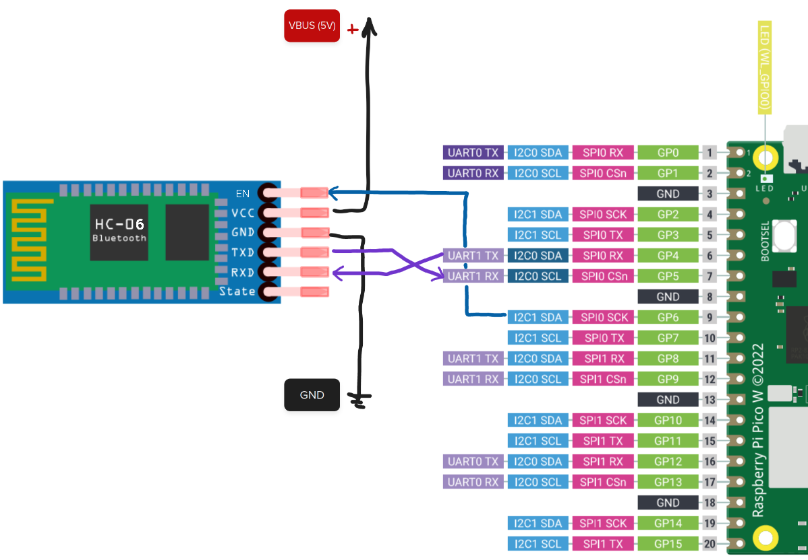
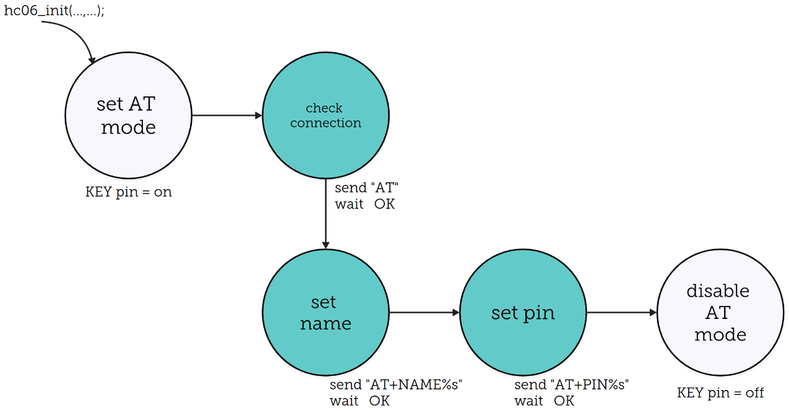

# HC-06

!!! Código exemplo
    Usar o código exemplo em:
    
    https://github.com/insper-embarcados/pico-rtos-hc06
    
O  [HC-06](https://www.olimex.com/Products/Components/RF/BLUETOOTH-SERIAL-HC-06/resources/hc06.pdf) é um módulo bluetooth popular (R$ 40) que pode funcionar como `device` , neste exemplo usaremos como device (conectando-se ao computador). O Computador (Windows ou Linux) virá enxergar o módulo HC-06 como um dispositivo bluetooth, e uma vez pareado o Windows irá criar uma porta COM (Serial --> Outgoing / Saída) associado a conexão, nessa porta faremos a recepção e envio dos dados via bluetooth.

O modulo será conectado ao microcontrolador através de uma comunicação UART (muito similar ao que vocês implementaram na disciplina Camada Física), o microcontrolador pode enviar dados para o computador por esta porta (TX) ou receber dados do computador (RX), conforme diagrama a seguir:

``` 
    +----------+           		+-------+             +----------+
    |    +-----|            	|       |   <---->    |    +-----|
    |    |USART| tx -------> RX |       |             |    | COM <---> Python ---> (Aplicação)
    |    +-----| rx <------- TX |       |  BLUETOOTH  |    +-----|
    | uc       |           		| HC-06 |             | PC       |
    +----------+            	+-------+             +----------+
```

No microcontrolador, iremos usar um **periférico** da pico chamado UART para realizar a serialização e desserialização do dado no protocolo UART. A comunicação com o módulo HC-06 segue um protocolo chamado de [AT Command](http://wiki.sunfounder.cc/images/7/7b/HC-06_AT_Commands_Reference.pdf).

Já no computador iremos usar um programa em **python** que acessará a porta COM criada pelo sistema operacional para enviar e receber dados do microcontrolador via protocolo Bluetooth. Note que estamos lidando com o Bluetooth de forma "transparente", apenas como "usuários", toda a mágica acontece dentro do HC-06.

!!! tip "HC-05"
	Exsite um outro dispositivo similar chamado de HC-05, esse módulo é mais completo e pode funcionar como `device` ou `host`.

## Exemplo

Conecte o hardware como indicado a seguir:



O exemplo faz uso dos pinos:

- **HC-VCC:** 5V (alimentação)
- **HC-GND**: GND (alimentação)
- **HC-TX:** Ligado na **UART 1 - RX** (recebimento de dados)
- **HC-RX:** Ligado na **UART 1 - TX** (transmissão de dados)
- **HC-EN:** Ligado no **GP6** (configurar modo de funcionamento)

!!! tip
	O pino `STATE` indica o estado do bluetooth, se ele está conectado ou pronto para parear. Por exemplo, se você precisar indicar para o usuário se o controle (bluetooth) está ou não conectado, você pode utilizar esse pino para isso.
​    
## Firmware

O firmware fornecido no exemplo possui uma task e um driver para comunicar com o bluetooth via o protocolo serial:

```c
void hc06_task(void *p) {
    uart_init(HC06_UART_ID, HC06_BAUD_RATE);
    gpio_set_function(HC06_TX_PIN, GPIO_FUNC_UART);
    gpio_set_function(HC06_RX_PIN, GPIO_FUNC_UART);
    hc06_init("aps2_legal", "1234");

    while (true) {
        uart_puts(HC06_UART_ID, "OLAAA ");
        vTaskDelay(pdMS_TO_TICKS(100));
    }
}
```

As funções iniciais da task são responsáveis por configurar o módulo UART e a função principal `bool hc06_init(char name[], char pin[])` faz a configuração do Bluetooth, com seguintes parâmetros:

- `name`: Nome do bluetooth que aparecerá quando procurar o dispositivo.
- `pin `: Senha de 4 dígitos que pode ser requisitada ao se conectar no dispositivo.

Se conectado corretamente, ao executar o código vocês devem obter isso na serial (debug):

```
check connection
connected

set name
name ok

set pin
pin ok
```

A função `hc06_init` faz a seguinte inicialização:



### Enviando dados para o bluetooth

Após iniciado o hardware, basta colocarmos `0` no pino `EN` e que toda informação enviada para a `UART 1` será enviada automaticamente para o bluetooth.

```c
    while (true) {
        uart_puts(HC06_UART_ID, "OLAAA ");
        vTaskDelay(pdMS_TO_TICKS(100));
    }
```

O trecho de código fica enviando `OLAA` pela UART, e deve aparecer no dispositivo quando conectado ao bluetooth.

# Conectando o PC ao bluetooth

!!! tip "windows"
	
	1. Bluetooth Devices > Devices
	1. There is an option called Bluetooth devices discovery set in default, change that to advanced.
	1. Click add device then Bluetooth and it shoud appear the HC06.

Agora será necessário conectar o computador no HC-06, para isso temos que seguir tutoriais específicos de cada sistema operacional:

- [Linux](https://marcqueiroz.wordpress.com/aventuras-com-arduino/configurando-hc-06-bluetooth-module-device-no-ubuntu-12-04/)
- [Windows](https://embeddedprogrammer.blogspot.com/2012/07/windows-communicating-with-hc-06.html)

Após conectado é só selecionar a porta criado por cada um dos sistemas operacionais.