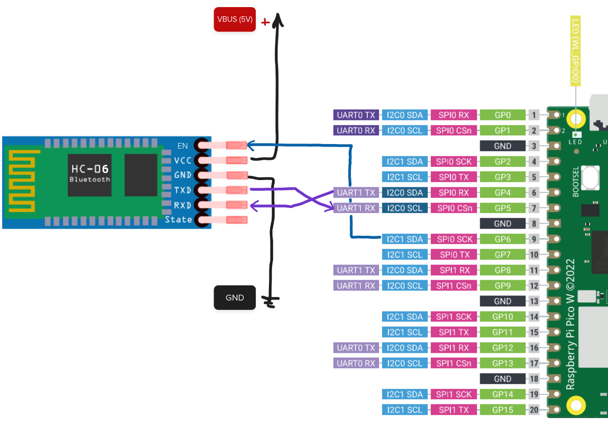
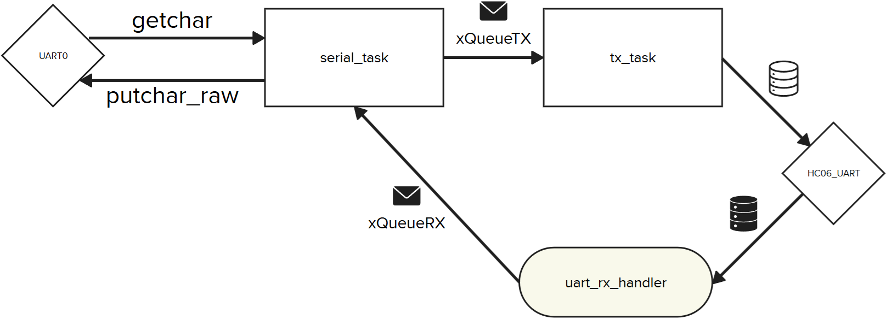

# HC-06

::: info Código exemplo
Usaro código exemplo em:

- https://github.com/insper-embarcados/pico-rtos-hc06-rx-tx
:::

O  [HC-06](https://www.olimex.com/Products/Components/RF/BLUETOOTH-SERIAL-HC-06/resources/hc06.pdf) é um módulo bluetooth popular (R$ 40) que pode funcionar como `device` , neste exemplo usaremos como device (conectando-se ao computador). O computador (Windows ou Linux) irá enxergar o módulo HC-06 como um dispositivo Bluetooth, e, uma vez pareado, o Windows criará uma porta COM (Serial --> Outgoing / Saída) associada à conexão. Nessa porta, faremos a recepção e o envio dos dados via Bluetooth.

O módulo será conectado ao microcontrolador através de uma comunicação UART (muito similar ao que vocês implementaram na disciplina Camada Física), o microcontrolador pode enviar dados para o computador por esta porta (TX) ou receber dados do computador (RX), conforme diagrama a seguir:

``` 
    +----------+           		+-------+             +----------+
    |    +-----|            	|       |   <---->    |    +-----|
    |    |USART| tx -------> RX |       |             |    | COM <---> Python ---> (Aplicação)
    |    +-----| rx <------- TX |       |  BLUETOOTH  |    +-----|
    | uc       |           		| HC-06 |             | PC       |
    +----------+            	+-------+             +----------+
```

No microcontrolador, iremos usar um **periférico** da pico chamado UART para realizar a serialização e desserialização do dado no protocolo UART. A comunicação com o módulo HC-06 segue um protocolo chamado de [AT Command](http://wiki.sunfounder.cc/images/7/7b/HC-06_AT_Commands_Reference.pdf).

Já no computador iremos usar um programa em **python** que acessará a porta COM criada pelo sistema operacional para enviar e receber dados do microcontrolador via protocolo Bluetooth. Note que estamos lidando com o Bluetooth de forma "transparente", apenas como "usuários", toda a mágica acontece dentro do HC-06.

::: tip HC-05
Existe um outro dispositivo similar chamado de HC-05, esse módulo é mais completo e pode funcionar como `device` ou `host`.
:::

## Montagem Exemplo

Conecte o hardware como indicado a seguir:



O exemplo faz uso dos pinos:

- **HC-VCC:** 5V (alimentação)
- **HC-GND**: GND (alimentação)
- **HC-TX:** Ligado ao **UART 1 - RX** (recebimento de dados)
- **HC-RX:** Ligado na **UART 1 - TX** (transmissão de dados)
- **HC-EN:** Ligado no **GP6** (configurar modo de funcionamento)

::: tip
O pino `STATE` indica o estado do bluetooth, se ele está conectado ou pronto para parear. Por exemplo, se você precisar indicar para o usuário se o controle (bluetooth) está ou não conectado, você pode utilizar esse pino para isso.
:::

## Firmware Exemplo




O firmware utiliza FreeRTOS com duas tarefas (`tx_task` e `serial_task`) e duas filas de comunicação (`xQueueRX` e `xQueueTX`).

A inicialização é feita diretamente no `main()`: configura a UART, chama `hc06_config(name, pin)` para definir o nome e PIN do dispositivo Bluetooth, e instala a interrupção de recepção. A recepção é orientada por IRQ: a ISR `uart_rx_handler` lê cada byte da UART e o enfileira em `xQueueRX` via `xQueueSendFromISR`. A `tx_task` consome a fila `xQueueTX` e escreve na UART. A `serial_task` faz a ponte entre o terminal USB e o Bluetooth: lê `xQueueRX` e imprime no PC, e lê entrada do PC colocando na `xQueueTX`.

Ao inicializar, a UART de debug exibe o progresso da configuração do HC-06, testando primeiro 9600 baud e, se necessário, 115200 baud:

```
Tentando baud = 9600...
Conectado!

Alterando baud rate para 115200...
Baud rate OK

Configurando nome...
Nome OK

Configurando PIN...
PIN OK

HC-06 configurado!
```

::: warning
No caso ilustrado acima, a configuração ocorreu sem erros ou retries: o módulo respondeu logo na primeira tentativa. Se o módulo estiver em outro baud rate, o firmware exibirá mensagens adicionais indicando novas tentativas até que a comunicação seja estabelecida.
:::

A sequência de inicialização e configuração automática é realizada pela função `hc06_config`, chamada pela `init_task` durante o boot do sistema:

- Coloca o HC-06 em modo AT
- Tenta comunicar em 9600 e, se necessário, em 115200 baud, exibindo mensagens de progresso e erro
- Ajusta o baudrate do módulo para 115200 se ele estiver em 9600
- Configura o nome e PIN, repetindo em caso de falhas
- Restaura o modo normal após terminar

## Testando

Para validar o funcionamento do HC-06 e testar sua comunicação, siga os passos abaixo:


### Rodando o `terminal.py`
1. Navegue até a pasta `python` onde está localizado o arquivo `terminal.py`.
2. Execute o programa:
   ```bash
   python terminal.py
   ```
3. Configure o programa para selecionar a porta COM e o BAUDRATE:

   - **Pico UART** (à esquerda).
   - **HC-06 (Bluetooth)** (à direita)

### Enviando e Recebendo Dados

- As mensagens enviadas pelo Bluetooth (via HC-06) serão exibidas no terminal USB conectado a Pico, e vice-versa.
- Este é um jeito simples e direto de validar tanto as conexões físicas quanto o fluxo de dados do firmware.

### Conectando o Computador ao HC-06

Agora será necessário parear o HC-06 com o computador. Siga os tutoriais específicos para o seu sistema operacional:

- **[Linux](https://marcqueiroz.wordpress.com/aventuras-com-arduino/configurando-hc-06-bluetooth-module-device-no-ubuntu-12-04/)**
- **[Windows](https://embeddedprogrammer.blogspot.com/2012/07/windows-communicating-with-hc-06.html)**

Ao terminar o pareamento, selecione a porta COM criada pelo sistema operacional no `terminal.py` e comece seu teste.
