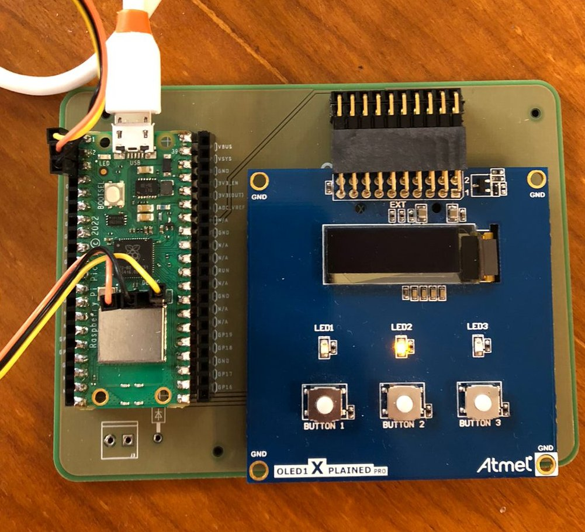

# OLED1

| Datasheet                                                                                                 |
|-----------------------------------------------------------------------------------------------------------|
| [OLED1](https://onlinedocs.microchip.com/pr/GUID-26DC66D4-2EF7-4C54-8D2D-2A29BED57CAB-en-US-1/index.html) |

O OLED1 é uma placa de extensão fabricada pela Atmel/Microchip que possui 3 botões, 3 LEDs e um display OLED.

## Placa Adaptadora

Desenvolvemos uma placa adaptadora que permite facilmente utilizarmos o OLED1 com a Raspberry Pi Pico. A placa elimina a necessidade de conexão, minimizando erros de montagem.

Os pinos da **Pico** foram selecionados de tal maneira que a placa OLED seja conectada ao **SPI1** da mesma, através do header **EXT**, conforme imagem abaixo:

Os pinos para o OLED (SPI), Botões e LEDS foram mapeados da seguinte maneira:

!!! warning
    Nenhum pino listado a seguir deve ser utilizado para outra funcionalidade.

<!--
| Conexão Pico W       | Pino Pico W | Conexão OLED1 | Pino OLED1 |
| -------------------- | ----------- | ------------- | ---------- |
| GND                  | 3           | GND           | 19          |
| VCC                  | 36          | VCC           | 20         |
| GPIO-9        (SPI1) | 12          | DISPLAY_CS    | 15         |
| GPIO-10      (SPI1)  | 14          | SPI_SCK       | 18         |
| GPIO-11      (SPI1)  | 15          | SPI_TX (MOSI) | 16         |
| GPIO-14              | 19          | DISPLAY_RESET | 10         |
| GPIO-15              | 20          | DISPLAY_DC    | 5          |
| GPIO-20              | 26          | LED 1         | 7          |
| GPIO-21              | 27          | LED 2         | 8          |
| GPIO-22              | 29          | LED 3         | 6          |
| GPIO-26              | 31          | BUTTON 2      | 3          |
| GPIO-27              | 32          | BUTTON 3      | 4          |
| GPIO-28              | 34          | BUTTON 1      | 9          |
-->

| Conexão Pico W       | Conexão OLED1 |
| -------------------- | ------------- |
| GND                  | GND           |
| VCC                  | VCC           |
| GPIO-9        (SPI1) | DISPLAY_CS    |
| GPIO-10      (SPI1)  | SPI_SCK       |
| GPIO-11      (SPI1)  | SPI_TX (MOSI) |
| GPIO-14              | DISPLAY_RESET |
| GPIO-15              | DISPLAY_DC    |
| GPIO-20              | LED 1         |
| GPIO-21              | LED 2         |
| GPIO-22              | LED 3         |
| GPIO-26              | BUTTON 2      |
| GPIO-27              | BUTTON 3      |
| GPIO-28              | BUTTON 1      |

## Display

O display da placa OLED é:

- UG-2832HSWEG04 monocromático OLED Display
- 128 x 32 pixels
- Controlado por interface SPI de 4 fios, de até 100 MHz

O importante é que para acessarmos o display, precisamos usar o protocolo de comunicação SPI! Esse protocolo é muito utilizado para esse tipo de comunicação entre microcontrolador e periféricos, então a maioria dos uC possuem um periférico específico para isso (que é o caso da nossa Raspberry Pi Pico).

## Driver

O driver é responsável por fazer a interface de baixo nível com o display externo, no nosso caso isso é feito pela comunicação SPI. O driver possui funções básicas como inicializar o display e escrever um pixel no display. O nosso microcontrolador possui dois periféricos de interface SPI:

## Lib Gráfica - glx

O display apenas exibe pixels, ele não processa ou gera textos. Para isso, será necessário usarmos uma biblioteca gráfica (`glx`) que será capaz de criar componentes básicos no display e facilitar a nossa vida!

A estrutura normalmente é realizada da seguinte maneira:

A aplicação faz uso da biblioteca `glx`, que gera as imagens e salva em um `framebuffer` local ao microcontrolador (vetor que possui todos os pixels do display). Quando a aplicação requisita uma mudança (por exemplo, escrever um texto), o glx modifica o `framebuffer` e, via o driver `ssd1306`, atualiza o display para exibir o novo resultado.
