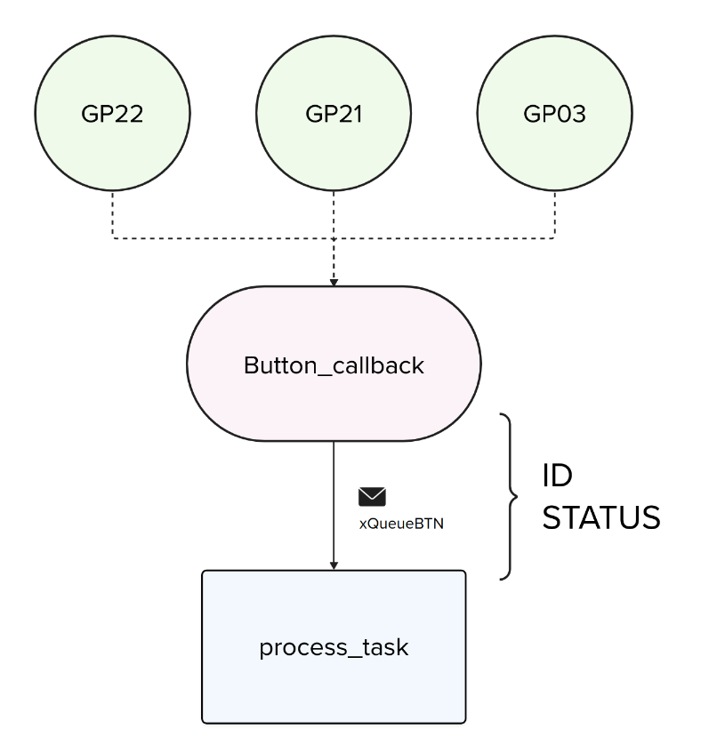

---
tags:
  - rtos
  - queue
description: Envio de uma struct pela fila
---

# Queue - struct

A fila pode ser usada para enviar não apenas um `inteiro` ou um `float`, mas também pode ser utilizada para o envio e recepção de um tipo de dado mais complexo. Podemos enviar na fila um vetor de dados que pode ser uma struct.

Isso facilita muito a organização do código, já que não é mais necessário criar uma fila para cada tipo de dado. Imagine a situação na qual você quer enviar pela fila a informação da interrupção de um botão. Nesse envio, você quer indicar o ID do botão e o status (apertado/solto):



Para isso, será necessário enviar na fila uma struct que deve possuir um campo de ID para indicar o botão e outro de status:

```c
typedef struct btn {
    int id;
    int status;
} btn_t;
```

Agora, na hora de criarmos a fila, devemos criá-la com o tamanho dessa struct:

```c
xQueueBtn = xQueueCreate(32, sizeof(btn_t));
```

E para enviarmos o dado na fila:

```c
void btn_callback(uint gpio, uint32_t events) {
    btn_t btn_data;
    btn_data.id = gpio;
    btn_data.status = events;
    
    // FromISR porque estamos em uma ISR!
    xQueueSendFromISR(xQueueData, &btn_data, 0);
}
```

E para receber:

```c
if (xQueueReceive(xQueueData, &btn_data, portMAX_DELAY)) {
```

!!! warning
    O erro mais comum observado é o de não criar a fila com o tamanho correto. Se for enviar uma struct, é necessário criar a fila com o tamanho da struct.
    
### Snippets

Snippets de código enviando uma `struct` pela `queue`.

### ISR-Task

```c
QueueHandle_t xQueueBtn;

typedef struct btn {
    int id;
    int status;
} btn_t;

void btn_callback(uint gpio, uint32_t events) {
    btn_t btn_data;
    btn_data.id = gpio;
    btn_data.status = events;
    xQueueSendFromISR(xQueueBtn, &btn_data, 0);
}

void btn_task(void *p) {
    btn_t btn_data;

    while (1) {
        if (xQueueReceive(xQueueBtn, &btn_data, portMAX_DELAY)) {
            printf("btn: %d, status: %d\n", btn_data.id, btn_data.status);
        }
    }
}

int main() {
    stdio_init_all();

    xQueueBtn = xQueueCreate(32, sizeof(btn_t));

    // ... 
    // ...
```

