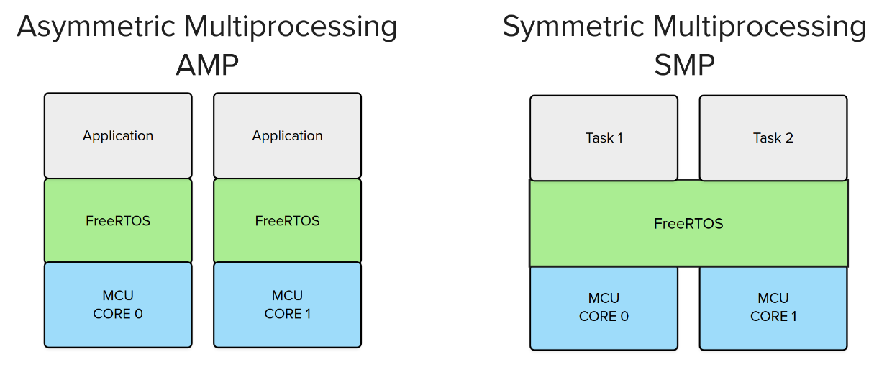
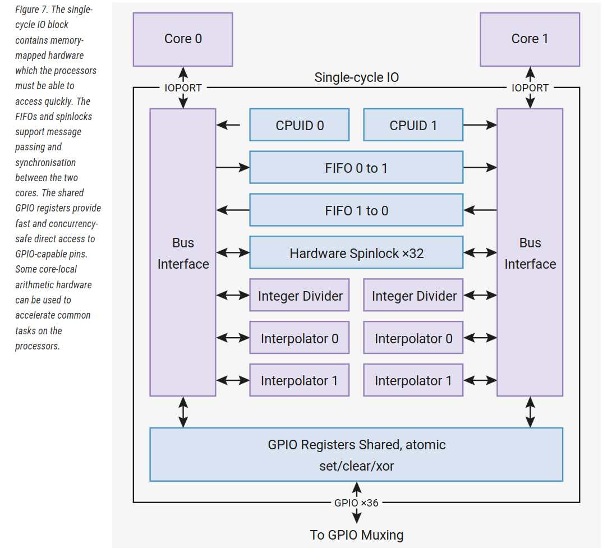

# Symmetric Multiprocessing (SMP)

Existem diversos jeitos de usarmos um RTOS com microprocessador multicore. Dois métodos populares são o Asymmetric Multiprocessing (`AMP`) e o Symmetric Multiprocessing (`SMP`), como indicado a seguir:



A primeira alternativa (`AMP`) consiste em executar dois `FreeRTOS` independentes em cada um dos processadores do microcontrolador, onde cada RTOS pode possuir suas próprias tasks. A comunicação entre as `tasks` de diferentes cores pode ser complicada; uma solução é o uso do recurso que o RP2040 fornece para comunicação entre os COREs, utilizando uma FIFO:

{width=600}

**Até agora nós temos utilizado um único CORE da CPU, ignorando o outro completamente.**

## SMP

!!! video
    

A segunda solução é executar um único `FreeRTOS` entre os dois COREs, o que simplifica bastante, já que toda a parte de baixo nível fica sob a responsabilidade do `FreeRTOS`. Assim, o scheduler do `FreeRTOS` vai alocar uma tarefa por CORE. O `FreeRTOS` recentemente fez merge na branch principal de uma atualização que adiciona suporte ao symmetric multiprocessing (`SMP`), permitindo o agendamento e distribuição de tarefas entre processadores idênticos de um microcontrolador multicore.

No SMP, existem quatro chamadas de função do `FreeRTOS` que deverão ser tratadas:

- `vTaskCoreAffinitySet(handle, mask)`: Fixa uma tarefa em um core específico. Na máscara, usar:
    - Core `0` com a máscara `1 << 0` e Core `1` com a máscara `1 << 1`.
- `vTaskCoreAffinityGet(handle)`: Retorna a qual CORE a tarefa foi atribuída.

!!! tip
    Você não precisa necessariamente associar uma task a um core; você pode deixar o escalonador decidir isso.

Para mais informações, consulte o site do FreeRTOS sobre o SMP:

- [FreeRTOS SMP Introduction](https://www.freertos.org/symmetric-multiprocessing-introduction.html)

### `FreeRTOSConfig.h`

::: info
Esta configuração só funciona com versões específicas do FreeRTOS. Use como base o código:
    
- https://github.com/Evlers/pico-freertos
:::


Para ativarmos o `SMP` em nossos projetos, precisamos editar o arquivo `freertos/FreeRTOSConfig.h`, modificando as seguintes linhas:

```diff
#if FREE_RTOS_KERNEL_SMP // set by the RP2040 SMP port of FreeRTOS
/* SMP port only */
+#define configNUMBER_OF_CORES 2
#define configUSE_PASSIVE_IDLE_HOOK 0
#define configTICK_CORE 0
#define configRUN_MULTIPLE_PRIORITIES 1
+#define configUSE_CORE_AFFINITY 1
#endif
```

Essas configurações fazem o seguinte: `configNUMBER_OF_CORES 2` define para o FreeRTOS quantos cores irão ser utilizados. Se o valor for maior que `1`, o `SMP` será ativado. Já o `configUSE_PASSIVE_IDLE_HOOK 0` indica que não queremos ter uma função de `callback` que será ativada sempre que não existir uma `task` a ser executada. O `configTICK_CORE` define qual `CORE` irá lidar com os `ticks` que o RTOS necessita para chamar o `scheduler`.

Se `configRUN_MULTIPLE_PRIORITIES` for configurado como `0`, então apenas tarefas de prioridades iguais vão executar simultaneamente. Ou seja, se apenas uma tarefa de alta prioridade precisar executar, um dos COREs ficará ocioso. E por último, o `configUSE_CORE_AFFINITY 1` diz que podemos atribuir manualmente uma `task` a um CORE específico!

## Code Snippets

Atribuindo três tasks, a primeira ao `CORE_0` e as demais ao `CORE_1`:

```c
#define CORE_0 (1 << 0)
#define CORE_1 (1 << 1)


void main() { 
    // ...

    TaskHandle_t xHandle1;
    TaskHandle_t xHandle2;
    TaskHandle_t xHandle3;
    
    xTaskCreate(vTask1, "task1", STACK_SIZE, NULL, tskIDLE_PRIORITY + 1, &( xHandle1 ) );
    xTaskCreate(vTask2, "task2", STACK_SIZE, NULL, tskIDLE_PRIORITY    , &( xHandle2 ) );
    xTaskCreate(vTask3, "task3", STACK_SIZE, NULL, tskIDLE_PRIORITY    , &( xHandle3 ) );

    vTaskCoreAffinitySet( xHandle1, CORE_0 );
    vTaskCoreAffinitySet( xHandle2, CORE_1 );
    vTaskCoreAffinitySet( xHandle3, CORE_1 );
}
```
