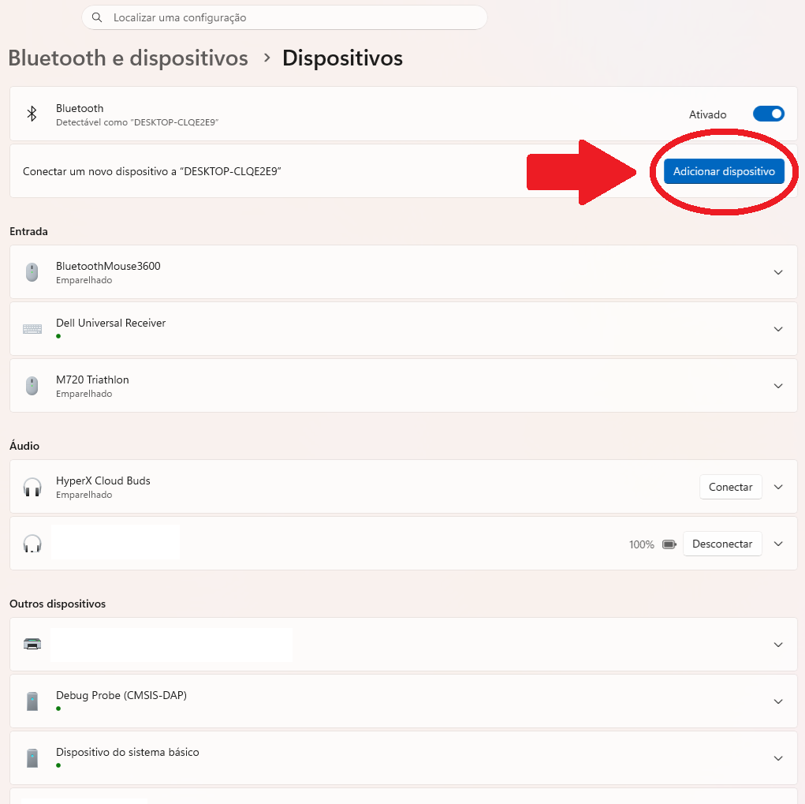
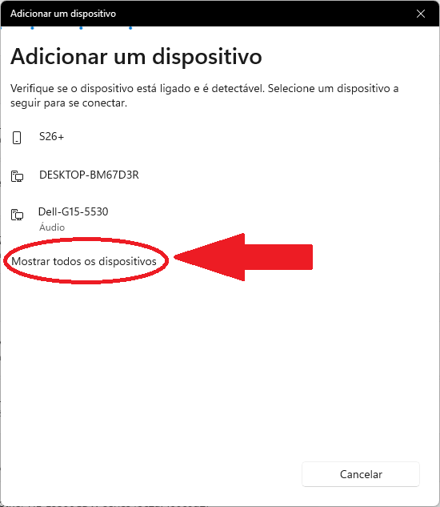
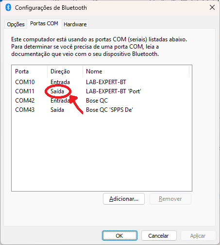

# Configurando Módulo Bluetooth HC-06 no Windows 11

> Tutorial original: [Embedded Programmer – Jorge Aparicio](https://embeddedprogrammer.blogspot.com/2012/07/windows-communicating-with-hc-06.html)

---

## Passo 1 — Descoberta do dispositivo

Abra o gerenciador de dispositivos Bluetooth de uma das formas abaixo:

- Acesse **Configurações > Bluetooth e dispositivos** (ou pressione `Win + I` e navegue até lá)
- Clique em **"Adicionar dispositivo"**
- Selecione **Bluetooth** na janela que abrir



O Windows 11 iniciará a busca por dispositivos Bluetooth próximos — certifique-se de que o módulo HC-06 esteja energizado neste momento.

> **Dica:** caso o HC-06 não apareça na lista, role até o final da janela e clique em **"Mostrar todos os dispositivos Bluetooth"**. Isso força o Windows a exibir dispositivos clássicos (BR/EDR) que podem ficar ocultos na visualização padrão.



---

## Passo 2 — Pareamento

Na lista de dispositivos encontrados, selecione o HC-06. Ele aparecerá com o nome padrão de fábrica `linvor`, ou com um nome personalizado caso tenha sido configurado via comando AT (ex: `LAB-EXPERT-BT`).

O Windows 11 pode solicitar o PIN diretamente nesta etapa. Insira o PIN do módulo — o padrão de fábrica é `1234`, mas pode ter sido alterado via comando AT.

---

## Passo 3 — Identificar a porta COM de Saída

O Windows cria **duas** portas COM para o HC-06: uma de Entrada e uma de Saída. Para comunicação serial bidirecional, utilize sempre a porta de **Saída**.

Para visualizar as portas atribuídas, abra as **Configurações de Bluetooth**:

1. Pressione `Win + R`, digite o comando abaixo e pressione Enter:
   ```
   control bthprops.cpl,,1
   ```
2. Na janela que abrir, clique na aba **"Portas COM"**
3. Localize o dispositivo HC-06 — serão listadas duas entradas:
   - **Entrada** — usada pelo módulo para enviar dados ao PC
   - **Saída (Outgoing)** — usada pelo PC para enviar dados ao módulo
4. Anote a porta de **Saída** (ex: `COM11`) — é ela que deve ser usada nos scripts e terminais



---

## Passo 4 — Comunicação

Com o módulo registrado como porta COM, é possível comunicar através de qualquer software ou script que abra uma porta serial.

### Python com pyserial

Instale a biblioteca:

```bash
pip install pyserial
```

Script para receber dados:

```python
import serial

ser = serial.Serial('COM3', baudrate=9600, timeout=1)  # ajuste a porta COM

print("Aguardando dados...")

while True:
    linha = ser.readline()
    if linha:
        print(linha.decode('utf-8').strip())
```

Para enviar dados ao módulo:

```python
ser.write(b'Hello HC-06\n')
```

> **Dica:** substitua `COM3` pela porta identificada no Passo 3. O `baudrate` padrão de fábrica do HC-06 é `9600`.

---

## Resultado

Pronto! O módulo HC-06 está configurado e acessível no Windows como uma porta COM virtual, pronto para enviar e receber dados via Bluetooth.
