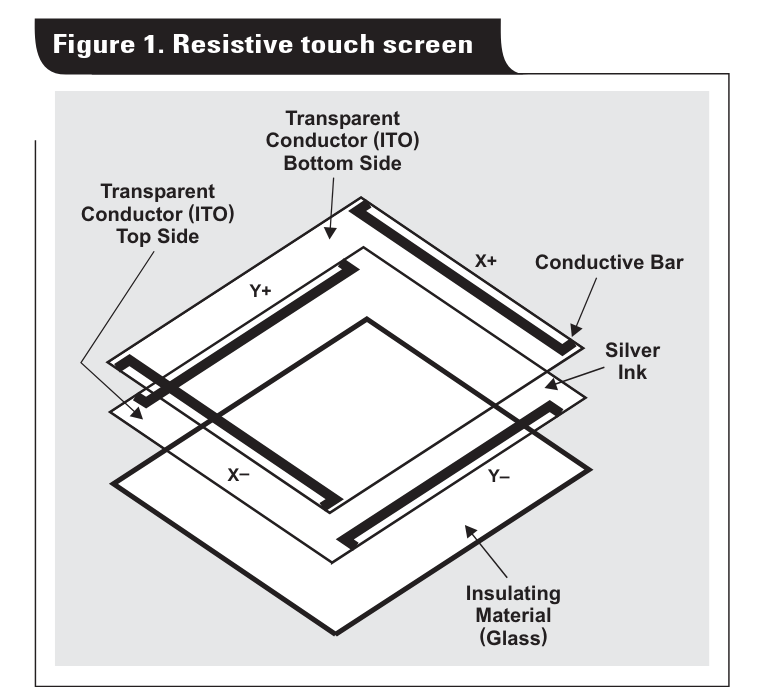
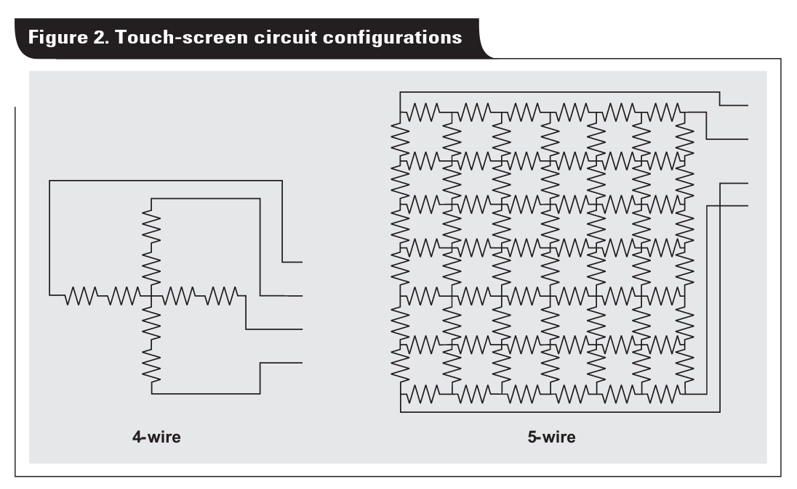

---
tags:
  - lcd
  - gxf
description: Uso de LCD
---

# LCD

O LCD que iremos usar nas próximas atividades da disciplina é fabricado pela adafruit com o nome de: [`2.8" TFT LCD with Touchscreen Breakout Board w/MicroSD Socket - ILI9341`](https://www.adafruit.com/product/1770) ele possui um LCD de `240x320` pixels operando em RGB e com uma sensor touch resistivo. O LCD é controlado por um controlador chamado de [**ILI9341**](https://cdn-shop.adafruit.com/datasheets/ILI9341.pdf) ele é responsável por atualizar e exibir as informações na tela. 

{width=500}

## ILI9341

O LCD utiliza o circuito integrado [ILI9341](https://cdn-shop.adafruit.com/datasheets/ILI9341.pdf) como controlador do display, este CI é responsável por toda parte de baixo nível de acesso ao LCD, este chip possui duas formas de interface com o uC: Paralelo e SPI. Iremos utilizar ele operando via SPI como ilustrado a seguir:

```
  x---------x           x---------x
  |         |           |         |
  | uc      |           | LCD     |
  |   ------|    spi    |-------  |
  |   | spi | <---/---> | ili  |  |
  x---------x           x---------x
```


::: box "ILI9341"
**a-Si TFT LCD Single Chip Driver 240RGBx320 Resolution and 262K color**

LI9341 is a 262,144-color single-chip SOC driver for a-TFT liquid crystal display with resolution of 240RGBx320 dots,  comprising  a  720-channel  source  driver,  a  320-channel  gate  driver,  172,800 bytes  GRAM  for  graphic display data of 240RGBx320 dots, and power supply circuit.

ILI9341  supports  parallel  8-/9-/16-/18-bit  data  bus  MCU  interface,  6-/16-/18-bit  data  bus  RGB  interface  and 3-/4-line serial peripheral interface (SPI). The moving picture area can be specified in internal GRAM by window address  function.  The  specified  window  area  can  be updated  selectively,  so  that  moving  picture  can  be displayed simultaneously independent of still picture area. 

ILI9341  can  operate  with  1.65V  ~  3.3V  I/O  interface  voltage  and  an  incorporated  voltage  follower  circuit  to generate voltage levels for driving an LCD. ILI9341 supports full color, 8-color display mode and sleep mode for precise power control by software and these features make the ILI9341 an ideal LCD driver for medium or small size portable products such as digital cellular phones, smart phone, MP3 and PMP where long battery life is a major concern.  

> Extraído do manual.
:::

## Touch

O LCD possui um "película" de [touchscreen resistivo](https://en.wikipedia.org/wiki/Resistive_touchscreen) que possibilita detectarmos toques na tela, conforme ilustrado a seguir:

{width=300} 
{width=300}

> Fonte das figuras: https://www.ti.com/lit/an/slyt209a/slyt209a.pdf

A película fornece dois valores de resistência: X e Y e via duas leituras analógicas conseguimos estimar onde aconteceu o toque na tela, e inclusive a pressão do toque.  O módulo de touch resistivo funciona de forma independente do display, sendo responsável por detectar a posição do toque na superfície da tela.

A Conexão do touch resistivo com o uC acontece via duas leituras analógicas conforme diagrama a seguir:

```
  x---------x          x----------- x
  |     dx  | -------> |  t  | LCD |
  | uc  dy  | -------> |  o  |     |
  |    AFEC | <------- |  u  |     |
  |    AFEC | <------- |  c  |     |
  x---------x          x-----------x
```

::: box
Como o touch não acompanha automaticamente a rotação aplicada ao display, é necessário realizar uma transformação das coordenadas para que o ponto detectado corresponda corretamente à interface gráfica exibida.
:::

# Bibliotecas gráficas

> Também conhecido por: GFX "Graphics" or "Graphic Effects"

O LCD é apenas responsável por exibir um `px` no display, normalmente ele é utilizado em conjunto com uma 
bibliotecas gráfica que estará sendo executada no microcontrolador e será responsavel por desenhar a tela e então se comunicar com o LCD para que os `pixels` sejam atualizados.

::: box-green framebufer
A maioria das bibliotecas gráficas trabalham com o conceito de [framebuffer](https://en.wikipedia.org/wiki/Framebuffer) que é uma região contínua de memória usada para armazenar a imagem que será exibida na tela, essa tecnologia é usado em vários lugares, inclusive no [linux](https://en.wikipedia.org/wiki/Linux_framebuffer). Em alguns casos é necessário dois framebuffers operando no modo [ping pong buffer](https://embedded.fm/blog/2017/3/21/ping-pong-buffers)
:::

Existem diversas bibliotecas gráficas que podem ser utilziadas para desenvolvimento de aplicacões embarcadas, caso queiram utilizar uma diferente da que será utilziada no curso, indicamos darem uma olhada no [lvgl](https://lvgl.io/) [^1].


[^1]: Essa lib foi utilizada em versões anteriores do curso, caso precise de ajuda a equipe possui domínio sobre ela.

# gfx

Nos exemplos do curso vocês irão trabalhar com uma `gfx` criada pelo Marco. Ela é uma lib bem simples, porém permitirá que vocês criem bastante coisas. A lib possui atualmente as seguintes funcoes, e funciona apenas com o controlador de display `ILI9341`.

- `gfx_init()` para inicializar o display e o subsistema gráfico
- `gfx_clear()` para limpar completamente a tela
- `gfx_fillRect()` para desenhar retângulos preenchidos
- `gfx_drawRect()` para desenhar retângulos apenas com contorno
- `gfx_drawCircle()` para desenhar círculos com espessura configurável
- `gfx_drawBitmap()` para desenhar bitmaps monocromáticos
- Definir a posição do texto com `gfx_setCursor()`
- Ajustar tamanho do texto com `gfx_setTextSize()`
- Ajustar cor do texto com `gfx_setTextColor()`
- Imprimir texto a partir do cursor com `gfx_print()`
- Desenhar texto em posição específica com `gfx_drawText()`
- Obter a largura em pixels de um texto com `gfx_getTextWidth()`
- Converter coordenadas brutas do touch com `gfx_touchTransform()`
- Desenhar botão retangular com `gfx_But_drawRect()`
- Verificar se botão retangular foi pressionado com `gfx_But_isPressed()`
- Desenhar botão com imagem usando `gfx_But_drawBitmap()`
- Verificar se botão com imagem foi pressionado com `gfx_But_isPressedBitmap()`

## Snippets

Códigos de exemplo para o uso do LCD.

### Demo

https://github.com/insper-embarcados/pico-lcd-ili9341/tree/main/DEMO

```c
#include <stdio.h>
#include "pico/stdlib.h"

#include "tft_lcd_ili9341/ili9341/ili9341.h"
#include "tft_lcd_ili9341/gfx/gfx_ili9341.h"
#include "tft_lcd_ili9341/touch_resistive/touch_resistive.h"

#include "image_bitmap.h"

#define SCREEN_ROTATION  1   // 0 = RETRATO, 1 = PAISAGEM

int main(void)
{   
    stdio_init_all();

    LCD_initDisplay();
    LCD_setRotation(SCREEN_ROTATION);

    gfx_init();
    gfx_clear();

    extern uint16_t _width;
    extern uint16_t _height;

    /* ============================
       TÍTULO CENTRALIZADO
       ============================ */

    const char *msg1 = "Computacao";
    const char *msg2 = "Embarcada";
    const char *msg3 = "5s";

    gfx_setTextSize(1);             // Tamanho 1 (6x8 pixels por caractere)
    gfx_setTextColor(0xF800);       // Vermelho
    gfx_drawText(130, 10, msg1);    // Escreve a msg1 na posição (130, 10)

    gfx_setTextSize(2);             // Tamanho 2 (12x16 pixels por caractere)
    gfx_setTextColor(0x07E0);       // Verde
    gfx_drawText(106, 25, msg2);    // Escreve a msg2 na posição (106, 25)
    
    gfx_setTextSize(4);             // Tamanho 4 (24x32 pixels por caractere)
    gfx_setTextColor(0x001F);       // Azul
    gfx_drawText(136, 50, msg3);    // Escreve a msg3 na posição (136, 50)


    /* ============================
       FORMAS GEOMÉTRICAS
       ============================ */

    // Círculo à esquerda
    gfx_drawCircle(
        (_width / 6),               // X centralizado na primeira sexta parte da tela
        (_height / 2),              // Y centralizado verticalmente
        30,                         // Raio de 30 pixels
        0xF81F,                     // Cor magenta
        10);                        // Espessura de 10 pixels

    // Quadrado à direita
    gfx_drawRect(
        (_width / 4) * 3,           // X centralizado na terceira sexta parte da tela
        (_height / 2) - 30,         // Y centralizado verticalmente, ajustado para o tamanho do quadrado
        60,                         // Largura de 60 pixels
        60,                         // Altura de 60 pixels  
        0x07FF,                     // Cor ciano
        3);                         // Espessura de 3 pixels                       

    /* ============================
       IMAGEM BITMAP
       ============================ */

    gfx_drawBitmap(
        117,                        // Posição em X
        140,                        // Posição em Y
        image_Layer_1_bits,         // Vetor de bytes do bitmap
        92,                         // Largura do bitmap
        92,                         // Altura do bitmap
        0xFFFF                      // Cor branca para os pixels "ligados" do bitmap
    );       

    /* ============================
       TOUCH
       ============================ */

    configure_touch();

    int px, py;

     while (true)
{
    if (readPoint(&px, &py))
    {
        int drawX, drawY;

        gfx_touchTransform(SCREEN_ROTATION,
                           px, py,
                           &drawX, &drawY);

        // Limpa faixa inferior
        gfx_fillRect(
            4,                      // X inicial
            _height - 40,           // Y inicial
            78,                     // Largura da faixa (toda a largura da tela)
            30,                     // Altura da faixa
            0xF800                  // Cor vermelho para limpar a área
        );                

        gfx_setTextSize(1);         // Seta para Tamanho 1 (6x8 pixels por caractere)
        gfx_setTextColor(0xFFFF);   // Cor branca para o texto

        // Linha 1
        gfx_setCursor(6, _height - 35);     // Posição para a primeira linha de texto
        gfx_print("ULTIMO TOQUE:");         // Escreve o título "ULTIMO TOQUE:"

        // Linha 2
        char buffer[40];                                // Buffer para armazenar as coordenadas formatadas
        sprintf(buffer, "X:%d Y:%d", drawX, drawY);     // Formata as coordenadas em uma string   

        gfx_setCursor(12, _height - 20);                // Posição para a segunda linha de texto, um pouco abaixo da primeira
        gfx_print(buffer);                              // Escreve as coordenadas do toque formatadas

        sleep_ms(10);
    }
}
}
```


