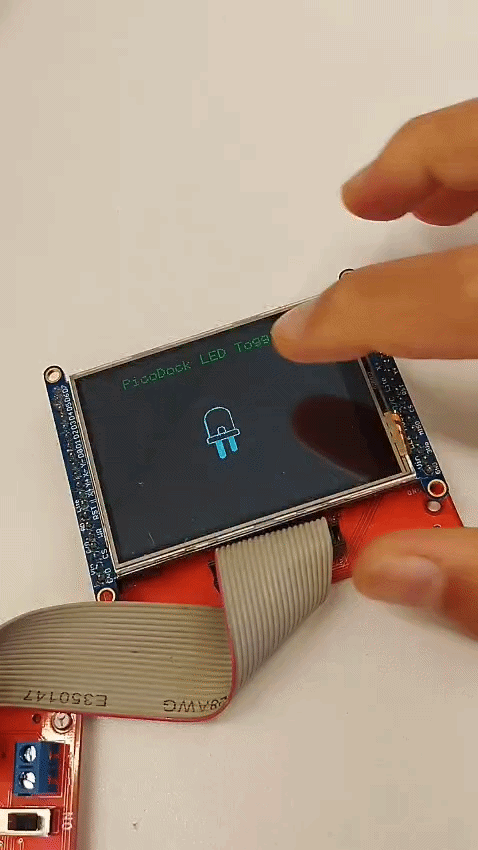
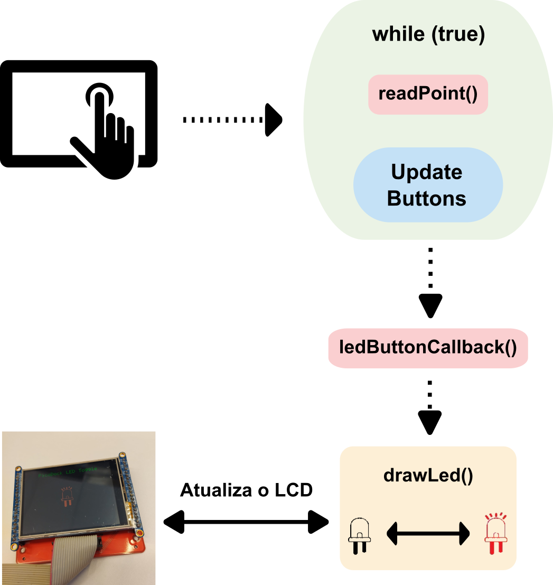
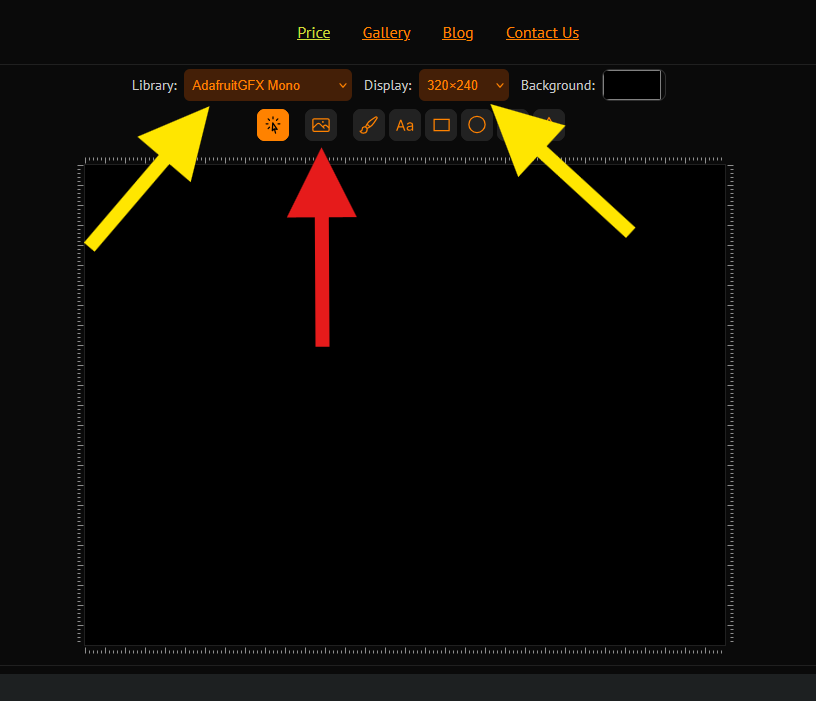
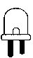
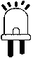
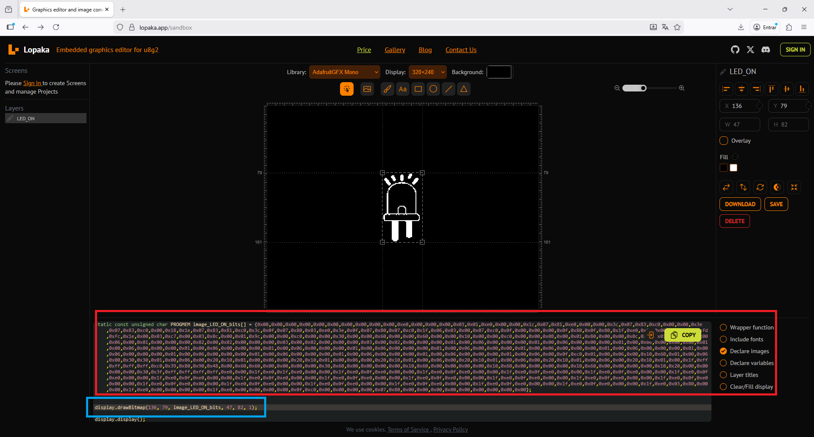

# Lopaka 

::: info Código base
Para serguir o tutorial utilize o código exemplo a seguir:

-  https://github.com/insper-embarcados/pico-lcd-ili9341
:::

A plataforma [lopaka](https://lopaka.app/) permite criarmos interfaces para displays de forma fácil, gerando os arquivos necessários para importarmos o design em um sistema embarcado. 

A seguir um tutorial de como usar a plataforma para criar um botão no LCD a partir de uma imagem.

## Criando um botão com uma imagem

A seguir um breve tutorial de como criar um botão a partir de uma imagem para gerar o efeito a seguir:

{width=250px}

No link para o repositório abaixo está o exemplo que vamos utilizar (LED_TOGGLE):

- https://github.com/insper-embarcados/pico-lcd-ili9341

O código de demonstração possui o seguinte fluxo:

{width=400px}

### Passos

Os bitmaps dos estados ON e OFF do LED foram gerados através do site:

- https://lopaka.app/sandbox

Na imagem abaixo você deve fazer a configuração conforme indicado pelas setas amarelas

{width=400px}

A seta vermelha é o botão que em que você importa a imagem, abaixo estão ambas as imagems (.bmp) utilizadas:

::: half
{width=40x}
:::

::: half
{width=40px}
:::


Após a importação é retornado o Bitmap gerado e também a função drawBitmap, já setada com o bitmap, tamanho e posição na tela.

{width=500px}

- VERMELHO: Bitmap contendo os valores

- AZUL: Função drawBitmap contendo informações do tamanho da imagem gerada e posiçao na tela

```c

drawBitmap(
    136,                //Posição horizontal da imagem
    79,                 //Posição vertical da imagem
    image_LED_ON_bits,  //Ponteiro para os dados do bitmap da imagem
    47,                 //Largura da imagem (width)
    82,                 //Altura da imagem (height)
    1                   //Cor da imagem (1 para cor definida, 0 para transparente)
);

```

Após isso, basta:

- Abrir o arquivo `image_bitmap.h` e colar o vetor Bitmap
- No main.c modificar as variáveis que solicitção os tamanho de `WIDTH` e `HEIGHT` da __imagem__

::: warning ATENÇÃO!!!
- O site gera um vetor do tipo `static const unsigned char PROGMEM`, no nosso exemplo utilizamos `static const uint8_t`, como pode ser visto no código exemplo.
:::

