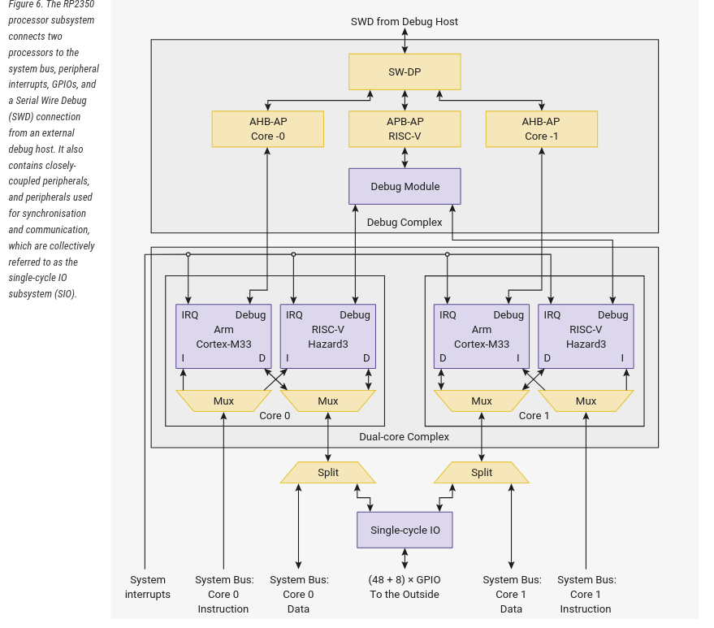

# Multi-core

O **RP2350** é um sistema dual-core simétrico. Os dois núcleos operam simultaneamente e de forma independente, oferecendo alto throughput de processamento e a capacidade de direcionar interrupções para núcleos distintos, melhorando tanto o throughput quanto a latência no tratamento de interrupções.

Os dois núcleos possuem uma visão simétrica do barramento do sistema: todos os recursos de memória no RP2350 são igualmente acessíveis por ambos os núcleos, com o mesmo desempenho.



## Paradigmas de Arquitetura para Sistemas Multicore

Em sistemas embarcados multicore, a divisão de responsabilidades entre os núcleos pode seguir diferentes estratégias. Considerando um cenário inicial sem sistema operacional (bare-metal), destacam-se dois paradigmas principais:

### 1. Arquitetura Mestre–Acelerador (Master–Worker)

Um núcleo (core primário) executa a lógica principal da aplicação, incluindo controle de fluxo e gerenciamento de estado.  

O segundo núcleo (core secundário) é dedicado à execução de tarefas computacionalmente intensivas (CPU-bound), como:

- Processamento digital de sinais (DSP)
- Cálculos matemáticos complexos (FTP)
- Criptografia
- Processamento de dados

### 2. Particionamento Funcional Simétrico

Cada núcleo é responsável por um subconjunto específico do sistema, com responsabilidades de complexidade semelhante. A divisão pode ser feita por domínio funcional (ex.: comunicação e controle) ou por etapas de processamento.

Esse modelo exige definição clara de sincronização, compartilhamento de memória e mecanismos de exclusão mútua.

## Interrupções

Cada núcleo possui um controlador de interrupções independente, e ambos compartilham praticamente o mesmo conjunto de fontes de interrupção.

O SDK associa a interrupção ao núcleo que a inicializou, conforme o exemplo abaixo:

```c
void gpio_set_irq_callback(gpio_irq_callback_t callback) {
    uint core = get_core_num();
```

::: box-green gpio
Por esse motivo, cada núcleo pode ter um callback de interrupção independente do outro. Ou seja, podemos ter dois callbacks de GPIO distintos — um para cada núcleo.
:::

## Usando multiplos COREs

A ideia é que teremos duas funções `main` cada uma com um loop infinito `while(1)` executando independente em cada um dos COREs ARM que a pico possui.

Para isso iremos ter que criar uma segunda função `main`, usualmente chamada de `core1_entry` nos exemplos oficiais da rasp pico, e indicar para o processador que ela será executada no segundo core, isso é feito pelo uso da função pela chamada da função no `main` principal.

```
multicore_launch_core1(core1_entry);
```

## Sincronismo

Ao trabalhar com sistemas multicore, é comum precisar:

1. Sincronizar um núcleo com o outro (por exemplo, liberar a execução do outro núcleo após determinado evento).
2. Transferir informações entre os núcleos.


### Variável global

Podemos resolver isso utilizando uma variável global compartilhada entre os núcleos?
Teoricamente, sim.

Uma variável global é visível e acessível por ambos os núcleos no RP2350. Como ambos compartilham o mesmo espaço de memória SRAM, declarar uma variável como global permite que os dois núcleos leiam e escrevam nela.

Porém — e este ponto é crítico — **visibilidade ≠ sincronização**.

Acesso concorrente sem mecanismos de proteção resulta em:

* *Data races*
* Comportamento indefinido
* Bugs difíceis de reproduzir e depurar

Portanto, é necessário utilizar mecanismos apropriados de sincronização.

### FIFO


Um dos mecanismos clássicos de sincronização e transferência de dados entre núcleos é a **FIFO** (*First-In, First-Out*).

Os microcontroladores da série RP possuem duas FIFOs para passagem de dados, mensagens ou eventos ordenados entre os dois núcleos e cada FIFO possui largura de 32 bits.

### Funções principais da API de FIFO

```c
// Verifica se há dados disponíveis na FIFO de leitura
// (dados enviados pelo outro núcleo)
static bool multicore_fifo_rvalid (void);

// Envia dados para a FIFO de escrita
// (dados destinados ao outro núcleo)
void multicore_fifo_push_blocking (uint32_t data);

// Remove (lê) um dado da FIFO de leitura
// (dados vindos do outro núcleo)
uint32_t multicore_fifo_pop_blocking (void);

// Remove (lê) um dado da FIFO de leitura com timeout
bool multicore_fifo_pop_timeout_us (uint64_t timeout_us, uint32_t *out);
```

## SDK

Para usar o ADC você deve modificar o `CMakeLists.txt` adicionando `pico_multicore` no `target_link_libraries`:


```diff
target_link_libraries(
                      ....
                      .....
+                     pico_multicore
)
```

E adicionar no headfile:

```c
#include "pico/multicore.h"
```

## Snippets

Códigos exemplo para uso do multicore da pico.

### Hello world

O exemplo a seguir executa dois printf um em cada core (`main` e `core1_entry`):

```c
#include <stdio.h>
#include "pico/stdlib.h"
#include "pico/multicore.h"

void core1_entry() {
    while(1){
        printf("Hello, core 1!\n");
        sleep_ms(100);
    }
}

int main() {    
    stdio_init_all();

    // inicializa core 1 com a função core1_entry
    multicore_launch_core1(core1_entry);

    while(1){
        printf("Hello, core 0!\n");
        sleep_ms(250);
    }
}
```

### Sincronismo

- [Link para API](https://www.raspberrypi.com/documentation/pico-sdk/high_level.html#group_multicore_fifo) / [Link para exemplo](https://github.com/raspberrypi/pico-examples/blob/master/multicore/hello_multicore/multicore.c)

No código a seguir, cada CORE controla um dos LEDs que estão conectados na pico, o `CORE_0` controla o `LED_0` e o `CORE_1` controla o` LED_1`. Os LEDs nunca piscam juntos, primeiro o LED_0 pisca por 5 vezes então o `LED_1` pisca por outras 5 vezes. Uma FIFO de comunicação é utilziada como mecanismo de sincronizacão.

```c
#include <stdio.h>
#include "pico/stdlib.h"
#include "pico/multicore.h"

const int LED_0 = 15;
const int LED_1 = 16;

void core1_entry() {
    printf("Hello, core 1!\n");

    gpio_init(LED_1);
    gpio_set_dir(LED_1, GPIO_OUT);

    int i = multicore_fifo_pop_blocking();
    while(1){

        if (i++ < 5) {
            gpio_put(LED_1, 1);
            sleep_ms(250);
            gpio_put(LED_1, 0);
            sleep_ms(250);
        } else {
            multicore_fifo_push_blocking (0);
            i = multicore_fifo_pop_blocking();
        }
    }
}

int main() {
    stdio_init_all();
    printf("Hello, core 0!\n");

    // inicializa core 1 com a função core1_entry
    multicore_launch_core1(core1_entry);

    gpio_init(LED_0);
    gpio_set_dir(LED_0, GPIO_OUT);

    int i = 0;
    while(1){
        if (i++ < 5) {
            gpio_put(LED_0, 1);
            sleep_ms(250);
            gpio_put(LED_0, 0);
            sleep_ms(250);
        } else {
            multicore_fifo_push_blocking (0);
            i = multicore_fifo_pop_blocking();
        }
    }
}
```
