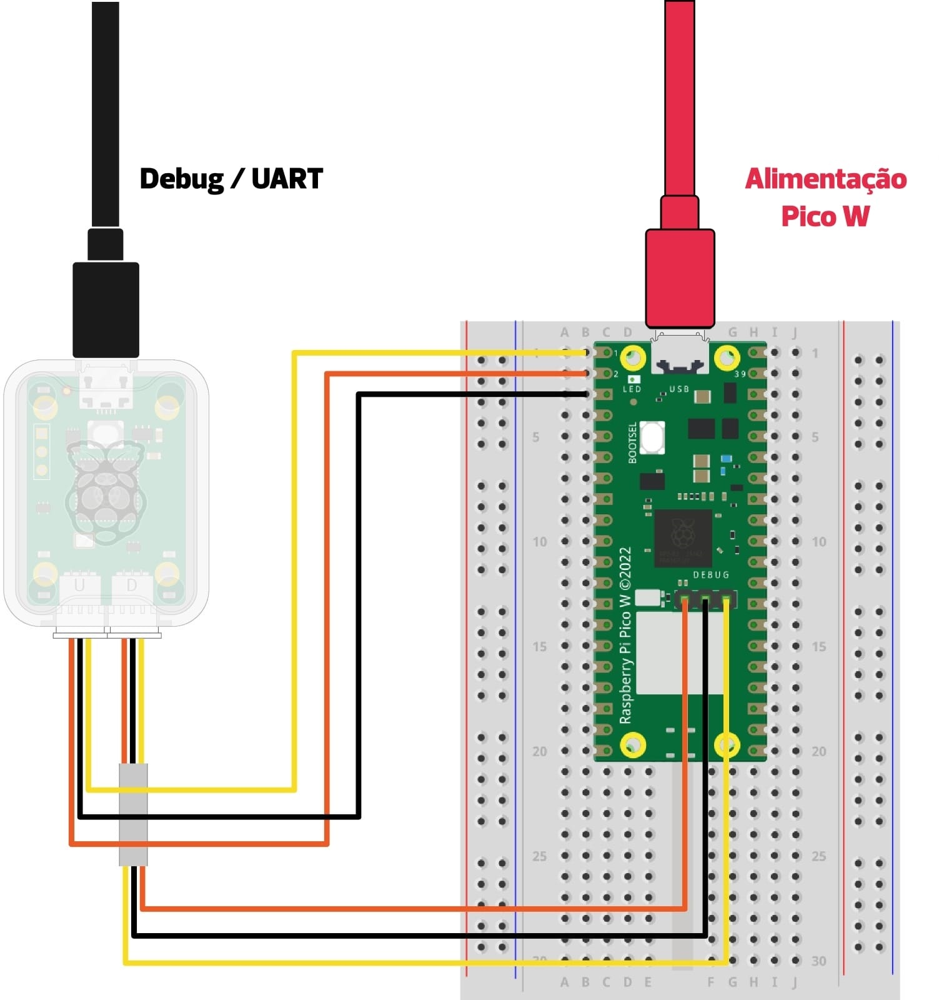

---
tags:
  - ambiente de desenvolvimento
description: Programando e depurando a pico, como usar o debug-probe.
---

# Linux? 

Se você estiver no Linux (ubuntu) precisa instalar:

```
sudo apt install libjim-dev libjim0.79 openocd gdb-multiarch libftdi1-2 libhidapi-hidraw0
```

E usar o comando `sudo gedit  /etc/udev/rules.d/60-openocd.rules` que vai criar um arquivo e coloca o [ESSE CONTEUDO](https://github.com/raspberrypi/openocd/blob/sdk-2.0.0/contrib/60-openocd.rules) no arquivo criado.

::: highlight
Agora reinicie o computador!
:::

# Depurador

No curso iremos usar o [debug-probe](https://www.raspberrypi.com/documentation/microcontrollers/debug-probe.html), um dispositivo criado para podermos gravar, depurar e ter acesso à saída UART da Raspberry Pi Pico.

Primeiro, faça a conexão como indicado a seguir:

::: info
    Note a necessidade de dois cabos USB!
:::

:::tabs
== tab Montagem

== tab Imagem

:::
