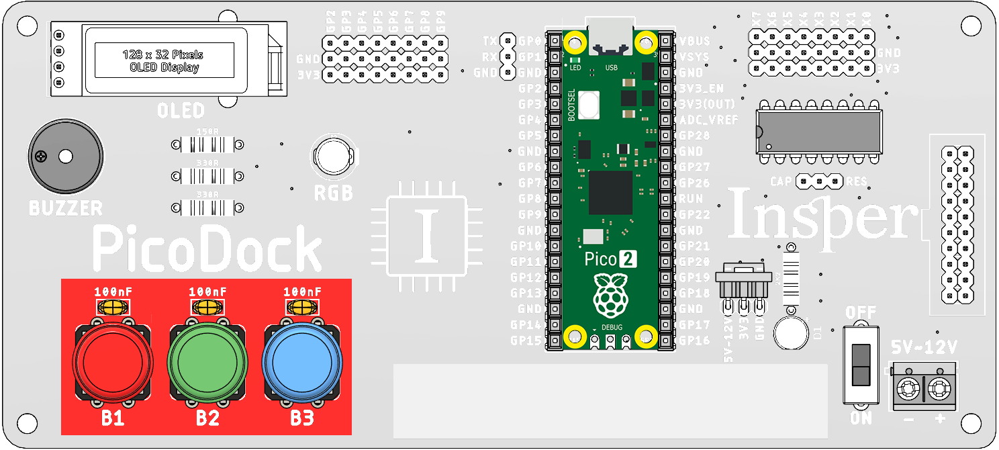
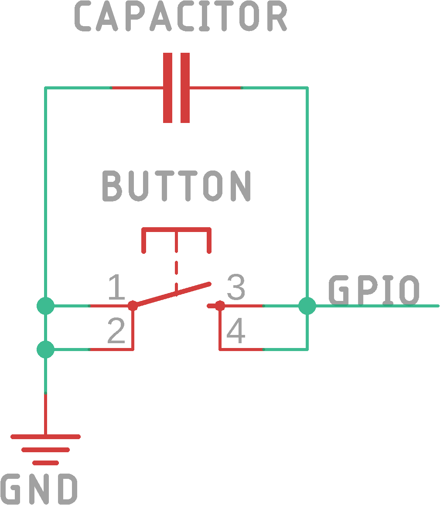
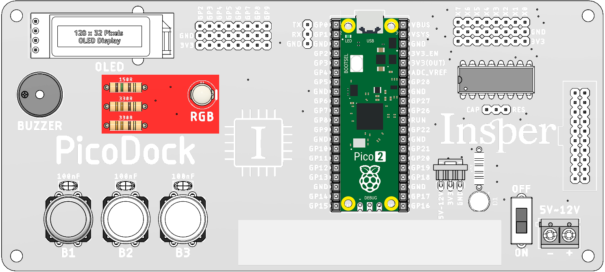
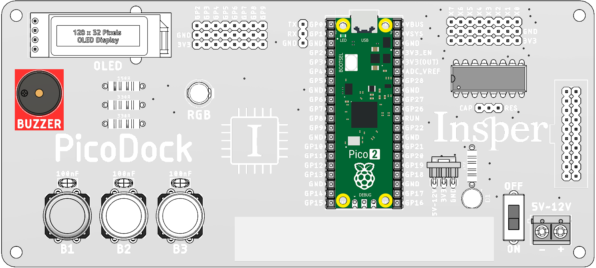
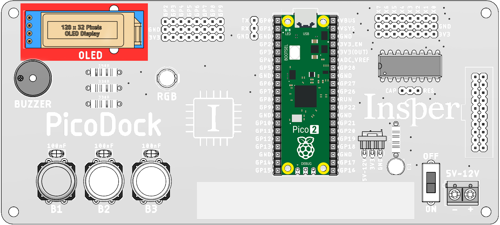
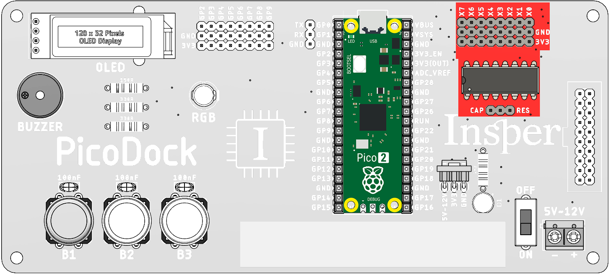
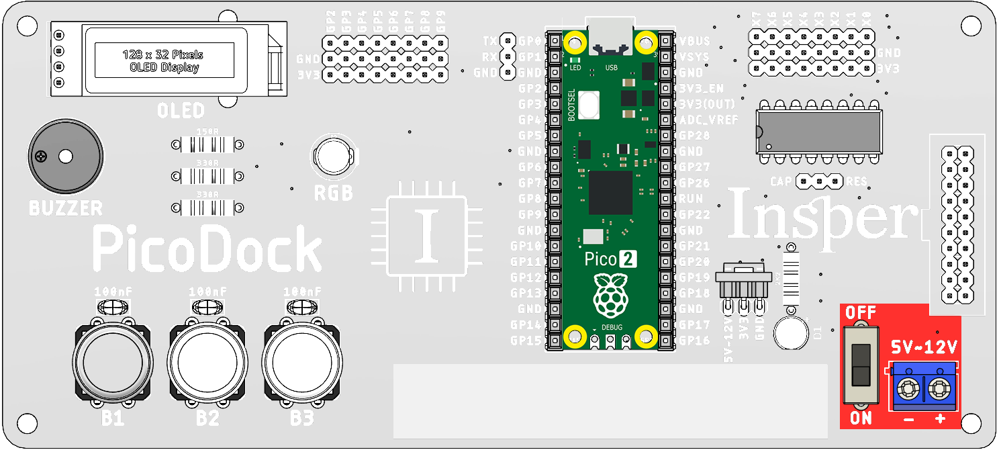
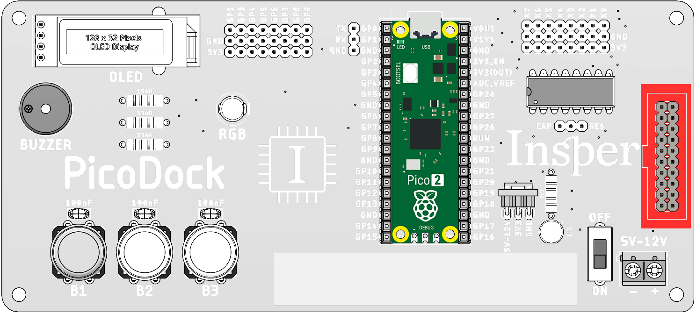

---
tags:
  - periféricos
  - picodock
description: Kit de desenvolvimento pico-dock
---

A **PicoDock** é uma placa de expansão desenvolvida para ser utilizada com a **Raspberry Pi Pico**, oferecendo acesso simplificado a diversos componentes eletrônicos já integrados.  
Seu objetivo é facilitar o desenvolvimento de projetos de prototipagem, ensino e experimentação em sistemas embarcados.

## Recursos

A **Raspberry Pi Pico** pode ser encaixada diretamente no soquete da PicoDock, onde todos os componentes ficam disponíveis sem a necessidade de conexão adicional, são os principais recursos:

- 3x Botões;
- 1x LED RGB;
- 1x Buzzer sem oscilador interno;
- 1x OLED 128x32;
- 1x Multiplexador ADC 8x1;
- 1x Barramento para conexão com a placa TFT LCD - Dock;
- 1x Borne KRE para alimentação externa até 12V;

Abaixo estão detalhados os GPIOs de cada recurso da placa:

| Componente | GPIO | Descrição |
| -------- | ----- | ----------- |
| OLED - SDA | 2 | -- |
| OLED - SCK (SCL) | 3 | -- |
| Botão B1 | 4 | -- |  
| Botão B2 | 5 | -- |
| Botão B3 | 6 | -- |
| LED RGB - Vermelho | 7 | -- |
| LED RGB - Verde | 8 | -- |
| LED RGB - Azul | 9 | -- |
| Buzzer | 10 | -- |
| Sel_A_4051 (MUX) | 11 | -- |
| Sel_B_4051 (MUX) | 12 | -- |
| Sel_C_4051 (MUX) | 13 | -- |
| ADC_IN_4051 (MUX) | 28 | -- |
| LCD_TOUCH_X+ (Resistivo) | 14 | -- |
| LCD_TOUCH_X- (Resistivo) | 26 | -- |
| LCD_TOUCK_Y+ (Resistivo) | 27 | -- |
| LCD_TOUCH_Y-/SDA (Resistivo / Capacitivo) | 20 | -- |
| LCD_TOUCH_SCL (Capacitivo) | 21 | -- |
| LCD_RESET | 16 | -- | 
| LCD_SPI_0_CS | 17 | -- |
| LCD_SPI_0_SCK | 18 | -- |
| LCD_SPI_0_TX | 19 | -- |
| LCD_DATA_CMD_SEL | 22 | -- |
| LCD_LITE | 15 | -- |

### Botões

A placa possui 3 botões para uso geral:

- Quando pressionado, o estado lógico vai para **0**.  
- Quando solto, o estado lógico fica em **alta impedância**, sendo necessário ativar o pino de leitura com **PULL_UP**.  

Segue abaixo o circuito implementado em cada botão:

### LED RGB

Permite o controle de três canais de cor (Vermelho, Verde e Azul) para geração de diferentes combinações de cores.  

### BUZZER

Controlado por saída digital ou PWM, pode ser utilizado para emissão de alertas sonoros ou geração de tons. 

### Display OLED 128x32

Conectado via protocolo I²C, possibilita a exibição de textos, gráficos e dados de sensores.  

### Display MUX_8x1 (ADC)

Conectado ao **pino ADC2** da Pico, permite a leitura de até 8 sinais analógicos diferentes através de um único canal.  

### Alimentação Externa

Conector para **alimentação externa**, garantindo maior flexibilidade no fornecimento de energia.  

### LCD TFT

Compatível para conexão de displays **TFT LCD**, expandindo as possibilidades visuais da placa.  

## Aplicações

- Prototipagem rápida de projetos com Raspberry Pi Pico 2  
- Ensino de eletrônica digital e programação embarcada  
- Projetos com múltiplas entradas analógicas  
- Testes com diferentes tipos de displays (OLED e TFT)  
- Desenvolvimento de sistemas interativos (botões, LEDs, buzzer)  
