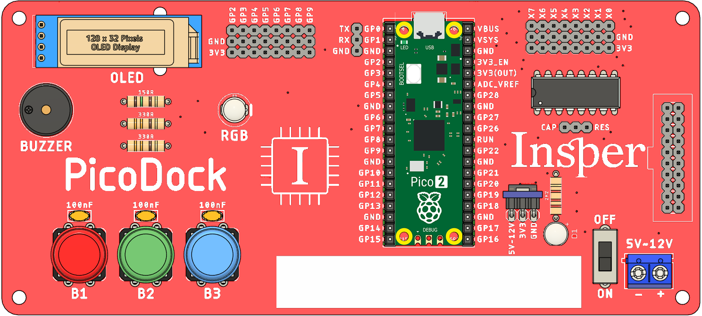
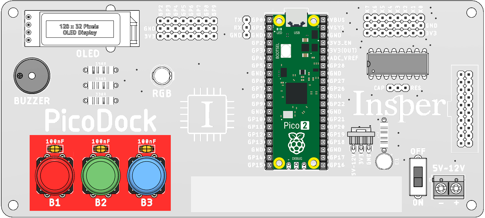
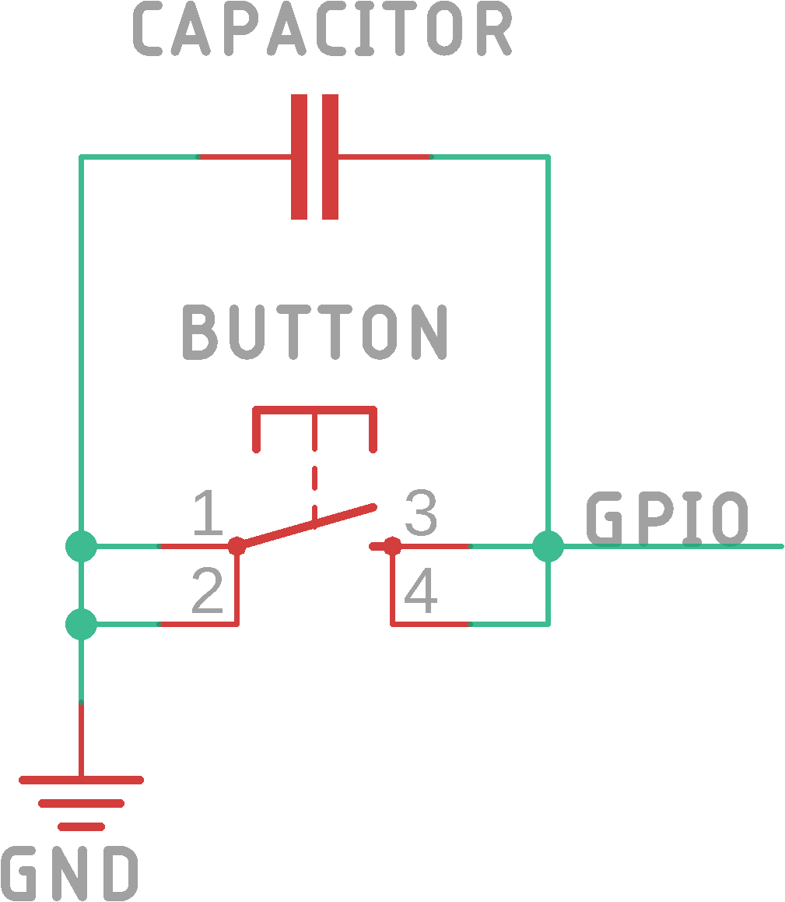
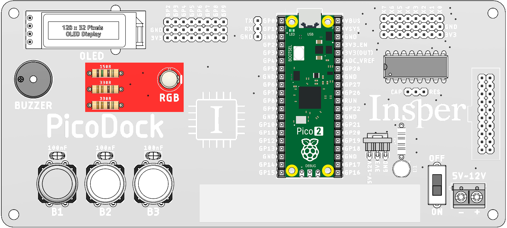
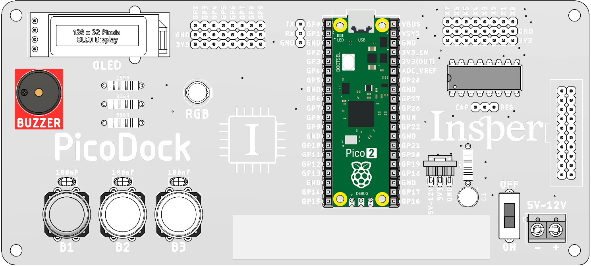
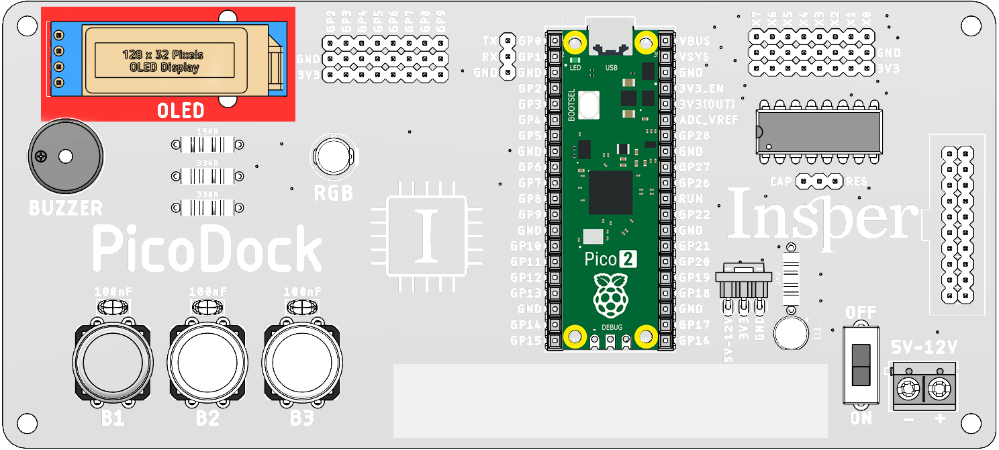
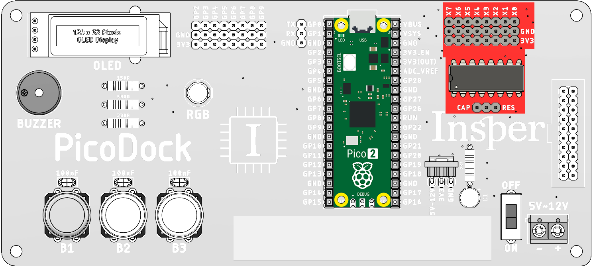
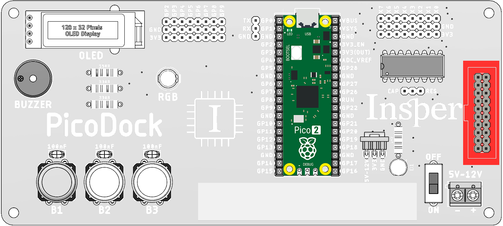
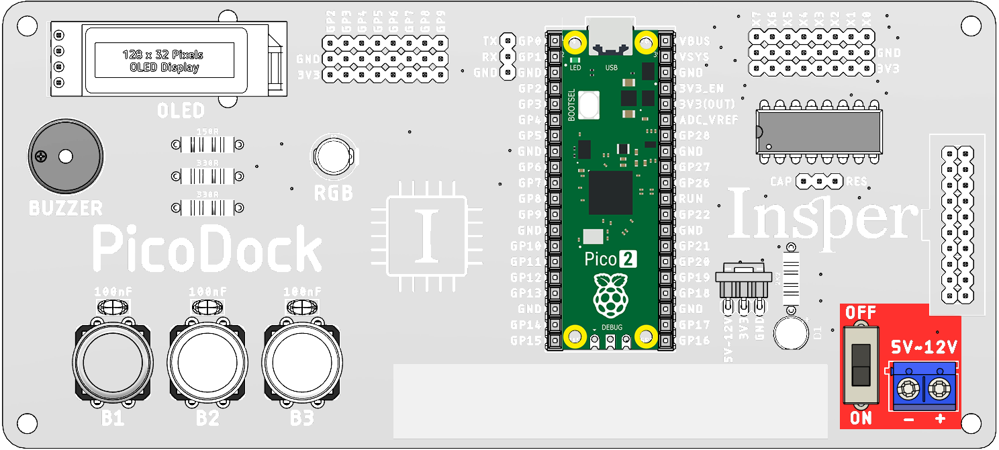

---
tags:
  - periféricos
  - picodock
description: Kit de desenvolvimento pico-dock
---

A **PicoDock** é uma placa de expansão desenvolvida para ser utilizada com a **Raspberry Pi Pico**, oferecendo acesso simplificado a diversos componentes eletrônicos já integrados.  
Seu objetivo é facilitar o desenvolvimento de projetos de prototipagem, ensino e experimentação em sistemas embarcados.

## Recursos

A **Raspberry Pi Pico** pode ser encaixada diretamente no soquete da PicoDock, onde todos os componentes ficam disponíveis sem a necessidade de conexão adicional, são os principais recursos:

- 3x Botões;
- 1x LED RGB;
- 1x Buzzer sem oscilador interno;
- 1x OLED 128x32;
- 1x Multiplexador ADC 8x1;
- 1x Barramento para conexão com a placa TFT LCD - Dock;
- 1x Borne KRE para alimentação externa até 12V;

Abaixo estão detalhados os GPIOs de cada recurso da placa:

| Componente                                   | GPIO | Descrição |
|----------------------------------------------|------|------------|
| OLED - SDA                                   | 2    | I2C0 - Dados |
| OLED - SCK (SCL)                             | 3    | I2C0 - Clock |
| Botão B1                                     | 4    | Entrada digital |
| Botão B2                                     | 5    | Entrada digital |
| Botão B3                                     | 6    | Entrada digital |
| LED RGB - Vermelho                           | 7    | Saída PWM / Digital |
| LED RGB - Verde                              | 8    | Saída PWM / Digital |
| LED RGB - Azul                               | 9    | Saída PWM / Digital |
| Buzzer                                       | 10   | Saída Digital |
| Sel_A_4051 (MUX)                             | 11   | Seleção A do multiplexador |
| Sel_B_4051 (MUX)                             | 12   | Seleção B do multiplexador |
| Sel_C_4051 (MUX)                             | 13   | Seleção C do multiplexador |
| ADC_IN_4051 (MUX)                            | 28   | Entrada ADC (leitura do MUX) |
| LCD_TOUCH_X+ (Resistivo)                     | 14   | Eixo X+ |
| LCD_TOUCH_X- (Resistivo)                     | 26   | Eixo X- |
| LCD_TOUCK_Y+ (Resistivo)                     | 27   | Eixo Y+ |
| LCD_TOUCH_Y-/SDA (Resistivo / Capacitivo)    | 20   | Y- ou I2C SDA (touch capacitivo) |
| LCD_TOUCH_SCL (Capacitivo)                   | 21   | I2C SCL (touch capacitivo) |
| LCD_RESET                                    | 16   | Reset do display |
| LCD_SPI_0_CS                                 | 17   | Chip Select (SPI0) |
| LCD_SPI_0_SCK                                | 18   | Clock SPI0 |
| LCD_SPI_0_TX                                 | 19   | MOSI SPI0 |
| LCD_DATA_CMD_SEL                             | 22   | Seleção Data/Command |
| LCD_LITE                                     | 15   | Controle de backlight |

### ⚠️ O que são pinos conflitantes?

⚠️ **Pinos conflitantes** são GPIOs que exercem mais de uma função de hardware ou que são compartilhados entre diferentes periféricos da placa.

Isso significa que:

- Um mesmo GPIO pode estar fisicamente conectado a dois recursos.
- Ativar uma função pode impedir o uso de outra.
- Dois periféricos podem disputar o mesmo barramento (ex: I2C ou SPI).

#### 🔎 Exemplos nesta placa:

⚠️ **GPIO 20**  
- Pode funcionar como `LCD_TOUCH_Y-` (modo resistivo)  
- Ou como `SDA` do touch capacitivo (I2C)  
Não é possível usar as duas funções simultaneamente.

⚠️ **GPIO 21**  
- Utilizado como `SCL` do touch capacitivo (I2C)  
Caso outro periférico utilize o mesmo barramento, é necessário verificar compatibilidade de endereços.

⚠️ **Barramentos compartilhados (I2C / SPI)**  

- I2C: GPIO 2–3 e 20–21  
- SPI0: GPIO 17–19  

Esses barramentos permitem múltiplos dispositivos, mas exigem configuração adequada:
- Endereços distintos no I2C  
- Controle correto do Chip Select (CS) no SPI  

### 🚨 Por que isso é importante?

Configuração incorreta de pinos conflitantes pode causar:

- Falha na comunicação com periféricos  
- Leituras incorretas  
- Travamentos no firmware  
- Conflitos elétricos (dois dispositivos dirigindo o mesmo pino)  

### ✔️ Boas práticas

- Consultar o esquemático da placa  
- Definir previamente os periféricos que serão utilizados  
- Verificar conflitos antes de inicializar os drivers  
- Documentar o mapeamento de GPIO no firmware  

---

## Botões

A placa possui 3 botões para uso geral:

- Quando pressionado, o estado lógico vai para **0**.  
- Quando solto, o estado lógico fica em **alta impedância**, sendo necessário ativar o pino de leitura com **PULL_UP**.  

Segue abaixo o circuito implementado em cada botão:

#### Pinos utilizados (Conflitantes)

| Componente                                   | GPIO | Descrição |
|----------------------------------------------|------|------------|
| Botão B1                                     | 4    | Entrada digital |
| Botão B2                                     | 5    | Entrada digital |
| Botão B3                                     | 6    | Entrada digital |

---

## LED RGB

Permite o controle de três canais de cor (Vermelho, Verde e Azul) para geração de diferentes combinações de cores.  

#### Pinos utilizados (Conflitantes)

| Componente                                   | GPIO | Descrição |
|----------------------------------------------|------|------------|
| LED RGB - Vermelho                           | 7    | Saída PWM / Digital |
| LED RGB - Verde                              | 8    | Saída PWM / Digital |
| LED RGB - Azul                               | 9    | Saída PWM / Digital |

---

## BUZZER

Controlado por saída digital ou PWM, pode ser utilizado para emissão de alertas sonoros ou geração de tons. 

#### Pino utilizado (Conflitante)

| Componente                                   | GPIO | Descrição |
|----------------------------------------------|------|------------|
| Buzzer                                       | 10   | Saída Digital ||

---

## Display OLED 128x32

Conectado via protocolo I²C, possibilita a exibição de textos, gráficos e dados de sensores.  

#### Pinos utilizados (Conflitantes)

| Componente                                   | GPIO | Descrição |
|----------------------------------------------|------|------------|
| OLED - SDA                                   | 2    | I2C0 - Dados |
| OLED - SCK (SCL)                             | 3    | I2C0 - Clock |

---

## Display MUX_8x1 (ADC)

Conectado ao **pino ADC2** da Pico, permite a leitura de até 8 sinais analógicos diferentes através de um único canal.  

#### Pinos utilizados (Conflitantes)

| Componente                                   | GPIO | Descrição |
|----------------------------------------------|------|------------|
| Sel_A_4051 (MUX)                             | 11   | Seleção A do multiplexador |
| Sel_B_4051 (MUX)                             | 12   | Seleção B do multiplexador |
| Sel_C_4051 (MUX)                             | 13   | Seleção C do multiplexador |
| ADC_IN_4051 (MUX)                            | 28   | Entrada ADC (leitura do MUX) |

---

## LCD TFT

Compatível para conexão de displays **TFT LCD**, expandindo as possibilidades visuais da placa.

#### Pinos utilizados (Conflitantes)

| Componente                                   | GPIO | Descrição |
|----------------------------------------------|------|------------|
| LCD_TOUCH_X+ (Resistivo)                     | 14   | Eixo X+ |
| LCD_TOUCH_X- (Resistivo)                     | 26   | Eixo X- |
| LCD_TOUCK_Y+ (Resistivo)                     | 27   | Eixo Y+ |
| LCD_TOUCH_Y-/SDA (Resistivo / Capacitivo)    | 20   | Y- ou I2C SDA (touch capacitivo) |
| LCD_TOUCH_SCL (Capacitivo)                   | 21   | I2C SCL (touch capacitivo) |
| LCD_RESET                                    | 16   | Reset do display |
| LCD_SPI_0_CS                                 | 17   | Chip Select (SPI0) |
| LCD_SPI_0_SCK                                | 18   | Clock SPI0 |
| LCD_SPI_0_TX                                 | 19   | MOSI SPI0 |
| LCD_DATA_CMD_SEL                             | 22   | Seleção Data/Command |
| LCD_LITE                                     | 15   | Controle de backlight |

---

## Alimentação Externa

Conector para **alimentação externa**, garantindo maior flexibilidade no fornecimento de energia.  

---

## Aplicações

- Prototipagem rápida de projetos com Raspberry Pi Pico 2  
- Ensino de eletrônica digital e programação embarcada  
- Projetos com múltiplas entradas analógicas  
- Testes com diferentes tipos de displays (OLED e TFT)  
- Desenvolvimento de sistemas interativos (botões, LEDs, buzzer)  
