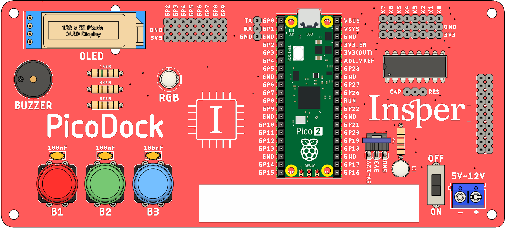

# PicoDock

A **PicoDock** é uma placa de expansão desenvolvida para ser utilizada com a **Raspberry Pi Pico**, oferecendo acesso simplificado a diversos componentes eletrônicos já integrados.  
Seu objetivo é facilitar o desenvolvimento de projetos de prototipagem, ensino e experimentação em sistemas embarcados.

---

## Recursos

A **Raspberry Pi Pico** pode ser encaixada diretamente no soquete da PicoDock, onde todos os componentes ficam disponíveis sem a necessidade de conexão adicional, são os principais recursos:

1 - 3x Botões;

2 - 1x LED RGB;

3 - 1x Buzzer sem oscilador interno;

4 - 1x OLED 128x32;

5 - 1x Multiplexador ADC 8x1;

6 - 1x Barramento para conexão com a placa TFT LCD - Dock;

7 - 1x Borne KRE para alimentação externa até 12V;

---

## Recursos da Placa

Abaixo estão detalhados os recursos disponíveis na placa:

| Componente | GPIO | Descrição |
| -------- | ----- | ----------- |
| Botão B1        | 1     | Inteiro     |
| Botão B2        | 2     |             |
| Botão B3        | 2     |             |
| LED RGB - Vermelho        | 2     |             |
| LED RGB - Verde       | 2     |             |
| LED RGB - Azul      | 2     |             |
| Buzzer       | 2     |             |
| OLED - SCK      | 2     |             |
| OLED - SDA      | 2     |             |
| Seletor MUX - ADC       | 2     |             |
| OLED - SCK      | 2     |             |
| OLED - SDA      | 2     |             |

- **3 Botões** (push-buttons)  
  Utilizados como entradas digitais, ideais para testes de leitura de sinais lógicos e interações simples.  

- **1 LED RGB** (comum cátodo ou ânodo, conforme montagem)  
  Permite o controle de três canais de cor (Vermelho, Verde e Azul) para geração de diferentes combinações de cores.  

- **1 Display OLED 128x32**  
  Conectado via protocolo I²C, possibilita a exibição de textos, gráficos e dados de sensores.  

- **1 Buzzer piezoelétrico**  
  Controlado por saída digital ou PWM, pode ser utilizado para emissão de alertas sonoros ou geração de tons.  

- **1 Borne KRE**  
  Conector para **alimentação externa**, garantindo maior flexibilidade no fornecimento de energia.  

- **1 Conector 2x20 pinos**  
  Compatível para conexão de displays **TFT LCD**, expandindo as possibilidades visuais da placa.  

- **1 Multiplexador (MUX) 8x1**  
  Conectado ao **pino ADC2** da Pico, permite a leitura de até 8 sinais analógicos diferentes através de um único canal.  

---

---

## Aplicações

- Prototipagem rápida de projetos com Raspberry Pi Pico 2  
- Ensino de eletrônica digital e programação embarcada  
- Projetos com múltiplas entradas analógicas  
- Testes com diferentes tipos de displays (OLED e TFT)  
- Desenvolvimento de sistemas interativos (botões, LEDs, buzzer)  

---