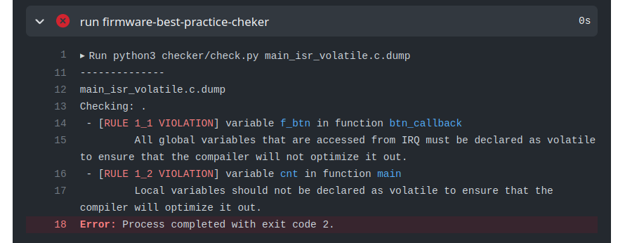

---
tags:
  - qualidade de código
  - interrupção
  - software
description: Como utilizar corretamente variáveis globais quando lidando com interrupcão.
--- 

# ISR - Variáveis

Devemos seguir algumas regras básicas quando desenvolvemos código que faz uso de interrupção, devemos tratar essa seção do programa como algo especial e que possui algumas regras básicas para operar corretamente. 

::: info
Para informações mais detalhadas consulte:
    
- https://betterembsw.blogspot.com/search/label/interrupts 
:::

## Variáveis volatile

Interrupção é normalmente um evento gerado pelo hardware e que, por consequência, executa uma função de `Handler` sem que o compilador tenha conhecimento disso (por ser um evento externo ao software). Por conta dessa característica, temos que tomar um cuidado especial com as variáveis que são acessadas por essa função chamada pelo hardware.

::: tip Rule 1.2
Todas as variáveis globais acessadas de uma interrupção (ISR) devem possuir a keyword: `volatile`
:::  

::: tip Rule 1.3
Somente as variáveis globais e modificadas durante a ISR devem ser globais.
:::

Essas regras podem ser flexibilizadas quando desejamos acessar periféricos e memórias externas, os valores desses endereços de memória são alterados sem o conhecimento do compilador.

## Exemplo

O exemplo a seguir demonstra um ==uso errado== da keyword `volatile`:

- `btn_callback`: É uma função de interrupção chamada pelo Hardware!
- `f_btn`: É uma variável global modificada por um evento no pino do botão, deveria ser `volatile`
- `cnt`: É apenas um contador, não devemos interferir no processo de compilação.

```c

int f_btn = 0; // deveria ser volatile

// ISR
void btn_callback(void) {
    f_btn = 1; // variável alterada de uma interrupcão
}

void main(void) {
    
    volatile int cnt = 0; // não precisa ser volatile
    
    while (1) {
        if (f_btn) {
            cnt++;
            f_btn = 0;
        }
    }
}
```
O exemplo viola as regras **1.1** e **1.2** nas duas variáveis ( `f_btn` e `cnt` ) gerando o seguinte erro:

