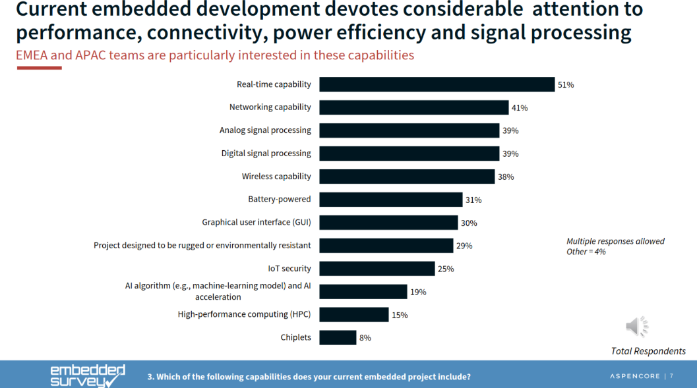

# Especialistas

Agora vocês podem escolher quais especialidades desejam trilhar, temos algumas opções que ajudarão vocês no projeto aberto:

- **Comunicação**: Aprender a utilizar outras formas de comunicação entre o uC e outro dispositivo.
- **Processamento Digital de Sinais (DSP)**: Focada em como adquirir, tratar e processar sinais em sistemas embarcados, essa trilha avança até a aplicação de Inteligência Artificial.
- **Sensores e Atuadores**: Esta trilha aprofunda a compreensão sobre como podemos detectar e controlar o mundo físico usando módulos. Frequentemente, esses módulos requerem o uso de protocolos machine-to-machine (M2M), como I2C, SPI, entre outros.
- **Firmware**: Uma das principais preocupações em sistemas embarcados são os requisitos energéticos, segurança e confiabilidade. Esta trilha se dedica a aprofundar o entendimento sobre como desenvolver códigos eficientes.

As trilhas foram criadas com base na experiência da equipe e também utilizando como referência informações disponíveis sobre o desenvolvimento de produtos com sistemas embarcados, uma das referências utilizadas é um survey da embedded.com:

